# Architecture — Unified Cloud File Manager

| Field | Value |
|---|---|
| Document | Technical Architecture |
| Version | 1.0 |
| Status | Draft — decisions are proposals until validated in Phase 0 |
| Scope | Android client; minimal backend for OAuth code exchange only |
| Related documents | `PRD.md`, `Rules.md`, `Phases.md`, `Design.md`, `Memory.md` |

### How to read this document

| Marker | Meaning |
|---|---|
| **CONFIRMED** | Verified against official Google/Android documentation, cited in §3. |
| **REQUIRES VALIDATION** | Not yet verified. Must be validated in Phase 0 before being relied upon. |
| **ADR-nn** | Architecture Decision Record; see §31. |
| **PROPOSED** | A design choice made here that is not yet confirmed by testing. |

> **Non-negotiable architectural constraint.** This system is a management and access layer over accounts the user has authorized. It creates no storage, pools no quota, shards no files, and clones nothing to work around a provider limit. File bytes live in Google Drive and go directly between the device and Google. The minimal backend never handles file content. Any design that violates this is invalid regardless of performance or convenience.

---

## 1. Architecture Objectives

Priority order, highest first. When objectives conflict, the higher one wins.

| # | Objective | Architectural consequence |
|---|---|---|
| 1 | **Security** | Keystore-backed token storage, no secrets in the APK, no content logging, explicit account context on every provider call, minimal exported surface |
| 2 | **Privacy** | Metadata-only local cache, no content caching by default, analytics allow-list, per-account purge on disconnect |
| 3 | **Maintainability** | Modular monolith, provider abstraction, no microservices, no premature platform abstraction |
| 4 | **Scalability** | Bounded pagination, per-account concurrency caps, a local index that does not require re-listing, parallel fan-out with a global cap |
| 5 | **Modularity & testability** | Provider interface is an interface, not a class; all provider calls are faked in tests; no Android framework types in the domain layer |
| 6 | **Separation of concerns** | Presentation → UI state → domain → data → provider abstraction. Dependencies point inward only. |
| 7 | **Reliable OAuth handling** | An explicit token state machine, a single refresh path, no silent retry loops |
| 8 | **Multi-account isolation** | `AccountId` is a required parameter on every provider operation. No ambient "current account". |
| 9 | **Good Android UX** | Offline-first rendering from cache, skeletons over spinners, navigation never blocks on network |
| 10 | **Efficient metadata handling** | Explicit `fields`, bounded pages, LRU thumbnail cache, indexed local queries |
| 11 | **Minimal backend storage** | The backend holds no file data and, ideally, no token data. Stateless where possible. |
| 12 | **Provider ownership of files** | Google Drive is the source of truth. Local data is a cache, always evictable. |

---

## 2. High-Level System Architecture

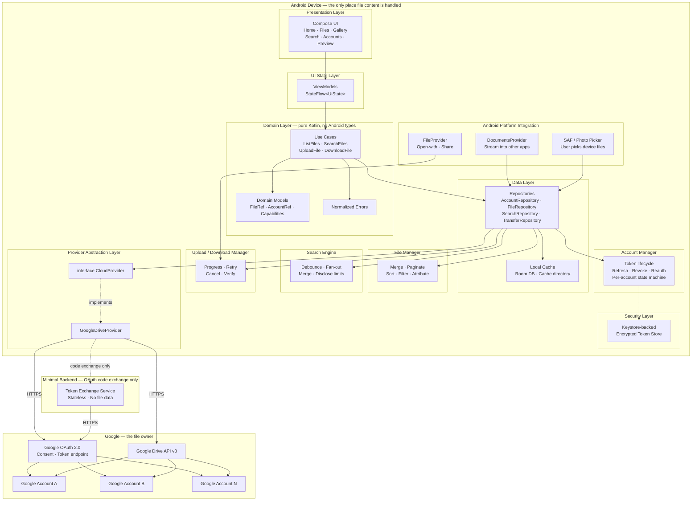

### 2.1 Data classification — what lives where

| Data class | Location | Authoritative? | Encrypted | Notes |
|---|---|---|---|---|
| **File contents** | Google Drive (source) · device cache dir (transient) | Google | In transit: TLS | Never in the app database. Never proxied through the backend. |
| **File metadata** | Google Drive (source) · Room (advisory cache) | Google | At rest: OS file encryption | The Room copy is always potentially stale. |
| **OAuth refresh tokens** | Keystore-backed store · **transit only** through the backend if used | Google (validity) | Yes | The critical secret. |
| **OAuth access tokens** | Memory + Keystore-backed store | Google | Yes | Short-lived. |
| **Authorization codes / ID tokens** | Memory only, transient | Google | Yes | Never persisted. Never logged. |
| **App settings, recents, favourites, history** | Room / DataStore | App | OS-level | User-clearable. |
| **Analytics events** | Local buffer → analytics provider | Analytics provider | Yes | Allow-listed only (PRD §20.1). |
| **Backend state** | Stateless. Metrics only. | — | — | No user file data. No persistent token store (ADR-05). |

### 2.2 The four data flows, kept separate

| Flow | Path | Rule |
|---|---|---|
| File content download | Google Drive → device | **Direct.** Never through the backend. |
| File content upload | device → Google Drive | **Direct.** Never through the backend. |
| Metadata read | Google Drive → device cache | Direct, cached, always qualified by age. |
| OAuth code exchange | device → backend → Google → backend → device | The only flow that touches the backend. The backend must be stateless (ADR-05). |

---

## 3. Verified External Facts

Every claim in this section is grounded in current official documentation. Anything not listed here and not in Phase 0's findings is **REQUIRES VALIDATION**.

### 3.1 Google OAuth and Drive

| # | Fact | Source |
|---|---|---|
| F-01 | `.../auth/drive.file` is **non-sensitive**; it grants per-file access to files the app created or opened, or that the user selected via the Google Picker or the app's own picker. | Google, "Choose Google Drive API scopes" |
| F-02 | `.../auth/drive.readonly` and `.../auth/drive` are **restricted** scopes. | Google, same |
| F-03 | `drive.metadata` / `drive.metadata.readonly` are also restricted and strictly prohibit access to file content. | Google, "Manage file metadata" |
| F-04 | Google publishes a downscoping ladder and explicitly names `drive.readonly` as correct only when "per-file selection with the `drive.file` scope via a file picker justifiably does not fit your use case." | Google, "Requesting Minimum Scopes" |
| F-05 | Google states that with `drive.file` an app cannot list the contents of a folder it did not create or open; the documented workaround is to request `drive.readonly`, or to prevent folder selection in the Picker. | Google support / community guidance |
| F-06 | Apps using sensitive or restricted scopes must complete OAuth App Verification before those scopes are granted. | Google, "Restricted scope verification" |
| F-07 | Brand verification typically takes 2–3 business days. | Google, same |
| F-08 | Google publishes ~6 weeks for restricted-scope data-access verification. | Google Cloud OAuth verification FAQ |
| F-09 | An app that requests restricted scopes and can access that data from or through a third-party server must undergo an **annual security assessment** by a Google-approved third party. Adding a new restricted scope can trigger reassessment. | Google, "Restricted scope verification" |
| F-10 | Verification requires a demonstration video, unlisted on YouTube, showing the OAuth grant flow in English, the consent screen with the correct app name and OAuth client ID, and the functionality enabled by each scope. | Google, same |
| F-11 | Drive corpora are `user`, `domain`, `drive`, `allDrives`. Google warns `allDrives` has a broad scope and can affect performance, and recommends `user` or `drive` for efficiency. | Google, "Files and folders overview" |
| F-12 | `capabilities` on the `files` resource derives permitted actions from the `permissions` resource; the permissions resource itself does not determine allowed actions. | Google, same |
| F-13 | Drive automatically generates thumbnails for many common file types; thumbnails can also be uploaded for unsupported types. | Google, same |
| F-14 | Provider file IDs are unique and persist for the life of the file, even if the file is renamed. | Google, same |
| F-15 | Drive API quota/rate limits are per-project, adjustable, and visible in the Cloud Console. | Google Cloud Console |
| F-16 | The OAuth consent screen lists scopes in a "Non-sensitive" section by default; sensitive and restricted scopes must be added and classified explicitly. | Google, restricted-scope verification |

### 3.2 Android

| # | Fact | Source |
|---|---|---|
| F-17 | `DocumentsProvider` is the documented extension point for a storage service — "a content provider that lets a storage service, such as Google Drive, reveal the files it manages." | Android, "Open files using the Storage Access Framework" |
| F-18 | A `DocumentsProvider` must be declared with `android:exported="true"`, `android:grantUriPermissions="true"`, `android:permission="android.Manifest.permission.MANAGE_DOCUMENTS"`, and an intent filter for `android.content.action.DOCUMENTS_PROVIDER`. | Android, "Create a custom document provider" |
| F-19 | A provider not protected by `MANAGE_DOCUMENTS` throws `SecurityException` in `attachInfo`. `MANAGE_DOCUMENTS` is a system-only permission; apps cannot use a documents provider directly — a user must actively select documents. | Android `DocumentsProvider` reference |
| F-20 | Documented guidance: if the user is not logged in, return **zero roots** (an empty root cursor) and call `notifyChange` so the picker re-queries. | Android, "Create a custom document provider" |
| F-21 | `ACTION_OPEN_DOCUMENT` is available from API 19; `ACTION_OPEN_DOCUMENT_TREE` from API 21. On Android 11+ (API 30) neither may be used to request certain directories. | Android, "Access documents and other files from shared storage" |
| F-22 | Because the user is involved in selecting files, SAF "doesn't require any system permissions, and user control and privacy is enhanced." | Android, same |
| F-23 | Client apps determine which document operations a provider supports by reading `Document.COLUMN_FLAGS`. | Android, same |
| F-24 | A provider that also declares an `ACTION_GET_CONTENT` intent filter appears **twice** in the system picker, which is confusing; the two are considered mutually exclusive. `EXTRA_EXCLUDE_SELF` can suppress this. | Android / Ian Lake, "Building a DocumentsProvider" |
| F-25 | `isChildDocument` should avoid network requests to stay fast, because it supports `ACTION_OPEN_DOCUMENT_TREE`. | Android `DocumentsProvider` reference |
| F-26 | Legacy Google Sign-In for Android is **deprecated** and is being removed from the Google Play services Auth SDK. | Android, "About the migration from legacy Google Sign-In" |
| F-27 | With Credential Manager, **authentication** and **authorization** are separate actions. Authorization to Google services such as Drive is handled by the `AuthorizationClient` API. | Android, same |
| F-28 | Credential Manager sign-in with Google uses `GetGoogleIdOption` and returns a **Google ID Token**; server-side ID-token validation is documented as the relying-party step. | Android, "Implement Sign in with Google" |
| F-29 | Automatic sign-in is disabled on a device with multiple authorized accounts. | Android, same |

### 3.3 Open questions — must be resolved in Phase 0

| # | Question | Blocks |
|---|---|---|
| Q-01 | Does `AuthorizationClient` yield a Drive-suitable **refresh token** for direct Drive REST calls, or only a short-lived ID/access credential? | The entire OAuth design (ADR-05) |
| Q-02 | Does Google's installed-app PKCE flow work for Android without a backend, and what redirect handling does it require? | Whether a backend is needed at all |
| Q-03 | If a minimal backend is used, what is the minimum it must store, and what security-assessment tier results? | Compliance budget, backend design |
| Q-04 | Is a multi-account personal file manager a permitted application type for restricted scopes? | **The product** (PRD §28 R-01) |
| Q-05 | What are the real per-project Drive API quotas for this project? | Fan-out sizing, caching policy |
| Q-06 | What are the real `files.list` result caps and `q` operator semantics? | Completeness disclosure design |
| Q-07 | How long do `thumbnailLink` values remain valid? | Thumbnail cache policy |
| Q-08 | Can Google-native Docs/Sheets/Slides be exported, or only linked? | Preview behaviour |
| Q-09 | Is resumable upload supported for Android clients, and does it survive process death? | Background upload strategy |
| Q-10 | What are Drive's real semantics for duplicate names, versioning, and folder creation? | Upload UI copy |
| Q-11 | Does `openDocument` streaming survive large remote files in DocumentsUI, or is cache-then-serve required? | Document provider design |
| Q-12 | What are the minimum `minSdk` constraints imposed by the chosen dependency set? | Build configuration |

---

## 4. Client Architecture

### 4.1 Stack, with justification for every choice

| Technology | Why it is used | Required? | Alternative considered |
|---|---|---|---|
| **Kotlin** | First-class Android language; coroutines and null-safety materially reduce defect classes in a system with this much nullable provider data | Yes | Java (more verbose, weaker null handling); Rust (not idiomatic for Android UI) |
| **Jetpack Compose** | The design system in `Design.md` is token-driven and state-driven; Compose maps directly to it. Material 3 support is current | Yes for new UI | Views + XML (no Material 3 parity without substantial custom work) |
| **Coroutines + Flow** | Every operation in this product is asynchronous and cancellable; structured concurrency makes cancellation correct by construction rather than by discipline | Yes | RxJava (steeper learning curve, no language integration); Java executors (error-prone) |
| **ViewModel + StateFlow** | The natural holder of `UiState`; survives configuration changes; testable without Android | Yes | Retained fragments (legacy); no holder (state loss) |
| **Navigation Compose** | Typed routes, deep-link support, saved-state handling | Yes | Manual fragment transactions (no deep-link safety) |
| **Room** | The metadata cache needs relational queries (parent/child, per-account scoping, sort) and migrations. SQLite via `SupportSQLite` would mean hand-writing all of it | Yes | In-memory maps (unbounded, no query support); DataStore (not relational) |
| **DataStore (Proto)** | Typed, coroutine-friendly preferences for settings | Yes | SharedPreferences (untyped, no Flow); Room (overkill for a handful of scalars) |
| **WorkManager** | The only correct primitive for deferrable, constraint-aware, process-death-survivable work | Yes | Coroutines + a foreground service (no constraint system); AlarmManager (not for this) |
| **Android Keystore + `EncryptedSharedPreferences`-style store** | Hardware-backed key protection for refresh tokens | Yes | Plain SharedPreferences (insecure); Room (see ADR-04) |
| **OkHttp** | Connection pooling, interceptors (the natural place for token injection and structured logging), `Range` support, streaming | Yes | `HttpURLConnection` (no interceptors, more error-prone); Ktor (fewer Android-specific streaming affordances) |
| **Kotlin serialization** | Compile-time-safe JSON for Drive API payloads, no reflection | Yes | Moshi/Gson (reflection or codegen setup); manual parsing (error-prone) |
| **Google Drive REST API directly** | The product needs file-level control (per-account calls, explicit `fields`, partial ranges) that the higher-level SDKs obscure | Yes | `google-api-services-drive` (large, and less transparent for explicit field selection) |
| **Credential Manager** | The current, supported authentication surface; the legacy path is deprecated (F-26) | Yes for authentication | Legacy Google Sign-In (deprecated) |
| **`AuthorizationClient`** | The documented current path for Drive **authorization** (F-27) | **REQUIRES VALIDATION** (Q-01) | Custom AppAuth integration (adds a dependency for a path whose necessity is unproven) |
| **Coil** | Compose-integrated image loading with downsampling, memory/disk cache control, and request cancellation | Yes | Manual `BitmapFactory` + LRU (reimplementing this is a known source of OOM defects) |
| **WorkManager + Coroutines** | Transfer continuation | Yes | — |
| **Paging** | Bounded, efficient lazy loading for very large listings | Yes | Manual page index (reinventing it) |

### 4.2 Dependencies explicitly NOT added

| Not added | Reason |
|---|---|
| Hilt / Koin | The object graph here is small. A hand-written `AppContainer` is ~50 lines, has no build-time codegen cost, and is trivially greppable. Revisit only if the graph becomes genuinely large. |
| Retrofit | Only the Drive API and one token endpoint are consumed. OkHttp + Kotlin serialization is sufficient and avoids annotation processing. |
| Firebase / Crashlytics | Adds a data transfer surface that must be justified under the privacy policy. **REQUIRES VALIDATION** with the privacy review before adding. Decide at Phase 17. |
| AppAuth-Android | Only if Q-01 and Q-02 both resolve against a custom flow. |
| MockK / Turbine | Use hand-written fakes. The `CloudProvider` interface is small; a mocking framework adds a build-time cost for no gain. |
| Firebase Analytics | The §20.1 allow-list is small enough to implement with a thin, auditable wrapper. |
| Any JSON-schema or DI codegen plugin | Not needed at this size. |

### 4.3 Layering rules (enforced by package structure and review)

```
Presentation  ──depends on──▶  Domain  ◀──implemented by──  Data
     │                            ▲                              │
     └──────────▶  UI State ◀─────┴──────────────────────────────┘
```

| Rule | Enforcement |
|---|---|
| The domain layer contains **no Android framework imports** | Package-level check in CI (`:domain` module dependency verification) |
| The domain layer does not know about Room, OkHttp, or Drive | Same check |
| The data layer does not import presentation types | Same check |
| Only the data layer knows about provider SDKs and Room | Same check |
| Dependencies point inward only | Same check |

**PROPOSED:** enforce the domain-purity rule by making `:domain` a pure Kotlin (JVM) Gradle module. If a dependency forces Android types into it, that dependency is wrong, not the rule.

---

## 5. Recommended Android Project Structure

```
unified-cloud-file-manager/
├── app/                              # Android application module (Compose UI + DI container)
│   └── src/main/java/com/unifiedcloud/filemanager/
│       ├── UnifiedFileManagerApp.kt   # Application; installs the AppContainer
│       ├── MainActivity.kt            # Single activity, Compose host
│       ├── app/
│       │   ├── AppContainer.kt        # Hand-written DI graph (no framework)
│       │   ├── AppDispatchers.kt      # Injected dispatchers for testability
│       │   └── Navigation.kt          # NavHost, typed routes, deep links
│       ├── security/
│       │   ├── KeystoreTokenStore.kt  # Encrypted at-rest token storage
│       │   ├── SecureLog.kt           # Redacting logger (prohibited-properties list)
│       │   └── Redaction.kt           # The redaction rules, unit-testable
│       ├── documentsprovider/
│       │   ├── UnifiedDocumentsProvider.kt   # SAF exposure (F-17)
│       │   ├── DocumentIdCodec.kt            # Encodes (accountId, fileId) into a document URI
│       │   └── RootRegistry.kt                # Roots per connected account; empty when none
│       ├── fileprovider/
│       │   └── ShareFileProvider.kt    # Open-with / Share of downloaded files
│       ├── workers/
│       │   ├── MetadataRefreshWorker.kt
│       │   ├── ThumbnailRefreshWorker.kt
│       │   ├── UploadWorker.kt
│       │   └── CacheMaintenanceWorker.kt
│       └── ui/
│           ├── theme/                 # Tokens → Compose theme (see Design.md §24)
│           │   ├── Color.kt  Type.kt  Shape.kt  Spacing.kt  Motion.kt
│           │   └── Theme.kt
│           └── components/            # Shared components from Design.md §8
│               ├── AccountBadge.kt  FileRow.kt  FileCard.kt
│               ├── StateViews.kt    # Loading, Empty, Error, Offline, Stale
│               └── ConfirmDialogs.kt
├── domain/                           # PURE KOTLIN. No Android, no provider SDKs.
│   └── src/main/kotlin/com/unifiedcloud/filemanager/domain/
│       ├── model/
│       │   ├── AccountRef.kt         # (provider, accountId)
│       │   ├── FileRef.kt            # (provider, accountId, providerFileId)  ← the only currency
│       │   ├── CloudFile.kt          # Metadata + capabilities
│       │   ├── FileQuery.kt          # Filters, sort, page
│       │   ├── Page.kt               # Bounded page + continuation
│       │   ├── Capabilities.kt
│       │   └── TransferState.kt
│       ├── error/
│       │   └── AppError.kt           # Normalized error taxonomy (see §21)
│       ├── repository/               # Interfaces only
│       │   ├── AccountRepository.kt
│       │   ├── FileRepository.kt
│       │   ├── SearchRepository.kt
│       │   └── TransferRepository.kt
│       ├── provider/
│       │   └── CloudProvider.kt      # The abstraction (§5)
│       └── usecase/
│           ├── ListFilesUseCase.kt
│           ├── SearchFilesUseCase.kt
│           ├── UploadFileUseCase.kt
│           ├── DownloadFileUseCase.kt
│           ├── DisconnectAccountUseCase.kt
│           └── GetFileContentUseCase.kt
├── data/                             # Android library. Room, OkHttp, provider implementations.
│   └── src/main/java/com/unifiedcloud/filemanager/data/
│       ├── account/
│       │   ├── AccountRepositoryImpl.kt
│       │   ├── AccountStateMachine.kt
│       │   └── AccountDao.kt
│       ├── file/
│       │   ├── FileRepositoryImpl.kt
│       │   ├── FileDao.kt
│       │   ├── FileMapper.kt
│       │   └── Unifier.kt           # Merge across accounts; deterministic ordering
│       ├── search/
│       │   ├── SearchRepositoryImpl.kt
│       │   ├── QueryBuilder.kt      # Drive `q` construction + escaping
│       │   └── CompletenessEvaluator.kt
│       ├── transfer/
│       │   ├── TransferRepositoryImpl.kt
│       │   ├── UploadEngine.kt
│       │   ├── DownloadEngine.kt     # Streaming, Range, progress
│       │   └── DestinationResolver.kt
│       ├── database/
│       │   ├── UnifiedCloudDatabase.kt
│       │   ├── entity/  Converters/  Migrations/
│       ├── settings/  DataStore-backed UserSettings
│       └── analytics/
│           ├── AnalyticsEvent.kt     # The §20.1 allow-list as sealed types
│           └── AnalyticsRecorder.kt
├── cloud/                            # Provider abstraction + providers
│   └── src/main/java/com/unifiedcloud/filemanager/cloud/
│       ├── provider/
│       │   ├── CloudProvider.kt      # (domain interface re-exported / or lives in domain)
│       │   ├── ProviderRegistry.kt   # provider id → implementation
│       │   ├── ProviderCapabilities.kt
│       │   └── ProviderScope.kt      # Scope → capability mapping
│       ├── google/
│       │   ├── GoogleDriveProvider.kt
│       │   ├── GoogleAuthClient.kt   # Code exchange, refresh, revoke
│       │   ├── TokenStore.kt         # Interface over KeystoreTokenStore
│       │   ├── drive/
│       │   │   ├── DriveApi.kt       # OkHttp-based, explicit fields
│       │   │   ├── DriveQueries.kt   # `q` builders
│       │   │   ├── DriveMappers.kt
│       │   │   ├── DriveErrors.kt    # 401/403/404/429/5xx → AppError
│       │   │   └── DriveScopes.kt
│       │   └── quota/
│       │       ├── QuotaGovernor.kt  # Per-account + global concurrency caps
│       │       └── RetryPolicy.kt    # Bounded exponential backoff + jitter
│       └── (future providers go here — NOT implemented)
├── feature/                          # One Gradle module per feature, or packages if modules
│   └── ...                           # are too granular. See §5 note.
├── core/                             # Cross-cutting utilities
│   ├── result/                       # Result / Outcome types
│   ├── dispatchers/
│   ├── logging/
│   └── testing/                      # FakeCloudProvider, FakeTokenStore, fixtures
├── database/                         # Kept separate from data/ if it grows; see §9
├── workers/                          # Shared WorkManager configuration and constraints
└── build.gradle.kts  settings.gradle.kts  gradle/libs.versions.toml
```

### 5.1 Directory rationale

| Directory | Why it exists |
|---|---|
| `domain/` | A separate pure-Kotlin module makes the "no Android in the domain" rule mechanically checkable, and makes domain logic fast to test |
| `data/` | All the impure concerns: Room, HTTP, mapping, merge logic |
| `cloud/` | Provider implementations. Isolated so that adding OneDrive later touches only this directory plus a registration line |
| `app/` | Android-specific: DI, navigation, the `DocumentsProvider`, the `FileProvider`, workers, and the Compose theme |
| `security/` | Token storage and redacting logging. Small and high-value; a reviewer must be able to read it in one sitting |
| `core/` | Genuinely cross-cutting helpers with no product meaning |
| `core/testing/` | Hand-written fakes live here so every module can use them without depending on each other |

### 5.2 A note on `feature/`

A `feature/` module per screen is the popular pattern, but it is **not recommended here**. It creates either (a) one module per small feature, which is build-time cost without benefit, or (b) heavy cross-module coupling because every feature needs the domain and data layers anyway. **PROPOSED:** organise features as packages inside `app/` for MVP, and extract a module only when a feature acquires its own team, its own release cadence, or a genuine reuse boundary. Revisit at Phase 18.

---

## 6. Provider Abstraction

### 6.1 The interface

The interface lives in `domain/` so that both the app and the data layer depend on it, and neither depends on a concrete provider.

```kotlin
// domain/provider/CloudProvider.kt
package com.unifiedcloud.filemanager.domain.provider

/**
 * A cloud storage provider.
 *
 * CONTRACT (enforced by tests, see Rules.md §5):
 *  - Every operation REQUIRES an explicit [accountId]. There is no ambient "current account".
 *  - Every returned [CloudFile] carries the [accountId] it came from.
 *  - Implementations MUST NOT cache across accounts.
 *  - Implementations MUST NOT retry non-idempotent operations.
 *  - All failures MUST be mapped to [AppError]; raw provider exceptions MUST NOT escape.
 */
interface CloudProvider {

    val providerId: ProviderId

    // ---- Capabilities -------------------------------------------------
    /** What this provider + the currently granted scopes can do. Drives which UI actions exist. */
    suspend fun capabilities(accountId: LocalAccountId): ProviderCapabilities

    // ---- Listing ------------------------------------------------------
    suspend fun listFiles(
        accountId: LocalAccountId,
        query: FileQuery,
    ): Page<CloudFile>

    suspend fun getFile(
        accountId: LocalAccountId,
        ref: FileRef,
        freshness: Freshness = Freshness.CACHE_IF_STALE,
    ): CloudFile

    suspend fun searchFiles(
        accountId: LocalAccountId,
        query: SearchQuery,
    ): SearchResultPage

    // ---- Content ------------------------------------------------------
    /** Opens a streaming source. The caller MUST close it. Never buffers. */
    suspend fun openContent(
        accountId: LocalAccountId,
        ref: FileRef,
        range: ByteRange? = null,
    ): ContentSource

    suspend fun upload(
        accountId: LocalAccountId,
        request: UploadRequest,
        progress: ProgressSink,
    ): CloudFile

    suspend fun download(
        accountId: LocalAccountId,
        ref: FileRef,
        destination: TransferDestination,
        progress: ProgressSink,
    ): TransferResult

    // ---- Mutation (same-account only in MVP) --------------------------
    suspend fun rename(accountId: LocalAccountId, ref: FileRef, newName: String): CloudFile
    suspend fun move(accountId: LocalAccountId, ref: FileRef, newParent: FileRef): CloudFile
    suspend fun trash(accountId: LocalAccountId, ref: FileRef)
    suspend fun createFolder(accountId: LocalAccountId, parent: FileRef?, name: String): CloudFile

    // ---- Account ------------------------------------------------------
    suspend fun accountInfo(accountId: LocalAccountId): CloudAccountInfo
    suspend fun usage(accountId: LocalAccountId): StorageUsage
    suspend fun revokeAccess(accountId: LocalAccountId)
}
```

### 6.2 Supporting types

```kotlin
// Progress and cancellation are first-class: this product moves large files.
interface ProgressSink {
    suspend fun onProgress(bytesTransferred: Long, totalBytes: Long?)
}

sealed interface ContentSource : AutoCloseable {
    val length: Long?
    suspend fun readAt(offset: Long, length: Long): InputStream
    suspend fun readFully(): InputStream
}

/**
 * TransferDestination is an abstraction so the same engine serves:
 *  - an app-managed cache file (preview, provider openDocument)
 *  - a SAF tree URI the user picked (ACTION_OPEN_DOCUMENT_TREE)
 *  - a FileProvider URI (Open-with / Share)
 */
sealed interface TransferDestination {
    data class AppCache(val file: File) : TransferDestination
    data class DocumentTree(val treeUri: Uri, val relativePath: String) : TransferDestination
}
```

### 6.3 Why this shape enables future providers without rework

| Property | How it is achieved |
|---|---|
| No provider types in the domain | `CloudProvider` returns only domain models |
| No capability assumptions in the UI | `capabilities()` returns a `ProviderCapabilities` set; the UI renders actions from it, never from a hardcoded list |
| No scope assumptions in the UI | `ProviderScope` maps granted scopes to capabilities. If Google downscopes us during review, capabilities shrink and the UI degrades rather than breaks |
| No new screen per provider | The gallery/browser are written against `CloudFile` + `FileRef` |
| Testability | `FakeCloudProvider` in `core/testing` implements this interface with scriptable behaviour, including per-account failure injection — which is how the mandatory multi-account tests are written |
| Cost of adding a provider | One directory under `cloud/`, one registration line in `ProviderRegistry`, and a capability mapping. **No UI changes, no domain changes, no database changes.** |

### 6.4 Not implementing future providers now

`ProviderRegistry` supports multiple providers structurally, but **no interface stub, mock implementation, or speculative data model for OneDrive or Dropbox may be added before one is actually being built.** A speculative provider abstraction layer is how YAGNI violations become permanent architecture. `Rules.md` §33.

---

## 7. Multi-Account Architecture

### 7.1 Structure

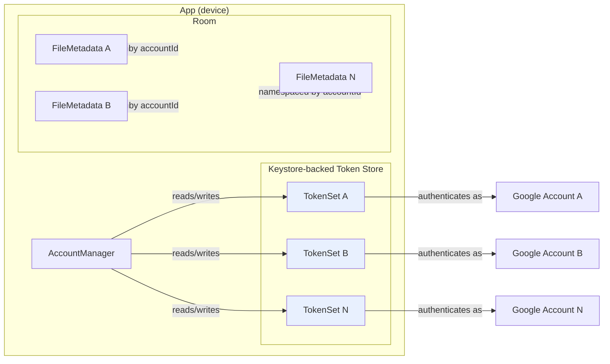

### 7.2 Isolation invariants (testable, and tested — see §23)

| # | Invariant | Enforcement |
|---|---|---|
| I-1 | Every provider call receives a non-null, resolvable `accountId` | The interface has no overload without it. Kotlin has no optional parameters here. |
| I-2 | The token used for a call is resolved from `accountId` alone, inside the auth client | One function: `tokenFor(accountId)`. No other token lookup exists. |
| I-3 | No `ThreadLocal`/singleton "current account" exists in production code | Code review + a lint rule banning mutable global account state |
| I-4 | Every database row carries a non-null `accountId`; every query is account-scoped | Room schema: `accountId` is `NOT NULL` and part of every index used for listing. A repository method without an account parameter does not exist. |
| I-5 | Cache keys include `accountId` | `CacheKey(accountId, kind, id)`; a `CacheKey` constructor without `accountId` does not exist. |
| I-6 | A failure in one account never aborts another account's operation | Fan-out uses structured concurrency with per-child error capture, not `awaitAll` on a single failing child |
| I-7 | The `DocumentsProvider` validates every document ID's account against the connected-account set | `DocumentIdCodec.decode` + a membership check before any provider call |
| I-8 | Disconnecting account A does not alter account B's tokens, cache, workers, or roots | Disconnect is scoped by `accountId` in every step; verified by an automated test |

### 7.3 Token state machine

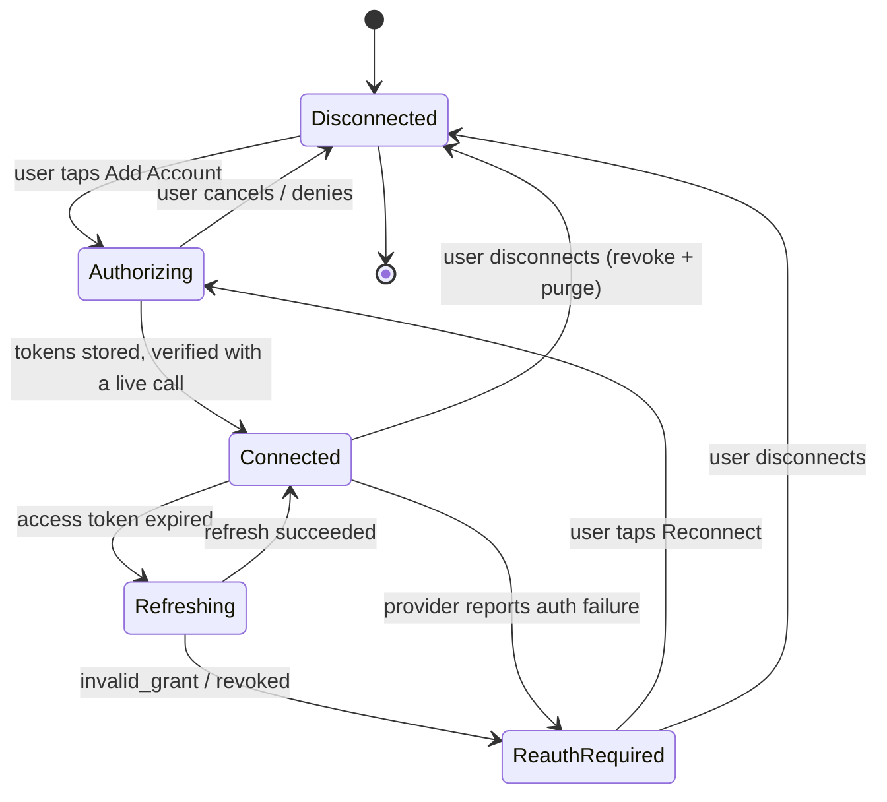

**Rules encoded in the machine:**

| Rule | Detail |
|---|---|
| SM-1 | A refresh is attempted at most once per operation. Never in a loop. |
| SM-2 | `ReauthRequired` is a terminal state for that account's operations until the user acts. It never degrades into silent retries. |
| SM-3 | Entering `ReauthRequired` for account A does not change account B's state. |
| SM-4 | `ReauthRequired` preserves the account's cached metadata, labelled stale and non-actionable. Mutating actions are disabled. |
| SM-5 | Cancellation never transitions state. |
| SM-6 | The transition to `Connected` requires a **live verification call**, not merely a token being received. A token that was never exercised is not proof of a working account. |

### 7.4 Account capacity

| Property | Value | Notes |
|---|---|---|
| Maximum accounts | 5 (configurable) | Enforced at the repository boundary, not in the UI, so it cannot be bypassed |
| Accounts are independent | Yes | No shared folders, no shared quotas, no cross-account listing in the provider layer |
| Unified mode | Read-mostly aggregation | Mutations resolve to exactly one account and require it to be named |
| Per-account mode | Full parity with unified, single-account scoped | |
| Removal | Complete purge | See §20.3 |

---

## 8. OAuth Architecture

### 8.1 Flow: adding an account

```mermaid
sequenceDiagram
    autonumber
    actor U as User
    participant UI as AddAccountScreen
    participant AM as AccountManager
    participant KS as KeystoreTokenStore
    participant BE as Token Exchange Service (optional, Q-02)
    participant GO as Google OAuth 2.0
    participant DR as Google Drive API

    U->>UI: Tap "Connect account"
    UI->>UI: Show per-scope plain-language justification
    U->>UI: Continue
    UI->>AM: authorize(AccountRequest(scopes, pkceVerifier, redirectUri))
    AM->>GO: Authorization request (Custom Tab, account chooser)
    U->>GO: Choose account, review consent, Grant
    GO-->>AM: Authorization code (deep link / custom tab redirect)
    AM->>AM: Validate state + PKCE

    alt Q-02: client-only exchange supported
        AM->>GO: POST /token (code, code_verifier, PKCE)
        GO-->>AM: access_token, refresh_token, expires_in, scope
    else Backend required
        AM->>BE: POST /oauth/exchange (code, code_verifier, redirect_uri)
        BE->>GO: POST /token (code, code_verifier, client_id, client_secret)
        GO-->>BE: tokens
        BE-->>AM: tokens (stateless pass-through, not stored)
    end

    AM->>KS: Store TokenSet (encrypted, hardware-backed)
    AM->>DR: Live verification call (about.get, with the new token)
    alt Verification succeeds
        DR-->>AM: Account info + granted scopes
        AM->>AM: state → Connected; persist AccountRecord
        AM-->>UI: Connected
        UI-->>U: Account listed with identity
    else Verification fails
        AM->>KS: Delete tokens
        AM->>AM: state → Disconnected
        AM-->>UI: Failure with a specific, actionable message
    end
```

### 8.2 Flow: refreshing an access token

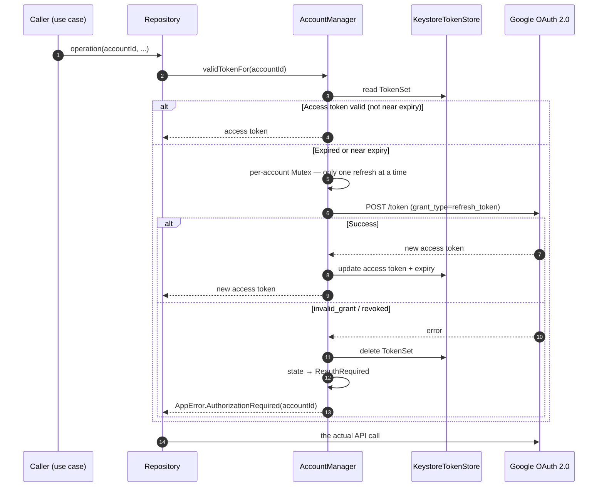

**Critical detail:** the refresh is guarded by a **per-account `Mutex`**. Unified search fans out across accounts; without this, five concurrent operations on one account would trigger five simultaneous refreshes, and the last write to the token store could overwrite a newer token with a stale one. This is a real failure mode, not a theoretical one.

### 8.3 Scopes

| Scope | Classification | Required for | Notes |
|---|---|---|---|
| `.../auth/drive.readonly` | **RESTRICTED** | List, search, metadata, thumbnails, download, open, `about.get` | Minimum for the core product (F-02, F-04) |
| `.../auth/drive` | **RESTRICTED** | Upload, rename, move, trash, create folder | Highest review burden. **Phase 0 must confirm whether it is granted.** |
| `email` (OIDC) | Non-sensitive | Account display identity | Exact scope string **REQUIRES VALIDATION** |
| `.../auth/drive.appdata` | Non-sensitive | *Nothing in MVP* | **Drop it.** Requesting unused scopes is a verification liability (F-08, F-16) |
| `.../auth/drive.install` | Non-sensitive | *Nothing in MVP* | Post-MVP consideration only |
| `.../auth/drive.file` | Non-sensitive | Fallback product only | Cannot deliver this product (F-01, F-05) |

**Scope policy, enforced in code:** the scope list is a single constant (`DriveScopes.kt`) with no conditional logic. It is compared in a test against the set submitted to Google. If Google forces a downgrade, the change is a deliberate, reviewed edit to one file — not an emergent behaviour.

### 8.4 Token storage

| Requirement | Implementation |
|---|---|
| Encryption at rest | AES-256-GCM via a key held in the Android Keystore. The key never leaves the Keystore. |
| Non-exportability | Keystore keys are non-exportable on devices with a secure lock. Behaviour without a secure lock must be detected and handled explicitly, not assumed. **REQUIRES VALIDATION** for the degraded mode. |
| No backup | The token store's data must be excluded from `android:allowBackup`, so an ADB backup cannot extract it. |
| Access pattern | Tokens are read into memory only for the duration of a request, then discarded. |
| Rotation | A refresh may return a new refresh token. The old one is overwritten atomically. |
| Deletion | `EncryptedSharedPreferences`-style deletion must be verified to actually remove the underlying key material. **REQUIRES VALIDATION** — deletion semantics differ across implementations. |

**Deliberate constraint:** a raw `EncryptedSharedPreferences` does not guarantee the underlying key material is irrecoverably deleted. For a product whose headline feature is multi-account Drive access, the disconnect guarantee (SEC-09) must be provable. **REPOSED ALTERNATIVE to evaluate:** store tokens in a Keystore-wrapped file, deleting both the ciphertext and its alias, and verify with an on-device test. Decide at Phase 17. (See ADR-04.)

### 8.5 Never

| Never | Why |
|---|---|
| Log an access token, refresh token, code, or ID token | Leakage to logs/crash reports/analytics is a Critical threat (PRD T-08) |
| Put a client secret in the APK | Trivially extractable; SEC-02 |
| Store a password | The app never has one. SEC-01 |
| Use the implicit or device flow | Deprecated; OA-01 |
| Retry a refresh in a loop | SM-1, SM-2 |
| Share one token across accounts | I-2 |
| Disable TLS verification, even in debug builds of release-shaped code | T-10. Debug builds may use a debug CA, never a trust-all TrustManager. |

---

## 9. Local Database

### 9.1 Entity relationship diagram

```mermaid
erDiagram
    CONNECTED_ACCOUNT ||--|| ACCOUNT_STATE : "has"
    CONNECTED_ACCOUNT ||--o{ TOKEN_SET : "rotates"
    CONNECTED_ACCOUNT ||--o{ FILE_METADATA : "owns (account-scoped)"
    CONNECTED_ACCOUNT ||--o{ PENDING_OPERATION : "queues"
    CONNECTED_ACCOUNT ||--o{ RECENT_FILE : "records"
    CONNECTED_ACCOUNT ||--o{ FAVORITE_FILE : "records"
    CONNECTED_ACCOUNT ||--o{ SYNC_STATE : "tracks"
    FILE_METADATA ||--o{ FILE_METADATA : "parent_of (account-scoped)"
    FILE_METADATA ||--o| SYNC_STATE : "has"

    CONNECTED_ACCOUNT {
        long localId PK
        string provider "GOOGLE_DRIVE"
        string providerAccountId "Google user id"
        string email
        string displayLabel "user-editable"
        string avatarUrl "nullable"
        long createdAt
        long updatedAt
        boolean isActive
    }
    ACCOUNT_STATE {
        long accountId PK_FK
        string state "Disconnected|Authorizing|Connected|ReauthRequired"
        string grantedScopes "space-separated"
        long lastSuccessAt "nullable"
        string lastErrorCode "nullable"
        long updatedAt
    }
    TOKEN_SET {
        long id PK
        long accountId FK
        string accessTokenCiphertext
        string refreshTokenCiphertext
        long accessTokenExpiresAt
        long updatedAt
    }
    FILE_METADATA {
        long localId PK
        string provider
        long accountId FK
        string fileId "provider file id"
        string name
        string mimeType
        long sizeBytes "nullable"
        string parentFileId "nullable"
        boolean isFolder
        long createdTime "nullable"
        long modifiedTime
        string webViewLink "nullable"
        string thumbnailLink "nullable"
        string capabilities "bitmask"
        boolean trashed
        boolean starred
        boolean ownedByMe
        string driveId "nullable"
        long fetchedAt
        string syncState
    }
    SYNC_STATE {
        long accountId FK
        string scopeKey "root|folder:<id>|query:<hash>"
        string pageToken "nullable"
        long lastSyncedAt
        boolean complete
    }
    PENDING_OPERATION {
        long id PK
        long accountId FK
        string type
        string sourceUri
        string targetFolderFileId "nullable"
        string state
        long bytesTransferred
        long totalBytes "nullable"
        string errorCode "nullable"
        long createdAt
    }
    RECENT_FILE {
        long accountId FK
        string fileId
        long lastAccessedAt
    }
    FAVORITE_FILE {
        long accountId FK
        string fileId
        long starredAt
    }
```

### 9.2 Entity specifications

| Entity | Primary key | Foreign keys | Indexes | Notes |
|---|---|---|---|---|
| `ConnectedAccount` | `localId` (autogenerate) | — | `provider` + `providerAccountId` (unique), `isActive` | `providerAccountId` uniqueness prevents duplicate connections of the same account |
| `AccountState` | `accountId` (= `ConnectedAccount.localId`) | `→ ConnectedAccount` (CASCADE) | — | One row per account. Deleting the account deletes the state |
| `TokenSet` | `id` | `→ ConnectedAccount` (CASCADE) | `accountId` | Ciphertext only. Modelled 1:* to allow rotation history during a write |
| `FileMetadata` | `localId` | `→ ConnectedAccount` (CASCADE) | **UNIQUE(`accountId`, `fileId`)**; `accountId, parentFileId, isFolder, modifiedTime`; `accountId, mimeType, modifiedTime`; `accountId, trashed`; `accountId, name`; `accountId, syncState` | The unique constraint on (`accountId`,`fileId`) is what makes FI-07 hold: the same provider file in two accounts is two rows, never merged. Every listing query is index-backed and account-scoped. |
| `SyncState` | composite (`accountId`, `scopeKey`) | `→ ConnectedAccount` (CASCADE) | `accountId, lastSyncedAt` | Page tokens are **advisory and volatile**; a stale token must be detected and the listing restarted, not trusted blindly |
| `PendingOperation` | `id` | `→ ConnectedAccount` (CASCADE) | `accountId, state`; `state` | Survives process death. Bounded: completed rows are pruned |
| `RecentFile` | composite (`accountId`, `fileId`) | `→ ConnectedAccount` (CASCADE) | `lastAccessedAt` | Bounded to a maximum count; pruned oldest-first |
| `FavoriteFile` | composite (`accountId`, `fileId`) | `→ ConnectedAccount` (CASCADE) | `starredAt` | P1 |

### 9.3 Why `FolderMetadata` is not a separate table

A folder is a `FileMetadata` row with `isFolder = true`. A separate table would duplicate every field, create a join on every listing, and add a synchronisation problem with no benefit. Rationale recorded so it is not re-litigated.

### 9.4 Migrations

| Rule | Detail |
|---|---|
| MIG-1 | No schema change ships without a `Migration` and a tested `MigrationTestHelper` case. |
| MIG-2 | Destructive migration is forbidden without an explicit product decision and a user-visible warning. `fallbackToDestructiveMigration()` is banned in release builds. |
| MIG-3 | Metadata is a cache. A migration that cannot preserve it must say so, and must not touch `ConnectedAccount` or `TokenSet` — losing a token forces an unnecessary re-authorization. |
| MIG-4 | Every migration is tested with data present, not just on an empty database. |
| MIG-5 | Schema version is asserted in a test against a constant, so an un-migrated entity fails CI rather than production. |

---

## 10. Backend Architecture

### 10.1 Does the MVP need a backend?

**Decision: a minimal backend is planned for, but its necessity is not yet established.** It is included because it is the conventional, provider-recommended way to protect an OAuth client secret, and because if one exists it must be designed for the security assessment anyway. If Phase 0 (Q-02) shows a client-only PKCE flow is fully supported, **the backend is deleted, not kept "just in case."**

| Capability | Backend needed? | Reasoning |
|---|---|---|
| OAuth code exchange | **Possibly** — Q-02 | Conventional practice protects the client secret server-side. If Google's installed-app flow accepts a bare client ID + PKCE, no backend is needed. |
| Token refresh | **Possibly** | Same reasoning. A device-held refresh token can be refreshed directly with a bare client ID under PKCE. |
| Multi-device sync | **No** | Not an MVP requirement. All state is device-local by design (MA-12). |
| User account / identity | **No** | Not an MVP requirement. Adding it multiplies the compliance surface. |
| Analytics ingestion | **No** | Use a privacy-reviewed third-party or a local-only implementation; no first-party pipeline is warranted at MVP scale. |
| Push notifications | **No** | Not an MVP requirement. |
| Server-side indexing | **No — explicitly rejected** | Would require uploading the user's file metadata to our servers, worsening the privacy story and the assessment burden, for no MVP benefit. |
| File proxying | **No — permanently rejected** | N-11. File bytes go device ↔ Google directly, always. |
| Crash reporting | **No** | Use a client-only SDK if one is approved. **REQUIRES VALIDATION** at Phase 17. |

### 10.2 Backend-light vs full backend

| Dimension | Backend-light (chosen) | Full backend |
|---|---|---|
| File data | Never touches a server | Would be proxied — rejected |
| Token custody | Device, or stateless pass-through | Server-held, encrypted — larger breach surface |
| User identity | None | Required |
| Search | Per-account, on device | Server-side index over user metadata |
| Offline | Fully available | Dependent on connectivity |
| Compliance surface | Minimal | Large: data protection, retention, deletion workflows, assessment |
| Operating cost | Near zero at MVP volume | Non-trivial |
| Fits a small team | Yes | No |

**Chosen: backend-light.** The only component is a stateless token-exchange endpoint, and only if Q-02 requires it.

### 10.3 If a backend is required — minimal design

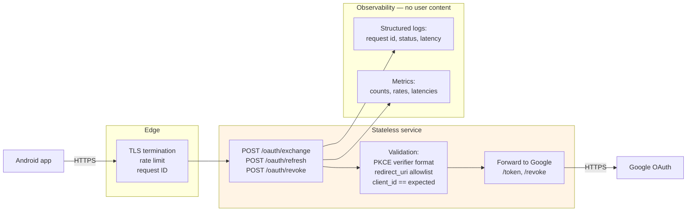

| Endpoint | Purpose | Auth | Validation | Rate limit |
|---|---|---|---|---|
| `POST /oauth/exchange` | Exchange an authorization code for tokens | None (the code + PKCE verifier is the proof) | `code_verifier` charset/length per RFC 7636; `redirect_uri` exact allowlist match; `client_id` exact match | Tight per-IP and global; this endpoint is a target for abuse |
| `POST /oauth/refresh` | Refresh an access token | The refresh token itself | Same | Tight |
| `POST /oauth/revoke` | Revoke a grant | The token | Same | Tight |

**Non-negotiable properties of this service:**

| # | Property |
|---|---|
| B-1 | **Stateless.** No database. No token persistence. Tokens are forwarded and returned, never stored. |
| B-2 | **No user file data, ever.** It cannot accept or emit file content. Enforced by content-type rejection. |
| B-3 | **No logging of request bodies, codes, verifiers, or tokens.** Log a request id, a status, a latency, and an error class. |
| B-4 | TLS only. HSTS. No CORS (there is no browser client). |
| B-5 | The `redirect_uri` allowlist is exact-match, not prefix-match. |
| B-6 | Rate limited aggressively. This endpoint can be used as a code-exchange oracle. |
| B-7 | Client secret lives only here, in a managed secret store, never in source, never in an image layer, never in an env file in the repo. |
| B-8 | Deployable as a single small instance or a serverless function. It is not a distributed system and must not become one. |
| B-9 | Health/metrics endpoints are authenticated or not publicly exposed. |
| B-10 | Region and retention documented for the privacy policy. If B-1 holds there is no user data to retain — say exactly that. |

### 10.4 If tokens must be stored server-side (the less-preferred path)

Only if Q-03 answers "yes, tokens must be stored". Then, in addition to B-1…B-10:

| # | Property |
|---|---|
| B-11 | Refresh tokens encrypted at rest with a KMS-managed key, envelope-encrypted. |
| B-12 | Per-user encryption context; the key never leaves the KMS. |
| B-13 | Every access logged with actor, action, target, and outcome. Access logs retained and reviewed. |
| B-14 | Explicit, bounded retention with automated expiry. |
| B-15 | A deletion path that provably removes ciphertext and key references, exposed to users. |
| B-16 | Read-only production access available to the third-party assessor, as Google's published process expects. |

**This path materially increases the security assessment tier and cost. Prefer B-1.**

---

---

## 11. API Architecture

### 11.1 Client → Google Drive API

This is the primary API surface. It is called **directly from the device**, with the user's own tokens, over TLS.

| Operation | Method / endpoint | Scope | Key parameters | Notes |
|---|---|---|---|---|
| List files | `GET /drive/v3/files` | `drive.readonly` | `q`, `pageSize`, `pageToken`, `orderBy`, `spaces`, `corpora`, `fields`, `includeItemsFromAllDrives` | `fields` is always restricted. `corpora`/`spaces` always explicit (F-11) |
| Get metadata | `GET /drive/v3/files/{fileId}` | `drive.readonly` | `fields`, `supportsAllDrives` | Request only needed fields |
| Get content | `GET /drive/v3/files/{fileId}?alt=media` | `drive.readonly` | `Range` header | Stream. Never buffer. |
| Search | `GET /drive/v3/files` with `q` | `drive.readonly` | `q` with `name contains` / `mimeType` / `modifiedTime` | Operator semantics **REQUIRES VALIDATION** (Q-06) |
| Account info | `GET /drive/v3/about?fields=user,storageQuota` | `drive.readonly` | `fields` | Per-account usage (ACC-11) |
| Create file | `POST /upload/drive/v3/files?uploadType=multipart\|resumable` | `drive` | metadata + media | **Requires `drive`** (Q-10) |
| Update | `PATCH /drive/v3/files/{fileId}` | `drive` | `addParents`, `removeParents`, `trashed`, `name` | Same-account only (N-05) |
| Delete permanently | `DELETE /drive/v3/files/{fileId}` | `drive` | — | **OUT OF SCOPE** (ACT-12) |
| Create permission | `POST /drive/v3/files/{fileId}/permissions` | `drive` | `role`, `type` | P2; **REQUIRES VALIDATION** |
| Revoke token | `POST /oauth2/v3/revoke` | — | `token` | Disconnect |

#### 11.1.1 `fields` policy

Every list and get request must name its fields explicitly. A representative list call:

```
GET https://www.googleapis.com/drive/v3/files
  ?q='<folderId>' in parents and trashed = false
  &orderBy=folder,modifiedTime desc
  &pageSize=100
  &spaces=drive
  &corpora=user
  &fields=nextPageToken,files(id,name,mimeType,size,modifiedTime,createdTime,
          thumbnailLink,webViewLink,parents,trashed,starred,ownedByMe,
          driveId,capabilities/canRename,capabilities/canTrash,
          capabilities/canDownload,capabilities/canShare)
  &supportsAllDrives=true
  &includeItemsFromAllDrives=true
Authorization: Bearer <access token for accountId>
```

Over-fetching `fields` costs latency and quota and, for restricted scopes, widens what the app touches. It is a policy violation, not an optimisation.

#### 11.1.2 `q` construction

`QueryBuilder` must escape user input. Drive query syntax treats `'` and `\` specially, and a naive interpolation of a user's search term can produce a malformed or unintended query. Escaping must be implemented once, in one place, and unit-tested with adversarial inputs including quotes, backslashes, and `%`.

#### 11.1.3 Error mapping

| HTTP | Meaning | Mapped `AppError` | Retry |
|---|---|---|---|
| 401 | Auth failed / token invalid | `AuthenticationError` → attempt refresh once, then `AuthorizationRequired` | Once |
| 403 (reason = `insufficientPermissions` / `userRateLimitExceeded` differs) | Read the `reason` field | `PermissionError` or `RateLimitError` | Never for permission; backoff for rate limit |
| 404 | Not found **or** not visible to this user | `FileNotFoundError` (with a hint that it may be a permission issue) | Never |
| 429 | Rate limited | `RateLimitError` | Bounded backoff with jitter, honouring retry guidance |
| 5xx | Provider failure | `ProviderUnavailableError` | Bounded backoff |
| Network / timeout | Transport | `NetworkError` | Bounded backoff, only if idempotent |

**The 403 ambiguity must be resolved by reading the provider's error reason, not by guessing.** Treating a rate limit as a permission error produces an unactionable message and destroys user trust.

### 11.2 Client → backend (only if Q-02 requires it)

See §10.3 for the three endpoints, their validation, and their non-negotiable properties. No other endpoint may be added without a documented need.

---

## 12. File Operations Flow

### 12.1 List files (unified, across accounts)

```mermaid
sequenceDiagram
    autonumber
    actor U as User
    participant VM as UnifiedFilesViewModel
    participant UC as ListFilesUseCase
    participant FR as FileRepository
    participant FM as Unifier
    participant DAO as FileDao
    participant QG as QuotaGovernor
    participant GDP as GoogleDriveProvider
    participant G as Google Drive (per account)

    U->>VM: open Unified Files
    VM->>UC: ListFiles(scope=Unified, filter, sort, page)
    UC->>FR: list(scope, refresh=IF_STALE)

    alt Cache is fresh
        FR->>DAO: query(account-scoped, indexed)
        DAO-->>FR: rows
        FR-->>UC: Page(rows, fromCache=true, age)
    else Cache stale or refresh requested
        FR->>QG: acquire(accountId) for each connected account
        par Fan-out in parallel, per-account error capture
            FR->>GDP: listFiles(accountId, query)
            GDP->>G: GET /files (accountId's token)
            G-->>GDP: page
            GDP-->>FR: Page<CloudFile> (each tagged accountId)
        and
            GDP->>G: GET /files (accountB's token)
            G-->>GDP: page or error
            GDP-->>FR: page, or AppError (accountB)
        end
        FR->>DAO: upsert per account, in a transaction per account
        FR->>FM: merge(pages, sort) → deterministic order
        FR-->>UC: Page(merged, fromCache=false) + per-account failures
    end

    UC-->>VM: ListFilesResult(files, perAccountFailures, dataAge)
    VM-->>U: Render with account badges; show partial-failure notice
```

**Key properties:** per-account parallelism with a global cap (QG); per-account error capture so one failure does not abort the fan-out; per-account transactions so one account's write does not roll back another's; deterministic merge order (see below).

### 12.2 Deterministic merge order

When merging pages from N accounts, the order must be stable and reproducible, otherwise pagination breaks (an item can appear on two pages or on none). **PROPOSED:** sort by the user's chosen key, then by a tiebreaker tuple `(chosenKey, modifiedTime, accountId, fileId)`. `accountId` and `fileId` are globally unique within the merge set, so the comparator is a total order and pagination is correct.

### 12.3 Open / preview a file

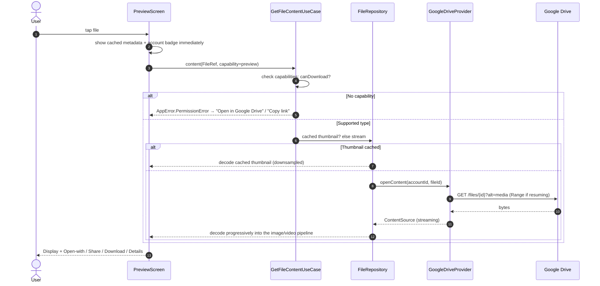

**Rules:** never `readBytes()` on a large file; decode at a size appropriate to the display size; a failed thumbnail falls back to a type icon, never a broken image; an unsupported type offers Open-with rather than an error.

### 12.4 Upload a file

```mermaid
sequenceDiagram
    autonumber
    actor U as User
    participant UI as UploadScreen
    participant UC as UploadFileUseCase
    participant TR as TransferRepository
    participant UE as UploadEngine
    participant GDP as GoogleDriveProvider
    participant G as Google Drive

    U->>UI: pick file (SAF / Photo Picker — no broad storage permission)
    UI->>UI: persistable URI permission taken
    U->>UI: choose destination account (REQUIRED)
    U->>UI: choose destination folder (account-scoped)
    U->>UI: Start
    UI->>UC: upload(accountId, sourceUri, targetFolderFileId)
    UC->>UC: verify capabilities: canUpload? else PermissionError
    UC->>TR: enqueue(PendingOperation)
    TR->>UE: start
    UE->>GDP: upload(accountId, request, progressSink)
    GDP->>G: POST /upload/drive/v3/files (accountId's token)
    G-->>GDP: progress → progressSink → UI
    alt Success
        G-->>GDP: file resource
        GDP-->>UE: CloudFile
        UE->>TR: mark Complete
        TR->>TR: upsert FileMetadata(accountId) — cache updated ONLY after provider confirmation
        UE-->>UI: Success + "View in folder"
    else Quota exceeded
        G-->>GDP: 403 insufficientStorage
        GDP-->>UE: AppError.StorageError
        UE-->>UI: "<Account> doesn't have enough space" + Choose another account
    else Network failure
        GDP-->>UE: AppError.NetworkError
        UE-->>UI: Retry / Cancel; local op state persists for retry
    end
    U->>UI: Cancel
    UI->>UE: cancel()
    UE->>UE: abort; report Cancelled (NOT success); note possible partial remote state
```

**Rules:** the destination account is mandatory — there is no implicit "current account"; success is reported only after the provider confirms; cancellation never reports success; the local cache is updated only after confirmation; a partial remote artefact from a cancelled resumable upload must be surfaced or cleaned up, not ignored (Q-09).

### 12.5 Download a file

```mermaid
sequenceDiagram
    autonumber
    actor U as User
    participant UI as DownloadSheet
    participant UC as DownloadFileUseCase
    participant DE as DownloadEngine
    participant DR as DestinationResolver
    participant GDP as GoogleDriveProvider
    participant G as Google Drive

    U->>UI: Download
    UI->>DR: resolve destination (SAF tree | app cache | Files)
    alt No room on device
        DR-->>UI: "Not enough space" with sizes + alternative destination
    end
    UI->>UC: download(FileRef, destination)
    UC->>DE: start
    DE->>GDP: openContent(accountId, fileId, range=resumePoint?)
    GDP->>G: GET /files/{id}?alt=media (+Range)
    G-->>GDP: bytes
    GDP-->>DE: ContentSource
    DE->>DE: write to destination file, report progress
    alt Complete
        DE->>DE: verify written length == expected (or Content-Length absent → verify readable)
        DE-->>UI: Success + saved location + Open-with
    else Interrupted
        DE->>DE: record resume point; do NOT present the partial file as complete
        DE-->>UI: "Stopped at n%" + Resume/Retry
    end
```

**Rules:** stream to a file, never to memory; verify completeness before reporting success; a partial file must be visibly partial; free space is checked before starting; the MIME type must be correct for Open-with.

### 12.6 Rename, move, trash, create folder

```mermaid
sequenceDiagram
    autonumber
    actor U as User
    participant UI as FileDetails
    participant UC as MutateFileUseCase
    participant FR as FileRepository
    participant GDP as GoogleDriveProvider
    participant G as Google Drive

    U->>UI: choose action
    UI->>UI: confirmation dialog naming FILE + ACCOUNT + ACTION
    U->>UI: confirm
    UI->>UC: rename/move/trash(FileRef, ...)
    UC->>UC: capability check; OFFLINE check → disable when offline (FI-03)
    UC->>FR: fresh provider confirmation first — never mutate from cache
    FR->>GDP: getFile(accountId, fileId, FRESH)
    GDP->>G: GET /files/{id}
    G-->>GDP: current state
    alt File gone or not visible
        GDP-->>FR: FileNotFoundError
        FR-->>UC: error → "This file no longer exists in <Account>"
    else Present
        FR->>GDP: update(accountId, fileId, patch)
        GDP->>G: PATCH /files/{id} (accountId's token)
        G-->>GDP: updated resource
        GDP-->>FR: CloudFile
        FR->>FR: update FileMetadata(accountId) after confirmation
        FR-->>UC: success
    end
```

**Move is same-account only.** A cross-account move would be a copy plus a delete, which N-05 forbids without explicit separate confirmation. The UI must not offer it.

### 12.7 Search

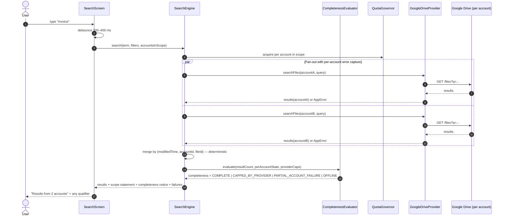

**The completeness notice is a requirement, not a nicety.** Presenting a capped or partial result set as if it were the whole answer causes the user to conclude a file does not exist. `CompletenessEvaluator` is a pure function and is unit-tested.

### 12.8 Refresh metadata

Pull-to-refresh or a consented scheduled worker: re-fetch the current scope's pages with `CACHE_IF_STALE` overridden to `FRESH`, upsert per account in a transaction, mark removed-but-present-in-cache files as `REMOVED` (never delete them silently — FI-04), and surface a summary ("12 updated, 2 no longer available").

---

## 13. Upload Architecture

| Concern | Decision | Rationale |
|---|---|---|
| Large files | Resumable upload where supported | A single multipart request cannot resume. **REQUIRES VALIDATION** (Q-09) |
| Process death | Persist `PendingOperation` before starting; resume or restart on next launch | WorkManager alone is not enough for an in-flight HTTP body |
| Network interruption | Bounded retry with backoff; on repeated failure, pause and surface | Never spin |
| Cancellation | `CoroutineScope` cancellation + HTTP call abort; mark `Cancelled`, never `Complete` | §12.4 |
| Duplicate names | Do not rename silently. Report Drive's actual behaviour | **REQUIRES VALIDATION** (Q-10). Silent renaming is a data-integrity hazard |
| Storage/quota errors | Map to `StorageError` and name the target account | ERR-09 |
| Token expiry mid-upload | One refresh attempt, then `AuthorizationRequired` for that account only | SM-2 |
| Progress | Real bytes from the request, not a timer-based simulation | PF-10 |
| Destination | Account + folder both explicit; no defaults | UPL-02, UPL-03 |
| Idempotency | On retry after an uncertain failure, re-check whether the file exists in the target folder before re-uploading, to avoid duplicates | Prevents a duplicate file from a "failed" upload that actually succeeded |

That last row is the most commonly missed upload defect: a network drop after the provider committed the file looks exactly like a failure. A retry then creates a second copy. The retry path must reconcile before it retries.

---

## 14. Download Architecture

| Concern | Decision |
|---|---|
| Streaming | `ContentSource` → `OutputStream` to a file. Never `readBytes()` |
| Resumption | Record bytes written; on retry send a `Range` header and append, after verifying the remote length |
| Progress | Real byte counts; p50/p95 measured, never asserted |
| Free space | Check available space against the content length before starting; if the length is unknown, require explicit confirmation and monitor |
| Cancellation | Abort; mark the destination file as incomplete and delete or clearly mark it |
| Verification | Compare written length to expected; if no length is available, verify the stream is readable to EOF |
| Destination | SAF tree URI (user-chosen), app cache (transient), or `FileProvider` (Open-with/Share) |
| Security | The downloaded file is opened via `FileProvider` with a narrow, temporary grant — never `file://` URIs, never a world-readable path |
| Offline | Blocked with an explanation; no fabricated behaviour |
| Content-type | Preserve the provider MIME type for Open-with correctness |

---

## 15. Search Architecture

| Concern | Decision |
|---|---|
| Local search | Room `LIKE`/FTS over cached metadata for instant results while offline. **Explicitly labelled as cached and possibly incomplete** |
| Provider search | Per account, via `files.list` with `q` |
| Unified search | Per-account fan-out in parallel under `QuotaGovernor`, then merge |
| Debounce | 300–400 ms, tunable, and cancelled on new input |
| Pagination | Per-account page tokens; the merged view is a merge of the first N per account. **This means global pagination across accounts is approximate** — disclose it |
| Deduplication | **Do not deduplicate across accounts.** The same-named file in two accounts is two distinct files (FI-07). Deduplicate only exact (`accountId`, `fileId`) duplicates from pagination overlap |
| Freshness | Provider results are fresh; local results carry an age label |
| Quota | Bounded pages, strict `fields`, no polling, global concurrency cap |
| Failure | Per-account error capture → partial results + a notice naming the failing accounts |
| Completeness | `CompletenessEvaluator` produces a `Completeness` value that the UI must render. Never present `CAPPED_BY_PROVIDER` or `PARTIAL` as complete |
| Escaping | All user input escaped in one place, adversarially unit-tested |

**Honest limitation, stated in the UI:** global pagination across multiple accounts is an approximation because each provider pages independently. The UI says which accounts were searched and how many results came back, and offers refinement rather than implying an exhaustive, globally-ordered result set.

---

## 16. Gallery Architecture

| Concern | Decision |
|---|---|
| Grid | `LazyVerticalGrid` with a stable key (`accountId` + `fileId`), so recycling never mixes accounts |
| Thumbnails | Requested at the display size, not full resolution. Coil with a bounded memory cache and a bounded disk cache |
| Off-screen items | Never decoded at full resolution. `LazyVerticalGrid` only composes visible items |
| Pagination | Paged by the same bounded mechanism as the file browser |
| Memory | Bounded image cache sized from the device's memory class; `onTrimMemory` evicts; decoding uses `inSampleSize`/downsampling |
| Lifecycle-aware | Requests cancelled when a cell leaves the composition |
| Full-screen | Decode at screen resolution, not original. For very large images, a downscaled preview with an explicit "view full resolution" action that streams |
| Video | Stream to a temp file, then play via the platform player. Handle unsupported codecs with a clear message and an Open-with fallback |
| Account badge | Rendered inside each cell, from `accountId`; never inferred from position |
| Date grouping | Section headers keyed by date, computed from the page |
| Selection mode | Grouped by account in the action bar when a selection spans accounts; destructive actions name the accounts |
| Failure isolation | One failed thumbnail falls back to a type icon; it does not fail the grid |
| OOM avoidance | Explicit test: scroll 10,000 items without an OOM (PF-12) |

---

## 17. Android System Integration

### 17.1 What we implement

| Capability | Implementation | Notes |
|---|---|---|
| Expose cloud files to the system picker | `UnifiedDocumentsProvider : DocumentsProvider` | F-17, F-18 |
| Open a device file for upload | `ACTION_OPEN_DOCUMENT` / `ACTION_OPEN_DOCUMENT_TREE` / Photo Picker | F-21, F-22. **No broad storage permission** |
| Choose an export destination | `ACTION_CREATE_DOCUMENT` | |
| Open a downloaded file elsewhere | `ACTION_VIEW` + `FileProvider` | Narrow, temporary grants |
| Share a file | `ACTION_SEND` + `FileProvider` | |
| Receive a file from another app | `ACTION_SEND` / `ACTION_VIEW` handling | Validate all extras; never trust a caller-supplied account id |
| Direct the user to enable the provider | Settings deep link + in-app guidance | The user must do this themselves (PL-03) |

### 17.2 Document provider design

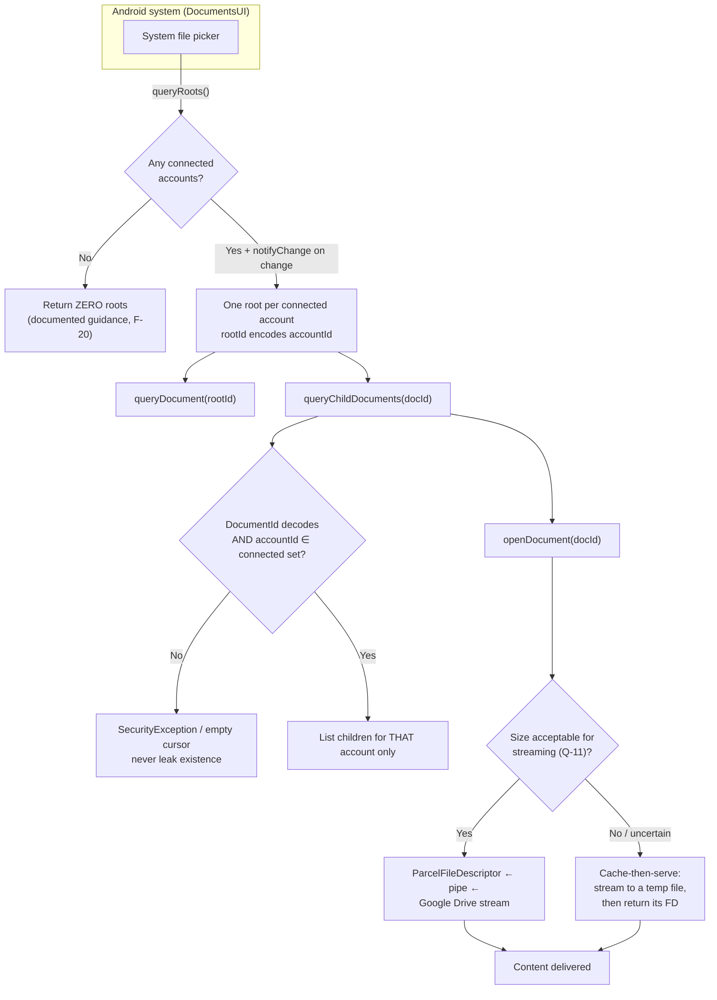

**Document ID scheme.** A document URI must encode `(accountId, fileId)`. Both are opaque to the system, so the encoding must be unambiguous and non-guessable-by-accident:

```
authority = "${applicationId}.documents"
root/{accountIdBase64Url}
document/{accountIdBase64Url}/{fileIdBase64Url}
```

| Requirement | Detail |
|---|---|
| DP-1 | `queryRoots` returns one root per connected account; **zero roots when none are connected** (F-20) |
| DP-2 | `notifyChange` is called when the connected-account set changes, so the picker re-queries |
| DP-3 | Every `documentId` is decoded and its `accountId` checked against the connected set **before** any provider call. A mismatch is refused (AC-12.5) |
| DP-4 | A disconnected account's root and documents vanish immediately (AC-12.3) |
| DP-5 | `isChildDocument` must **not** make network calls (F-25). It answers from the local cache only, and returns a conservative `false` when unknown |
| DP-6 | `openDocument` streams. For large files, the cache-then-serve path is used pending Q-11 |
| DP-7 | `queryChildDocuments` uses the local metadata cache for speed, with the staleness state exposed via `COLUMN_*` where the contract allows |
| DP-8 | `COLUMN_FLAGS` advertises only genuinely supported operations (F-23) |
| DP-9 | The provider is protected by `MANAGE_DOCUMENTS`, which only the system can hold (F-19) |
| DP-10 | **No `ACTION_GET_CONTENT` intent filter**, to avoid a duplicate picker entry (F-24) |
| DP-11 | Read and write modes: write is supported only where a capability check passes, and `createDocument` is implemented only for accounts with `canCreateFile` |
| DP-12 | Nothing is exposed while the app has no connected accounts, even if a cache exists |

### 17.3 What Android controls, and what the user must do

| Fact | Consequence for our design |
|---|---|
| Only the system can hold `MANAGE_DOCUMENTS` (F-19) | We cannot shortcut the user selection. Correct and desirable. |
| The user must enable the provider in settings (PL-03) | In-app guidance + a settings deep link. Cannot be automated. |
| Only SAF-aware apps see our provider (PL-02) | We must not claim universal visibility. Store listing and onboarding must be honest. |
| DocumentsUI has timeouts | Provider operations must be fast and must degrade to partial/empty rather than hang |
| `ACTION_OPEN_DOCUMENT_TREE` is restricted on Android 11+ (F-21) | Import flows must handle refusal gracefully |

### 17.4 What requires testing

Recorded in full in PRD §8.4 and `Phases.md` Phase 15. The two that most affect design: whether `openDocument` streaming survives large remote files (Q-11), and provider visibility across OEMs.

### 17.5 What we explicitly do **not** claim

- That the app becomes the system file manager. It does not (PL-01).
- That every app can select our files. Only SAF-aware apps can (PL-02).
- That we can read other providers' files. We cannot (PL-01).
- That we can appear without the user enabling the provider. We cannot (PL-03).

---

## 18. Background Tasks

WorkManager is the only permitted mechanism. No `AlarmManager`, no raw `JobScheduler`, no unbounded coroutines on `Dispatchers.IO` pretending to be background work.

| Worker | Trigger | Constraints | Work | Does NOT do |
|---|---|---|---|---|
| `MetadataRefreshWorker` | User pull-to-refresh, or the consented periodic schedule | Network connected; battery not low | Re-fetch the user's visible scopes | Never runs if background refresh is off (IDX-04) |
| `ThumbnailRefreshWorker` | After a metadata refresh | Network connected; battery not low; storage not low | Refresh the thumbnail cache within a byte budget | Never downloads file content |
| `UploadWorker` | A queued `PendingOperation` | Network connected; unmetered for large files | Execute or resume an upload | Never upload without an explicit account + folder chosen by the user |
| `DownloadWorker` | A user-initiated download that the user chose to continue | Network connected | Stream to the chosen destination | Never download content in the background on the user's behalf |
| `CacheMaintenanceWorker` | Periodic, low priority | Battery not low; storage not low | Enforce cache size limits, prune old recents/history, delete orphaned temp files | Never delete tokens or account records |
| `TokenMaintenanceWorker` | On app foreground | None | Check for near-expiry tokens and pre-refresh if beneficial; detect revoked accounts | Never refresh in a tight loop |

| Rule | Detail |
|---|---|
| BG-1 | No polling. Every worker is user-initiated, event-driven, or on an explicitly consented schedule. |
| BG-2 | **No background content download**, ever, by default (SY-06). |
| BG-3 | Every worker declares its constraints. Work that must not happen on metered or low-battery devices says so. |
| BG-4 | Every worker is idempotent and safe to re-run. WorkManager may run it again after a failure or a reboot. |
| BG-5 | Workers are namespaced by `accountId` so that disconnecting an account cancels only its work. |
| BG-6 | A worker never writes to the UI. It updates the database and posts a notification where the user should know. |
| BG-7 | WorkManager's default backoff and constraints are used rather than custom retry loops. |
| BG-8 | Foreground-service promotion is used only for a user-initiated transfer the user is actively watching, and only for as long as it is active. |

**Note on upload continuation:** WorkManager cannot resume an in-flight HTTP request body. A resumable upload that is interrupted by process death must be restarted or continued from a session URI, which depends on Q-09. Until that is answered, uploads are foreground-bound and the UI says so honestly rather than promising background continuation.

---

## 19. Caching

| Cache | Location | Size bound | Invalidation | Expiry | Offline behaviour |
|---|---|---|---|---|---|
| File metadata | Room | Row-count and byte bound, configurable | Provider mutation, manual refresh, disconnect, clear | Soft TTL for the "fresh" label; hard TTL for eviction (**both REQUIRES VALIDATION**) | Read-only, age-labelled |
| Thumbnails | Disk cache dir | Hard byte bound, LRU | LRU, size enforcement, clear cache | Implicit via LRU | Visible and labelled |
| Temporary downloads | Cache dir | Freed on operation end | Deleted after use unless the user chose a persistent destination | Short | Only if the operation completed; a partial is not presented as complete |
| Upload queue | Room `PendingOperation` | Bounded; completed rows pruned | On completion or cancellation | Bounded by age | **Not executable offline** — the UI says so |
| Search results | Memory only | Bounded | On new query, on app background | Session | **Not shown as authoritative offline**; labelled as cached |
| Token store | Keystore-backed | n/a | On refresh, on disconnect | n/a | Available offline; operations requiring the network are blocked with a reason |

### 19.1 Cache rules

| Rule | Detail |
|---|---|
| C-1 | Cache only what is necessary. Metadata and thumbnails, not content. |
| C-2 | Every cache entry is bounded and evictable. There is no unbounded growth path. |
| C-3 | Every cache key includes `accountId` (invariant I-5). |
| C-4 | Invalidation order on a provider mutation: **provider operation → provider confirmation → cache update.** Never the reverse. |
| C-5 | Cache invalidation on disconnect is complete and verified by test. |
| C-6 | The user can view the cache size and clear any of it from Settings. |
| C-7 | Cached data is never presented as live data without a qualifier. This is a trust requirement, not a formatting preference. |
| C-8 | Thumbnails are treated as ephemeral. `thumbnailLink` lifetime is **REQUIRES VALIDATION** (Q-07); a stale link must produce a type-icon fallback, never an error. |

---

## 20. Security Architecture

### 20.1 Defence layers

```mermaid
flowchart TB
    subgraph L1["1 · Build and supply chain"]
        A1["Dependency verification / lockfiles"]
        A2["Static analysis in CI"]
        A3["APK secret scan: no client secret, no token"]
        A4["Release builds strip debug logs"]
    end
    subgraph L2["2 · Device at rest"]
        B1["Keystore-backed encrypted token store"]
        B2["noBackup: token store excluded from backup"]
        B3["Room holds no tokens; metadata is cache only"]
        B4["Screenshots: FLAG_SECURE where validated"]
    end
    subgraph L3["3 · In transit"]
        C1["TLS everywhere; platform-trusted CAs"]
        C2["No custom TrustManager, ever"]
        C3["Optional pinning: Google hosts only, with a rotation owner"]
        C4["Backend: exact redirect_uri allowlist; rate limited"]
    end
    subgraph L4["4 · Application logic"]
        D1["Explicit accountId on every provider call"]
        D2["Capability checks before any action is offered"]
        D3["Provider confirmation before any mutation"]
        D4["Deep links authenticated; opaque ids only"]
        D5["DocumentId validated against the account context"]
    end
    subgraph L5["5 · Observability"]
        E1["Redacting logger with a prohibited-properties list"]
        E2["No file names, queries, or identifiers in analytics"]
        E3["CI test fails the build if a token pattern reaches a log"]
        E4["Crash reports scrubbed"]
    end
    L1 --> L2 --> L3 --> L4 --> L5
```

### 20.2 Keystore usage

| Property | Decision |
|---|---|
| Key type | AES-256-GCM, non-exportable, generated in the Android Keystore |
| Use | Encrypts the token blob at rest. The key itself never leaves the Keystore |
| Authentication | Not bound to user presence by default — a biometric gate on every file operation would be hostile UX. **REQUIRES VALIDATION** as a P2 opt-in for a "private mode" |
| Degraded mode | Devices without a secure lock have weaker guarantees. Detect explicitly and disclose in Privacy & Security rather than silently pretending |
| Deletion | Delete the ciphertext **and** its key alias. Verify with an on-device test. See §8.4 and ADR-04 |

### 20.3 Disconnect: the complete sequence

Disconnect is a security operation. A partial implementation is a privacy defect (MA-07, SEC-09).

| Step | Action | Failure handling |
|---|---|---|
| 1 | Cancel all WorkManager jobs tagged with this `accountId` | Log; continue |
| 2 | Revoke the grant at Google (best effort) | If it fails, tell the user explicitly: "Removed from this app, but the grant may still be listed in your Google Account. Revoke it at accounts.google.com." **Do not report success silently.** |
| 3 | Delete the `TokenSet` and its key alias | Must be verified, not assumed (§8.4) |
| 4 | Delete all `FileMetadata` for the account (cascade) | Transactional |
| 5 | Delete cached thumbnails derivable from that account | Best effort; the cache is byte-bounded anyway |
| 6 | Delete `RecentFile`, `FavoriteFile`, `SyncState`, `PendingOperation` (cascade) | Transactional |
| 7 | Remove the provider root; `notifyChange` | Mandatory (F-20) |
| 8 | Remove any persisted deep-link state for that account | |
| 9 | Tell the user what happened, in plain words | Includes step 2's caveat if applicable |

### 20.4 Input validation

| Input | Source | Validation |
|---|---|---|
| Search terms | User | Escaped once, in `QueryBuilder`, adversarially unit-tested |
| Deep-link parameters | Intent | Authenticated; opaque ids only; every parameter validated; no tokens, no paths |
| Document ids | DocumentsUI | Decoded, account membership checked (DP-3) |
| File names on rename | User | Length limit, no path separators, no control characters — validated against what Drive accepts (**REQUIRES VALIDATION**, Q-10) |
| Destination URIs | SAF | Validated to be a persisted, user-granted URI from this app |
| Intent extras from other apps | Other apps | Treated as untrusted; never used to select an account |

### 20.5 Threat model summary

Full register in PRD §22. Architectural responses to the Critical and High items:

| Threat | Architectural response |
|---|---|
| T-01 Stolen token | Keystore; no logging; no backup; revocation on disconnect; short-lived access tokens |
| T-03 Cross-account contamination | Invariants I-1…I-8; `accountId` required everywhere; mandatory CI test matrix |
| T-04 Unauthorized file access | Least-privilege scopes; no enumeration; provider is the enforcement point; capabilities derived from the provider, never assumed |
| T-05 Wrong-target destruction | Provider confirmation before mutation; FI-03; offline disables mutation |
| T-06 Document provider abuse | `MANAGE_DOCUMENTS`; DP-3 account validation; roots dropped on disconnect |
| T-08 Token leakage in logs | Redacting logger; CI log-scan test; release log stripping; analytics allow-list |
| T-09 Backend token exposure | Stateless backend (B-1); no token persistence preferred; assessor-ready configuration |
| T-10 TLS bypass | No custom `TrustManager`; CI check for `X509TrustManager`/`HostnameVerifier` implementations outside approved locations |
| T-14 Policy violation | Phase 0 gate; no prohibited claims; accurate store listing; compliance review |
| T-16 Backup extraction | `allowBackup=false` or an explicit exclusion for token-bearing storage |

---

## 21. Error Architecture

### 21.1 The taxonomy

Every provider, transport, and platform failure is normalised into exactly one of these. Raw exceptions never reach the presentation layer.

```kotlin
sealed interface AppError {
    // --- Auth ---
    data class AuthenticationFailed(val accountId: LocalAccountId) : AppError
    data class AuthorizationRequired(val accountId: LocalAccountId) : AppError
    data class PermissionDenied(val reason: PermissionReason) : AppError

    // --- Transport ---
    data class NetworkUnavailable(val cause: TransportCause) : AppError
    data class Timeout(val operation: String) : AppError
    data class RateLimited(val retryAfterMillis: Long?) : AppError

    // --- Provider ---
    data class ProviderUnavailable(val statusCode: Int) : AppError
    data class ProviderError(val statusCode: Int, val reason: String?) : AppError

    // --- Content ---
    data class FileNotFound(val ref: FileRef) : AppError
    data class UnsupportedFileType(val mimeType: String) : AppError
    data class FileTooLarge(val sizeBytes: Long, val limitBytes: Long) : AppError

    // --- Storage ---
    data class InsufficientDeviceStorage(val required: Long?, val available: Long) : AppError
    data class ProviderQuotaExhausted(val accountId: LocalAccountId) : AppError

    // --- Local ---
    data class CacheMiss(val ref: FileRef) : AppError
    data class IntegrityFailure(val detail: String) : AppError

    // --- Lifecycle ---
    data object Cancelled : AppError
    data class Unknown(val correlationId: String, val original: Throwable) : AppError
}
```

`Cancelled` is a **first-class member**, not an exception. This is what prevents the common defect of showing an error after the user deliberately cancelled (EH-07).

### 21.2 Three separate presentations

| Layer | Contains | Rule |
|---|---|---|
| **User message** | Plain language, a recovery action, no internals | Defined per `AppError` in one place, so wording is consistent everywhere |
| **Developer log** | Error class, operation, `accountId`, status code, latency, correlation id, safe ids | Structured; redacted; never a stack trace to the user |
| **Analytics** | Enumerated `error_code` from the PRD §19 catalogue only | No free text, no ids |

**One `AppError` value, three renderings.** Copy lives in one mapping, not scattered through the UI, so the same error never reads differently on two screens.

### 21.3 Retry policy

| Error class | Retryable | Policy |
|---|---|---|
| `NetworkUnavailable`, `Timeout` | Yes, if idempotent | Bounded exponential backoff with jitter |
| `RateLimited` | Yes | Honour retry guidance; cap the attempt count; then surface |
| `ProviderUnavailable` | Yes, if idempotent | Bounded backoff |
| `AuthenticationFailed` | Once | Exactly one refresh attempt, then `AuthorizationRequired` |
| `AuthorizationRequired` | **No** | User action required (SM-2) |
| `PermissionDenied` | **No** | No blind retry ever |
| `FileNotFound` | **No** | Surface and mark removed |
| `InsufficientDeviceStorage` | **No** | User must act |
| `ProviderQuotaExhausted` | **No** | User must act |
| `UnsupportedFileType`, `FileTooLarge` | **No** | Offer an alternative path |
| `Cancelled` | **No** | Not an error |
| `IntegrityFailure` | **No** | Escalate; never paper over |

**Non-idempotent operations (upload, rename, move, trash, create folder) are never retried automatically.** Retry is user-initiated, and an upload retry reconciles first (§13).

---

## 22. Observability

### 22.1 Structured logging

Every log line is a structured event, not a free-text string:

```
event=provider.list.completed
accountId_hash=7f3a…        // non-reversible short hash, for correlation
provider=GOOGLE_DRIVE
pageSize=100
resultCount=100
latencyMs=412
outcome=success
```

| Rule | Detail |
|---|---|
| O-1 | Structured fields only. No string concatenation of variable data into a message. |
| O-2 | Accounts are identified by a short non-reversible hash, so logs can be correlated without carrying an email address |
| O-3 | File identity is logged as a short hash of `(accountId, fileId)` — never the file name |
| O-4 | Every error carries a `correlationId` that the user can quote in a support request |
| O-5 | Log levels: DEBUG (development only), INFO (lifecycle), WARN (recoverable degradation), ERROR (operation failed) |
| O-6 | Debug logging is compiled out of release builds via a BuildConfig flag checked in CI |
| O-7 | No stack trace is ever rendered to a user |

### 22.2 Prohibited in all telemetry

| Never logged | Never in analytics | Never in crash reports |
|---|---|---|
| Access tokens, refresh tokens, authorization codes, ID tokens | File names, file paths | File names, file paths |
| Passwords (the app has none) | Search queries or terms | Search queries or terms |
| File contents, ever | Account emails or account ids | Account emails |
| `thumbnailLink` / `webViewLink` values (may embed identifiers) | Provider file ids | `thumbnailLink` values |
| Authorization codes in a redirect URI | Any user-entered text | Any user-entered text |

`thumbnailLink` and `webViewLink` deserve emphasis: they are bearer-adjacent URLs. A `thumbnailLink` grants read access to that file's thumbnail to anyone holding it. Logging it is equivalent to logging a credential. **REQUIRES VALIDATION** on link lifetime (Q-07) does not change this rule.

### 22.3 Crash reporting

| Rule | Detail |
|---|---|
| CR-1 | **REQUIRES VALIDATION** before any crash-reporting SDK is added (Phase 17). The default is none. |
| CR-2 | If added, the SDK must be configured to exclude the fields in §22.2, and its actual outbound payload must be inspected in testing to confirm the configuration worked |
| CR-3 | Custom keys are restricted to enumerated error codes and non-reversible hashes |
| CR-4 | The user can disable crash reporting, and the privacy policy must say so |

### 22.4 Metrics

| Metric | Type | Purpose |
|---|---|---|
| Provider request rate, by operation and account count | Counter | Quota headroom (M-19) |
| Provider latency p50/p95/p99, by operation | Histogram | PF targets validated against reality |
| Error rate by `error_code` | Counter | Regression detection (M-20) |
| Rate-limit events | Counter | Quota pressure early warning |
| Token refresh success/failure rate | Counter | OAuth health |
| Upload/download success, duration, bytes | Histogram | M-11, M-12 |
| Cache hit rate | Ratio | Cache policy tuning |
| Room query latency p95 | Histogram | PF-14 |
| Main-thread frame misses during gallery scroll | Histogram | PF-13 |
| Crash-free sessions | Ratio | M-14 |

**These metrics are aggregate and contain no user content.** They are the primary way the PF targets in PRD §17 get replaced with measured numbers.

---

## 23. Testing Architecture

### 23.1 Test pyramid

| Layer | Scope | Tooling | Runs on |
|---|---|---|---|
| **Unit** | Domain use cases, `Unifier`, `QueryBuilder`, `CompletenessEvaluator`, `AppError` mapping, `Redaction`, `DocumentIdCodec`, sort comparators | JUnit + kotlinx-coroutines-test | Every commit |
| **Property** | Sort determinism, merge stability across pagination, `q` escaping against adversarial input, `AppError` exhaustiveness | JUnit + property-based assertions | Every commit |
| **Repository** | `FileRepository`, `AccountRepository` against an in-memory Room DB and `FakeCloudProvider` | Room in-memory + fakes | Every commit |
| **Provider** | `GoogleDriveProvider` against recorded/sanitised responses and scripted failures; never the live API in CI | MockWebServer-style interception | Every commit |
| **OAuth** | Token state machine across every transition; refresh mutual exclusion; `invalid_grant` handling; cancellation | Fakes | Every commit |
| **Multi-account isolation** | **The mandatory matrix below** | Fakes + in-memory DB | Every commit — **a failure blocks the build** |
| **Database** | DAO queries against realistic data volumes; every migration with data present | Room + `MigrationTestHelper` | Every commit |
| **UI / Compose** | Every screen's loading, empty, error, offline, stale, and permission states; accessibility semantics | Compose UI test | Every commit |
| **Integration** | OAuth + listing + search + upload + download against **real Google accounts** on a device | Manual + instrumented | Before each phase gate; pre-release |
| **Security** | Log scanning; APK secret scan; `TrustManager`/deep-link audit; document-provider ID validation | CI + on-device | Every commit |
| **Performance** | Gallery scroll over 10k items; cold start; search latency; memory ceiling | Instrumented, on low/mid-range hardware | Phase 18 and pre-release |

### 23.2 Mandatory multi-account isolation matrix

**This is the most important test suite in the project.** It is executed in CI and a failure blocks the build (`Rules.md` §26).

| # | Scenario | Assertion |
|---|---|---|
| M1 | Two accounts, each with distinct files | `listFiles(A)` returns only A's files; `listFiles(B)` only B's |
| M2 | Five accounts | Every one lists only its own files; the merged unified view contains all five, correctly attributed |
| M3 | Same file name in A and B | Two distinct rows; each carries the correct `accountId`; neither is merged |
| M4 | Same provider `fileId` presented for two accounts (simulated) | Two distinct rows; never merged (FI-07) |
| M5 | Disconnect A, then list | A returns nothing; no A rows in any cache, recent, favourite, or search result; B unaffected |
| M6 | Disconnect A, then search unified | Only B's results; A contributes nothing |
| M7 | A's token fails (`invalid_grant`) | A → `AuthorizationRequired`; B continues fully; A's failure never propagates to B |
| M8 | A's token fails during unified search | B's results still returned; a partial-failure notice names A |
| M9 | Concurrent operations across A and B | Each request carries the correct token. Verified by asserting the auth header per request, not by outcome |
| M10 | Concurrent operations **within** A (e.g. unified search + a manual refresh) | Exactly one token refresh occurs (per-account mutex) |
| M11 | Disconnect A while an A operation is in flight | The operation is cancelled; no post-disconnect write to A's data; B unaffected |
| M12 | Document provider: document id for A, requested while A is disconnected | Refused; nothing about A is exposed |
| M13 | Document provider: document id for A presented with a claimed account of B | Refused (AC-12.5) |
| M14 | Cache: write a row for A, query the cache for B | No A row returned (AC-03.4) |
| M15 | Upload to A, verify the request's auth header | Carries A's token |
| M16 | Rename in A while B has a file with the same name | Only A's file is modified |

M9, M10, and M16 are the ones most likely to be skipped and most likely to hide a real defect. They assert on the **request that was made**, not on the visible outcome, because a correct outcome can be produced by an incorrect request when only one account is involved.

### 23.3 Other required test cases

| Area | Cases |
|---|---|
| OAuth | Cancel; deny; `invalid_grant`; revoked externally; refresh near expiry; refresh concurrent; process death mid-flow; state-parameter mismatch rejected; PKCE verifier mismatch rejected |
| Database | Insert/update/delete; account-scoped queries at 50k rows; every migration with data present; cascade delete on disconnect; unique-constraint conflict on (`accountId`,`fileId`) |
| Upload | Success; cancel mid-flight; network loss; retry after an uncertain failure (must reconcile, not duplicate); quota exhausted; token expiry mid-upload; duplicate name (per Q-10); zero-byte file; very large file |
| Download | Success; insufficient storage; interrupted + `Range` resume; wrong `Content-Length`; token expiry; unsupported type; Open-with MIME correctness |
| Search | Debounce collapses rapid input; per-account fan-out; one account fails; result cap reached; empty result; `q` escaping with quotes/backslashes/`%`; determinism across identical repeated queries |
| Preview | Supported image; large image downsampling; video with an unsupported codec; Google-native doc (link fallback); not permitted; not found; offline with no cached content |
| Offline | Cold start offline; browse cached; search shows cached-only and labels it; mutations disabled; upload/download blocked with a reason |
| Gallery | 10k-item scroll with no OOM; thumbnail failure → type icon; selection across accounts; account badge present on every cell |
| Error handling | Every `AppError` renders a user message and a recovery action; `Cancelled` renders nothing; no stack trace reaches the UI; `403` ambiguity resolved by reason |
| Security | Token pattern never reaches a log; no client secret in the APK; no custom `TrustManager`; deep-link params validated; document-id account validation; backup exclusion for the token store |
| Accessibility | TalkBack on every screen; font scale 200%; contrast in both themes; touch targets ≥ 48 dp; no colour-only information |

---

## 24. Scalability

### 24.1 Growth dimensions

| Dimension | Scaling approach | Limit |
|---|---|---|
| **More connected accounts** | Already fan-out per account. The `QuotaGovernor` global cap and the max-account limit (5) bound the blast radius | 5 (configurable) |
| **More files per account** | Pagination everywhere; the local index is queried per page, never loaded whole. `listFiles` never requests an unbounded result | Bounded by page size |
| **Larger metadata sets** | Composite indexes designed for the actual access patterns (`accountId` + `parentFileId` + `isFolder` + `modifiedTime`; `accountId` + `mimeType` + `modifiedTime`). Tested at 50k rows | 50k rows per account tested |
| **More API requests** | `fields` restriction, bounded pages, debounce, no polling, parallel-with-cap fan-out, a local cache that answers repeat queries | Quota-governed; alerts at a defined fraction of the real quota |
| **More users** | There is no server-side per-user state (MA-12), so users do not contend for anything. Backend, if it exists, is stateless and scales horizontally by construction | Stateless |
| **More providers** | `ProviderRegistry` plus one directory per provider. The domain, database, and UI are unchanged | Unlimited in principle, one at a time in practice |

### 24.2 Scale limits that are real and accepted

| Limit | Consequence | Accepted because |
|---|---|---|
| Global pagination across accounts is approximate | Users refine rather than paging exhaustively | Disclosed in the UI (SRCH-09); a globally-ordered merge across independently paged providers is not achievable |
| The local index is a cache, not a mirror | Some views require a network round trip | A full mirror would mean downloading the user's entire file library's metadata — a privacy and quota cost the product should not pay |
| Unified listing memory | Bounded by page size | A paged list is the correct design regardless |
| Background work | Bounded by WorkManager constraints and user opt-in | Battery and data are the user's |

### 24.3 What is deliberately not built

Microservices, Kubernetes, event-driven infrastructure, a message bus, a service mesh, a distributed cache, server-side search. **None of these has a driver in this product.** The only server-side component is a stateless token-exchange endpoint, and the most likely end state is that even that is deleted (Q-02). `Rules.md` §34.

---

## 25. Cost Architecture

### 25.1 Cost drivers

| Driver | MVP cost | Notes |
|---|---|---|
| Backend compute | Near zero, or zero | A single small instance or a serverless function serving one endpoint. Free tiers likely suffice at MVP volume |
| Backend database | **Zero** | The backend is stateless by design (B-1). No database is provisioned |
| Backend storage | **Zero** | No file data, no token storage |
| Bandwidth (backend) | Negligible | Authorization codes and tokens are a few kilobytes. **File bytes never pass through the backend** |
| Bandwidth (device → Google) | borne by the user | This is the correct outcome: the app does not pay to move the user's files |
| Authentication | Google's OAuth | No fee |
| Analytics | Free tier or zero | Until volume justifies otherwise |
| Crash reporting | Free tier or zero | **Pending Phase 17** |
| Logging / monitoring | Free tier or zero | Aggregate metrics only |
| CDN | **Never** | No public content is served |
| CI/CD | Free tier on a public repository | |
| **External, non-infrastructure** | | |
| Google OAuth verification | Time, no fee | ~6 weeks for restricted-scope verification |
| **CASA security assessment** | **Potentially significant** | Billed by a Google-empanelled third-party assessor. **REQUIRES VALIDATION** (Q-03, R-02). This is the project's largest external cost and the reason the client-only design is strongly preferred |
| Google Cloud project | Free tier | Quotas and monitoring |

### 25.2 Cost principles

| # | Principle |
|---|---|
| C-1 | Never proxy a user's file through infrastructure we pay for. It costs money, destroys the privacy story, and worsens the security assessment. |
| C-2 | Never build infrastructure that is not currently required. A stateless function is not a platform. |
| C-3 | Prefer free tiers at MVP volume; revisit only when a real limit is hit. |
| C-4 | The dominant cost is the compliance path, not the infrastructure. Engineering effort should reflect that reality. |
| C-5 | No cost-driven decision may weaken a security control or a privacy guarantee. |

---

## 26. Deployment

### 26.1 Android environments

| Environment | Signing | Distribution | Purpose |
|---|---|---|---|
| **Debug** | Debug keystore | `assembleDebug`, sideload | Development |
| **Internal** | Internal test key | Play **Internal testing** track | The team; first real-device OAuth testing. Google OAuth test accounts are permitted here |
| **Closed beta** | Upload key → Play App Signing | Play **Closed testing` track** | Beta users; crash monitoring; feedback |
| **Open beta / Production** | Upload key → Play App Signing | Play **Production** | Public release |

| Rule | Detail |
|---|---|
| DEP-1 | The upload keystore and its passwords are **never** in the repository, never in CI logs, never in an image. They live in a secret manager or an offline encrypted store |
| DEP-2 | Play App Signing holds the app signing key; only the upload key is ours |
| DEP-3 | Debug and release builds differ in: logging verbosity, network security config, `applicationIdSuffix` (`.debug`), and whether the debug CA is trusted |
| DEP-4 | **No code path disables TLS verification in any build.** Debug uses a debug CA, never a trust-all manager |
| DEP-5 | `applicationIdSuffix = ".debug"` in debug, so debug and release can coexist on one device — essential for OAuth testing across accounts |
| DEP-6 | Release builds are verified in CI: no debug logs, no client secret, no test endpoints |
| DEP-7 | `versionCode`/`versionName` are set deliberately per release, never auto-incremented |

### 26.2 Backend environments (only if it exists)

| Environment | Config source | Data | Notes |
|---|---|---|---|
| **Local** | Local run; secrets from a local, git-ignored file | Real Google, test accounts | |
| **Staging** | CI secret store | Real Google, dedicated test project | Separate OAuth client, separate Google Cloud project |
| **Production** | Production secret store | Real Google | Separate OAuth client and Google Cloud project. **Never share a client across environments** |

| Rule | Detail |
|---|---|
| DEP-8 | Separate Google Cloud projects and OAuth clients per environment. A staging project must never hold a production client |
| DEP-9 | Test accounts only in staging. No real user data exists server-side to protect, because there is none |
| DEP-10 | Secrets are injected at deploy time from a secret manager. No `.env` file in the repository, no secret in a Dockerfile |

### 26.3 Configuration and secrets

| Item | Where it lives | In the repo? |
|---|---|---|
| `clientId` (public, installed app) | `local.properties` → `BuildConfig` | **No.** `local.properties.example` is committed |
| Backend `client_secret` | Secret manager, injected at deploy | **No** |
| `webClientId` (for sign-in, if used) | `local.properties` | **No** |
| Google Cloud project id | `local.properties` | **No** |
| Sentry/analytics DSN | `local.properties` / secret store | **No** |
| API base URL | Build config per environment | Yes, as a non-secret placeholder |
| Feature flags | Build config | Yes |

`.gitignore` must cover `local.properties`, `*.jks`, `*.keystore`, `secrets*`, `.env*`, and build output. A CI job asserts none of these are tracked.

---

## 27. CI/CD

### 27.1 Branching

| Aspect | Choice | Rationale |
|---|---|---|
| Model | Trunk-based with short-lived branches | Appropriate for a small team; avoids long-lived divergence |
| Branch naming | `feature/<short-description>`, `fix/<short-description>`, `spike/<question>` | A `spike/` prefix marks throwaway Phase 0 work that must never merge |
| Main branch | Always releasable | |
| Release branch | Cut only for a release, deleted afterwards | |

### 27.2 Pull request requirements

| Gate | Requirement |
|---|---|
| Build | `./gradlew assembleDebug` succeeds |
| Unit tests | All pass |
| Multi-account isolation matrix | **All pass — blocks merge** |
| Static analysis | Lint + Detekt (or equivalent) with zero new violations |
| Dependency verification | Gradle dependency verification passes |
| APK secret scan | No client secret, no token pattern |
| Log scan | No prohibited log calls introduced |
| Formatting | `ktlint`/Spotless check |
| Migration check | Any schema change has a migration and a test |
| Documentation | If architecture or an ADR changed, the docs are updated in the same PR |

### 27.3 Pipeline stages

```mermaid
flowchart LR
    A["Push / PR"] --> B["Build<br/>assembleDebug"]
    B --> C["Static analysis<br/>Lint · Detekt · ktlint"]
    C --> D["Unit + property tests"]
    D --> E["Multi-account<br/>isolation matrix"]
    E --> F["Repository + DB + migration tests"]
    F --> G["Compose UI tests"]
    G --> H["Security checks<br/>APK secret scan · log scan"]
    H --> I["Dependency verification"]
    I --> J{"All green?"}
    J -->|No| K["Block: report and fail"]
    J -->|Yes| L["Merge to main"]
    L --> M["Build release<br/>unsigned + signed"]
    M --> N["APK/AAB verification<br/>no debug logs · no secrets"]
    N --> O["Internal testing track"]
    O --> P["Closed beta"]
    P --> Q["Production"]
```

| Stage | Notes |
|---|---|
| Runs on | Every push and PR. Full suite under a realistic time budget; if the suite grows too slow, PR runs a fast subset and `main` runs everything |
| Integration tests against real Google accounts | **Not in CI.** They need real credentials and real network. They run manually before each phase gate and before release. Never fake them into a green CI |
| Signing | Keyless CI for the unsigned artifact; signing happens in a protected, audited environment |
| Versioning | SemVer for the app; the Google OAuth consent screen and privacy policy carry their own version and date, tracked separately |
| Rollback | Play supports staged rollout and, for urgent cases, halting a rollout. Rollback does not restore data — the app is a client, and Google Drive is unaffected by an app rollback |

### 27.4 Release checklist gates

| Gate | Requirement |
|---|---|
| OAuth verification status | Recorded. **If verification is not granted, the release is limited to the internal test track and the unverified-app warning is understood** |
| Privacy policy | Published, and the in-app version matches |
| Data safety declaration | Matches actual behaviour |
| Prohibited-phrasing scan | Zero occurrences of banned storage claims in the listing, release notes, or in-app copy |
| Crash-free rate | Meets the target on the internal track |
| Security review findings | No open Critical or High |
| Document provider | Verified on the OEM matrix, or the feature is disabled for that build |
| Support channel | Live, with an SLA (REQUIRES VALIDATION) |

---

## 28. Complete Project Tree

```
unified-cloud-file-manager/
├── PRD.md
├── Architecture.md
├── Rules.md
├── Phases.md
├── Design.md
├── Memory.md
├── README.md
├── LICENSE
├── .gitignore
├── .editorconfig
├── .gitattributes
│
├── settings.gradle.kts
├── build.gradle.kts
├── gradle.properties
├── gradle/
│   ├── libs.versions.toml              # Version catalogue — the single source of dependency versions
│   ├── verification-metadata.xml       # Dependency verification (checksums)
│   └── wrapper/
│       └── gradle-wrapper.properties
│
├── app/                                # Android application module
│   ├── build.gradle.kts
│   ├── proguard-rules.pro
│   └── src/
│       ├── main/
│       │   ├── AndroidManifest.xml
│       │   ├── res/                    # Minimal: launcher icon, strings, themes, xml/file_paths.xml
│       │   └── java/com/unifiedcloud/filemanager/   # see §5
│       ├── debug/                      # Debug-only manifest + network security config
│       └── test/  androidTest/
│
├── domain/                             # Pure Kotlin module — NO Android
│   ├── build.gradle.kts
│   └── src/main/kotlin/com/unifiedcloud/filemanager/domain/
│   └── src/test/kotlin/...             # Fast, pure unit tests
│
├── data/                               # Android library: Room, HTTP, mappers, merge
│   ├── build.gradle.kts
│   └── src/
│       ├── main/java/com/unifiedcloud/filemanager/data/
│       ├── test/
│       └── androidTest/                # Room instrumented tests
│
├── cloud/                              # Provider abstraction + providers
│   ├── build.gradle.kts
│   └── src/
│       ├── main/java/com/unifiedcloud/filemanager/cloud/
│       ├── test/                       # FakeCloudProvider lives in core/testing, used here
│       └── androidTest/                # Live-API tests — manual, not CI
│
├── core/                               # Cross-cutting utilities
│   ├── build.gradle.kts
│   └── src/main/kotlin/com/unifiedcloud/filemanager/core/
│       ├── result/  dispatchers/  logging/
│       └── testing/                    # Fakes, fixtures, test rules
│
├── docs/                               # Supplementary design docs
│   ├── adr/                            # One file per ADR (also summarised in §31)
│   ├── validation/                     # Phase 0 findings — the record of what was actually verified
│   │   ├── V-01-permitted-app-type.md
│   │   ├── V-04-oauth-pkce.md
│   │   ├── V-06-api-quotas.md
│   │   └── ...
│   └── runbooks/                       # Disconnect verification, key rotation, incident response
│
├── scripts/
│   ├── verify-no-secrets.ps1           # Scans the repo and the built APK for secret patterns
│   ├── verify-domain-purity.ps1        # Enforces "no Android imports in :domain"
│   ├── verify-no-prohibited-copy.ps1   # Scans for banned storage claims
│   └── check-migrations.sh
│
├── .github/workflows/
│   ├── ci.yml
│   ├── release.yml
│   └── security-scan.yml
│
└── .run/  .idea/                       # IDE config; .idea partially gitignored
```

### 28.1 Notes on the tree

| Path | Note |
|---|---|
| `gradle/libs.versions.toml` | The single source of dependency versions. A version is changed in one place, and dependency verification hashes are updated deliberately |
| `docs/validation/` | **The record of what was actually verified in Phase 0.** Every `REQUIRES VALIDATION` in these documents should end with a file here, or remain a live open issue. This is how the project stops accumulating unverified claims |
| `scripts/verify-*.ps1` | Enforceable rules, not intentions. `Rules.md` is only real if CI enforces it |
| `cloud/src/androidTest/` | Live-API tests, explicitly separated so nobody accidentally runs them in CI |
| No `backend/` directory | Deliberately absent until Q-02 is answered. Creating an empty backend module "for later" is how a stateless function becomes a distributed system |

---

## 29. Complete System Diagram

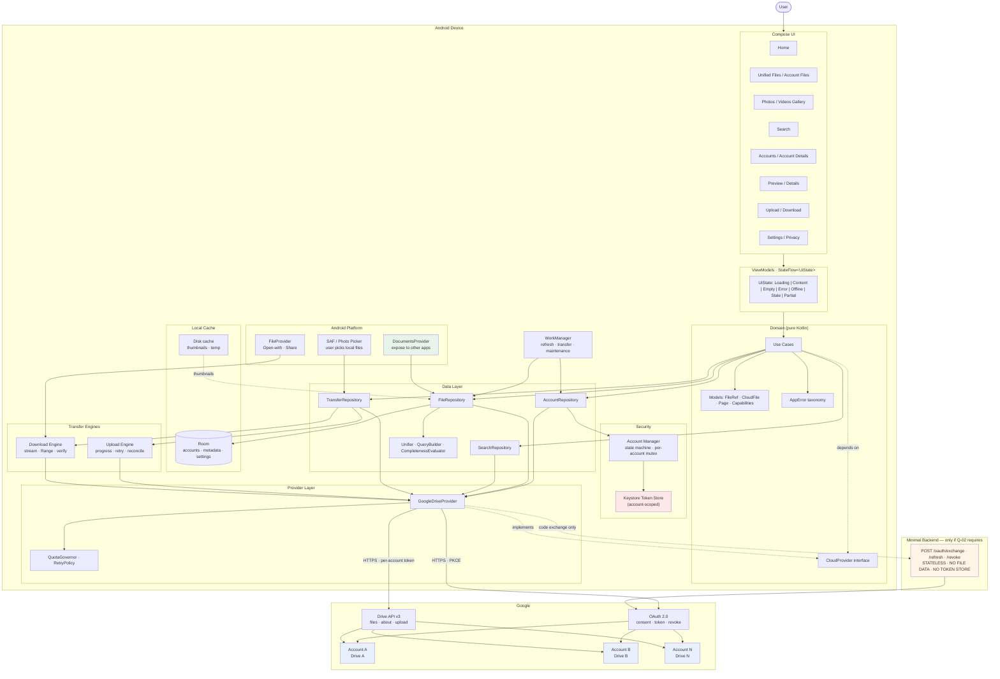

### 29.1 The two flows that must never be confused

| Flow | Path | Enforced by |
|---|---|---|
| **File content** | Google Drive ⇄ device, directly | No code path exists that routes file bytes through the backend. The backend has no endpoint that accepts or returns file content (B-2). |
| **OAuth** | device ⇄ backend (optional) ⇄ Google | The only backend endpoints are the three token ones (§10.3) |

If a future change makes file content pass through the backend, it violates N-11 and N-16 and must be rejected regardless of its stated benefit.

---

## 30. Complete Data Flow

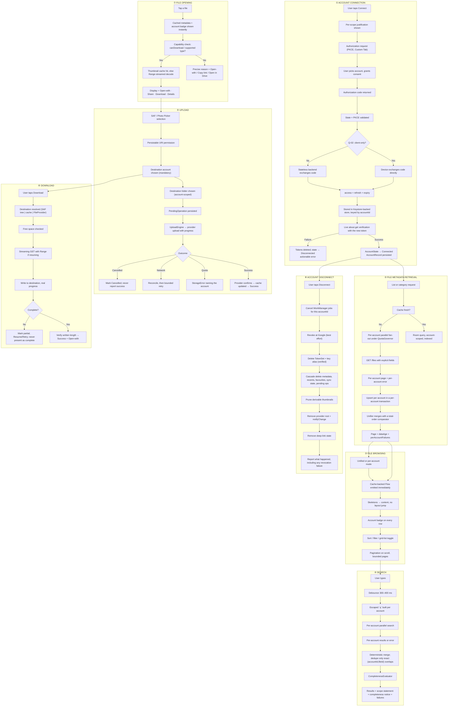

### 30.1 Data-flow invariants

| # | Invariant |
|---|---|
| DF-1 | No file content ever enters the Room database, the backend, or any log |
| DF-2 | The cache is written only **after** a provider operation is confirmed |
| DF-3 | Every flow that touches provider data carries an `accountId` end to end |
| DF-4 | Disconnect is a complete purge, verified by an automated test |
| DF-5 | Search results are never rendered without a completeness value attached |
| DF-6 | A cancelled transfer is never reported as successful |
| DF-7 | Cached data is never rendered as live data without an age qualifier |

---

## 31. Architectural Decisions (ADR)

### ADR-01 — Kotlin + Jetpack Compose

| Field | Value |
|---|---|
| **Decision** | Build the Android client in Kotlin with Jetpack Compose and Material 3 |
| **Reason** | Null safety materially reduces defects when handling nullable provider fields; coroutines make the async, cancellable operations in this product correct by construction; Compose maps directly onto the token-driven design system in `Design.md` |
| **Alternatives** | Views + XML (no Material 3 parity without heavy custom work); Java (verbose, weaker null handling); Flutter/React Native (a web-derived toolchain for a file manager that needs deep platform integration, including `DocumentsProvider`) |
| **Trade-offs** | Compose has a smaller talent pool than Views; the Compose compiler adds build time; the `DocumentsProvider` is still a `ContentProvider` and must be written in the View/Framework model |
| **Status** | Accepted |

### ADR-02 — Local Room database for the metadata cache

| Field | Value |
|---|---|
| **Decision** | Cache file metadata in an on-device Room database; treat it as an evictable cache |
| **Reason** | Listing needs relational queries (parent/child, per-account scoping, sort, paginate). SQLite by hand means writing all of it. DataStore is not relational |
| **Alternatives** | In-memory maps (unbounded growth, no query support); Room on a server (privacy cost, no benefit — the user is one device); no cache (breaks the offline requirement, PRD §18) |
| **Trade-offs** | Schema migrations must be maintained forever; a stale cache is a permanent source of subtle bugs unless staleness is modelled as a first-class state |
| **Status** | Accepted |

### ADR-03 — No backend, or a stateless token-exchange endpoint only

| Field | Value |
|---|---|
| **Decision** | Plan for a minimal, stateless OAuth code-exchange service; build it **only if** Q-02 shows a client-only flow is not viable. Do not create the module until then |
| **Reason** | A client secret must not live in an APK. If Google's installed-app PKCE flow accepts a bare client ID, no backend is needed and the project avoids an entire service, its hosting, its logs, and its security-assessment surface |
| **Alternatives** | Full backend with user accounts and server-side indexing (rejected: no MVP requirement, worse privacy story, much larger compliance surface); embed a client secret (rejected: trivially extractable); AppAuth-Android (deferred pending Q-01/Q-02) |
| **Trade-offs** | If a backend is needed, it is an ongoing operational and security-review obligation, and likely raises the assessment tier |
| **Status** | **Proposed — blocked on Q-02** |

### ADR-04 — Token storage: Keystore-backed, with a verified deletion path

| Field | Value |
|---|---|
| **Decision** | Store the refresh token encrypted with an AES-256-GCM key held in the Android Keystore. Prefer a Keystore-wrapped file over `EncryptedSharedPreferences` so that deletion can be verified |
| **Reason** | The refresh token is the highest-value secret in the system. The disconnect guarantee (SEC-09) is a headline user promise and must be provable |
| **Alternatives** | Plain `SharedPreferences` (rejected: plaintext on disk); Room (rejected: a cache database is not a secret store, and it is backed up); `EncryptedSharedPreferences` (accepted only if its deletion semantics are verified on-device — **REQUIRES VALIDATION**) |
| **Trade-offs** | Keystore is unavailable or degraded on some devices; a key invalidated by a lock-screen change can render stored tokens unreadable, requiring re-authorization |
| **Status** | **Proposed — deletion semantics REQUIRES VALIDATION at Phase 17** |

### ADR-05 — No user identity, no server-side per-user state

| Field | Value |
|---|---|
| **Decision** | All state is device-local. There is no app-level user account and no server-side user record for MVP |
| **Reason** | No MVP requirement needs it. Adding identity multiplies the compliance surface — privacy policy, data protection, deletion workflows, assessment scope — for zero user value |
| **Alternatives** | Anonymous device id only (rejected: no benefit if there is no server state); full accounts + multi-device sync (deferred to a later phase, and only if validated demand justifies the cost) |
| **Trade-offs** | No multi-device continuity. Settings, recents, and favourites do not follow the user to a new phone |
| **Status** | Accepted |

### ADR-06 — Provider abstraction as an interface in the domain module

| Field | Value |
|---|---|
| **Decision** | `CloudProvider` lives in the pure-Kotlin domain module; implementations live in `cloud/`; the UI never imports a provider type |
| **Reason** | Makes the domain testable without Android, makes capability-driven UI possible, and makes adding a provider a contained change |
| **Alternatives** | Abstract class (rejected: prevents multiple inheritance of interfaces and fakes); DI-provided dynamic dispatch (rejected: over-engineered for one provider) |
| **Trade-offs** | The interface must be kept small. Every method added to it is a contract every future provider must honour — resist scope creep here |
| **Status** | Accepted |

### ADR-07 — Direct Drive REST calls over OkHttp, not a generated SDK

| Field | Value |
|---|---|
| **Decision** | Call the Drive REST API directly with OkHttp and Kotlin serialization |
| **Reason** | This product needs explicit `fields`, explicit `corpora`/`spaces`, per-account tokens, and `Range` requests. A generated client obscures exactly the things that matter for quota safety and isolation |
| **Alternatives** | `google-api-services-drive` (large, and less transparent about field selection); gRPC/DataStore (an extra dependency for no MVP benefit) |
| **Trade-offs** | No auto-generated model refresh. The DTOs are hand-written and must be kept in sync with the API — mitigated by mapping tests against recorded responses |
| **Status** | Accepted |

### ADR-08 — Cache-first rendering with explicit staleness

| Field | Value |
|---|---|
| **Decision** | Render from the local cache first, with a data-age label; refresh behind the user only where consented |
| **Reason** | The offline requirement (PRD §18) and the perceived-speed requirement (PF-01…PF-15) both demand it. It also matches user expectation from every file manager |
| **Alternatives** | Network-first (rejected: blank or spinners offline, slow, and it looks broken); cache with no staleness label (rejected: violates N-14 and the trust requirement C-7) |
| **Trade-offs** | Staleness is a permanent source of subtle bugs. It is mitigated by making `syncState` and `fetchedAt` first-class and by disabling mutations when data is stale (FI-03) |
| **Status** | Accepted |

### ADR-09 — Search: per-account fan-out with mandatory completeness disclosure

| Field | Value |
|---|---|
| **Decision** | Fan out to each account in parallel, merge deterministically, and always attach a `Completeness` value to the results |
| **Reason** | It is the only way to search across accounts. The completeness disclosure exists because presenting a capped or partial result set as complete causes users to conclude files are missing |
| **Alternatives** | Local-only search (rejected: incomplete by construction and cannot find uncached files); sequential per-account search (rejected: latency multiplies); a server-side index (rejected: requires uploading user metadata to our servers) |
| **Trade-offs** | Global pagination across accounts is approximate. Quota cost is real and is bounded by `QuotaGovernor` |
| **Status** | Accepted |

### ADR-10 — Domain purity enforced by the build

| Field | Value |
|---|---|
| **Decision** | `:domain` is a pure Kotlin JVM module. CI fails if it acquires an Android dependency |
| **Reason** | A layering rule that is not mechanically enforced is a comment, not a rule |
| **Alternatives** | Package conventions in a single module (rejected: unenforceable); a lint rule only (weaker than a module boundary) |
| **Trade-offs** | A dependency that insists on Android types cannot be used in the domain. That is the point |
| **Status** | Accepted |

### ADR-11 — No crash-reporting or analytics SDK until privacy review approves it

| Field | Value |
|---|---|
| **Decision** | Default to no third-party telemetry SDK. Add one only after Phase 17, with the SDK's actual outbound payload inspected |
| **Reason** | Any SDK is an external data transfer that must be justified in the privacy policy and assessed. The §20.1 event set is small enough to implement with a thin auditable wrapper |
| **Alternatives** | Firebase Crashlytics / Analytics (deferred); Sentry (deferred); a bespoke first-party pipeline (rejected: unjustifiable infrastructure) |
| **Trade-offs** | Less diagnostic signal before Phase 17. Structured local logging and the aggregate metric set cover most needs |
| **Status** | **Proposed — REQUIRES VALIDATION at Phase 17** |

### ADR-12 — Compose for the UI, framework model for the DocumentsProvider

| Field | Value |
|---|---|
| **Decision** | Compose everywhere the user sees our own UI. The `DocumentsProvider` and `FileProvider` are written as framework `ContentProvider` subclasses |
| **Reason** | The provider is invoked by the system, not by our UI. It has no composables and no UI state |
| **Alternatives** | A custom picker UI instead of a provider (rejected: loses all other apps' ability to reach the files, which is the point of the feature) |
| **Trade-offs** | Two UI models in one codebase. Contained: the provider has no UI at all |
| **Status** | Accepted |

---

## 32. Architecture Risks

| ID | Risk | Impact | Probability | Mitigation | Validation |
|---|---|---|---|---|---|
| AR-01 | Google rejects a multi-account file manager as an impermissible restricted-scope use | **Product-killing** | Medium | Phase 0 gate before any commitment; a documented `drive.file` fallback product | **Q-04 — blocking** |
| AR-02 | CASA assessment tier and cost exceed budget | Major | High | Prefer a strictly client-only design (ADR-03) to reduce the tier; obtain a written quote early | **Q-03** |
| AR-03 | `AuthorizationClient` does not yield a Drive-suitable refresh token | Major | Medium | Fall back to a custom OAuth flow or AppAuth; do not assume | **Q-01** |
| AR-04 | Cross-account isolation defect | **Critical** | Medium | Invariants I-1…I-8; mandatory CI matrix M1–M16; blocking gate | Internal, automated |
| AR-05 | Quota exhaustion degrades unified search | Major | Medium | `QuotaGovernor`; strict `fields`; bounded pages; debounce; no polling; partial-result degradation; console quota alerts | **Q-05** |
| AR-06 | Search completeness is misjudged, so users conclude files are missing | Moderate | High | Mandatory `Completeness` value; never render results without it | **Q-06** |
| AR-07 | `DocumentsProvider` invisible or unreliable across OEMs | Major | Medium | OEM test matrix; in-app enablement guidance; treat as P1 value, not MVP-critical | **Q-11** |
| AR-08 | `openDocument` streaming times out for large files | Moderate | Medium | Cache-then-serve; size limits with clear messaging | **Q-11** |
| AR-09 | Gallery OOM | Major | Medium | Bounded image cache, downsampling, paging, `onTrimMemory`; explicit 10k-item no-OOM test | Phase 18 perf test |
| AR-10 | Token leakage via logs or crash reports | **Critical** | Medium | Redacting logger; CI log scan; release log stripping; no SDK until Phase 17 | Internal, automated |
| AR-11 | Backend token custody increases the breach surface | **Critical** | Low | Stateless by design (B-1); no token persistence; assessed at Phase 17 | **Q-03**, Phase 17 |
| AR-12 | Android minSdk forced up by dependencies, shrinking the audience | Moderate | High | Dependency audit at Phase 1; feature-detect rather than branch on API level | **Q-12** |
| AR-13 | Legacy Google Sign-In deprecation breaks the planned auth path | Major | Low | Already planned against Credential Manager (F-26, F-27) | **Q-01** |
| AR-14 | Keystore key invalidated by a lock-screen change, forcing re-authorization | Moderate | Medium | Detect explicitly; surface a clear re-auth prompt rather than silent failure | Phase 17 |
| AR-15 | `EncryptedSharedPreferences` deletion does not remove key material, breaking the disconnect guarantee | **Critical** | Medium | ADR-04 Keystore-wrapped file with a verified deletion test | Phase 17 |
| AR-16 | Room schema migration loses data or forces re-authorization | Major | Low | Migrations never touch accounts or tokens; every migration tested with data present | Automated |
| AR-17 | Cancelled transfers reported as successful | Major | Medium | `Cancelled` as a first-class `AppError`; AC-07.2, AC-08.3 | Automated |
| AR-18 | Duplicate files from a retried upload after an uncertain failure | Moderate | High | Reconcile-before-retry (§13) | Automated |
| AR-19 | Local environment gaps (no JDK, no Android SDK) block Phase 1 | Moderate | **High (observed)** | Install and pin a JDK and Android SDK before Phase 1 | Local, verifiable |
| AR-20 | Scope creep toward storage-pooling features | **Product-killing** | Medium | N-01…N-16 contractual; CI copy scan; review rejects | `Rules.md` §1, §23 |

---

## 33. Final Architecture Recommendation

### 33.1 Recommended stack

| Layer | Choice |
|---|---|
| Language | Kotlin |
| UI | Jetpack Compose + Material 3, tokens from `Design.md` |
| Async | Coroutines + Flow, structured concurrency |
| State | ViewModel + `StateFlow<UiState>` |
| Navigation | Navigation Compose, typed routes, authenticated deep links |
| Local DB | Room (metadata cache only — never tokens, never content) |
| Settings | DataStore (Proto) |
| Secure storage | Android Keystore + AES-256-GCM |
| HTTP | OkHttp + Kotlin serialization |
| Async work | WorkManager |
| Images | Coil (bounded memory + disk cache) |
| Auth | Credential Manager (authentication) · `AuthorizationClient` (Drive authorization, **Q-01**) |
| Cloud | Google Drive REST API v3, called directly, per-account tokens |
| Platform | `DocumentsProvider`, `FileProvider`, SAF, Photo Picker |
| DI | Hand-written `AppContainer` — no framework |
| Build | Gradle Kotlin DSL, version catalogue, dependency verification |
| CI | GitHub Actions: build → analyse → test → isolation matrix → security scans |

### 33.2 Recommended architecture

**A single Android app, modular, with a strictly layered core and a stateless optional token-exchange endpoint.**

The design is deliberately shaped by one fact: **file bytes go directly between the device and Google, and nothing else.** That single constraint removes the backend from the data path, removes file content from every system we operate, makes the privacy story defensible, and keeps the security assessment surface as small as it can be.

The second shaping fact: **every provider operation is account-scoped.** Not "mostly", not "by convention" — the type system requires it. The highest-severity defect class in this product is designed out rather than tested for.

### 33.3 MVP architecture

- Single Gradle build; `:app`, `:domain` (pure Kotlin), `:data`, `:cloud`, `:core`.
- Room cache with an account-scoped composite schema.
- One provider: `GoogleDriveProvider`.
- Token store in the Keystore with a verified deletion path.
- `DocumentsProvider` exposing connected-account roots.
- **No backend module exists** until Q-02 is answered.
- No analytics or crash SDK.

### 33.4 Future architecture

Only if validated demand justifies it, and one step at a time:

| Step | Change | Blast radius |
|---|---|---|
| OneDrive | New `cloud/onedrive/` + registration + capability mapping | None outside `cloud/`. UI and domain unchanged |
| Dropbox | Same | Same |
| Multi-device sync | Requires a backend, identity, and a privacy-policy rewrite | **Large.** A genuine phase boundary, not an increment |
| Offline content sync | Requires a clear privacy story for shared devices (PRD §3.4) | **Large** |
| Server-side metadata index | Rejected for now. It would require uploading user file metadata to our servers | Would contradict the privacy position in §2.2 |

### 33.5 Major technical constraints

1. The core feature requires a **restricted** Google scope. There is no non-sensitive alternative.
2. Restricted scopes require **verification** and an **annual third-party security assessment**.
3. Whether a multi-account file manager is a **permitted application type** is unestablished. This is a Phase 0 gate, not a footnote.
4. Legacy Google Sign-In for Android is **deprecated**; authorization runs through Credential Manager's `AuthorizationClient`, and whether it yields a Drive-suitable refresh token is **unverified**.
5. A `DocumentsProvider` must be **manually enabled by the user**, is visible only to **SAF-aware apps**, and does not make the app the system file manager.
6. Provider quotas, result caps, and `q` semantics must be **read from the Cloud Console and measured**, never hardcoded from memory.
7. Global pagination across multiple accounts is **approximate** and must be disclosed.
8. The local environment currently has **no JDK and no Android SDK**. Phase 1 cannot start until they are installed and pinned.

### 33.6 Items requiring validation

All of Q-01…Q-12 (§3.3), and in particular the four that can change the architecture:

| Priority | Item |
|---|---|
| **Blocking** | Q-04 — permitted application type for restricted scopes |
| **Architecture-changing** | Q-02 — client-only PKCE viability · Q-01 — `AuthorizationClient` refresh-token viability · Q-03 — security assessment tier |
| **Design-affecting** | Q-06 search caps · Q-07 thumbnail lifetime · Q-09 resumable upload · Q-11 provider streaming · Q-12 minSdk |

### 33.7 What developers must not assume

| Must not assume | Why |
|---|---|
| That `drive.file` is an equivalent, cheaper alternative | It cannot browse an account. It is a different, smaller product. |
| That OAuth verification is a formality or is automatic | It is a multi-week review with a real chance of refusal or forced downscoping. |
| That a security assessment is a one-off cost | It is annual. |
| That a provider ID is small, sequential, or meaningful | It is opaque (F-14). Never parse or infer structure. |
| That `thumbnailLink` is a stable URL | It is short-lived and bearer-adjacent. Treat as ephemeral; never log it. |
| That a `403` means "permission denied" | It is ambiguous with rate limiting. Read the reason. |
| That `allDrives` is the convenient default | Google documents it as broad and performance-affecting (F-11). |
| That a `DocumentsProvider` makes the app the system file manager | It does not. |
| That Google Docs/Sheets/Slides can be previewed in-app | No general binary export. Fall back to `webViewLink`. |
| That cached data reflects reality | It does not, by design. Mutations require fresh provider confirmation. |
| That a provider's `capabilities` field matches what a user can do | It is provider-derived, not permission-derived (F-12). Trust the API's answer to an attempted operation. |
| That a successful-looking upload means the file is there once | An uncertain network failure can hide a committed upload. Reconcile before retrying. |

### 33.8 Final word

This architecture is intentionally small. Five Gradle modules, one provider, one optional stateless endpoint, no message bus, no orchestration, no service mesh, and no premature abstraction.

The complexity that genuinely exists in this product — account isolation, token lifecycle, quota discipline, and provider incompleteness — is handled explicitly and tested, rather than absorbed by infrastructure. For a small team, that is the difference between a system that is correct and a system that is merely elaborate.

