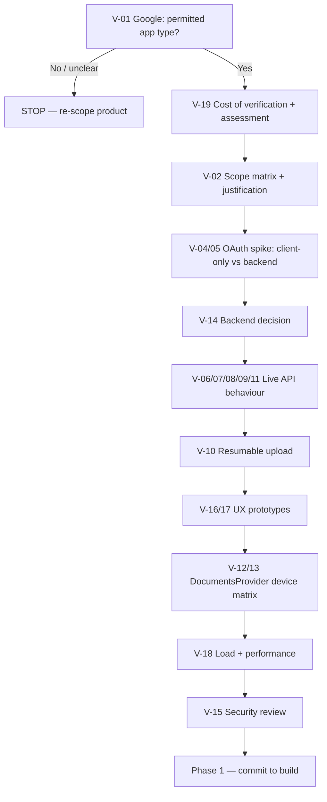

# PRD — Unified Cloud File Manager

| Field | Value |
|---|---|
| Document | Product Requirements Document |
| Version | 1.0 |
| Status | Draft — blocked on Phase 0 validation |
| Product (working name) | Unified Cloud File Manager |
| Platform | Android, mobile-first |
| Related documents | `Architecture.md`, `Rules.md`, `Phases.md`, `Design.md`, `Memory.md` |

### Document conventions

| Marker | Meaning |
|---|---|
| **REQUIRES VALIDATION** | Not verified against current official documentation or a live test. Must not be treated as fact, and must not be built upon without verification. |
| **CONFIRMED** | Verified against official Google/Android documentation (citations in `Architecture.md` §3). |
| **P0 / P1 / P2** | Must have / Important / Later. |
| **OUT OF SCOPE** | Explicitly excluded from this release. |

> **Language prohibition — binding on all copy, code, and design.**
> This product must never be described, in any surface, as: "unlimited Google storage", "free extra Google storage", "extra Google storage", "bypass Google Drive limits", "pooled storage", "combined quota", or any equivalent.
> The only permitted framing is: **"A unified interface for managing authorized files across multiple Google Accounts."**
> Storage remains owned, metered, and enforced by each respective Google Account. See §5 and §23.

---

## 1. Executive Summary

### 1.1 Product statement

> **Unified Cloud File Manager is a mobile file manager and gallery that presents authorized files from multiple personally-owned Google Accounts through one familiar interface.**

Files remain in their originating Google Drive. The product is a **management and access layer**, not a storage provider.

### 1.2 Problem it solves

A person who legitimately owns, or is explicitly authorized to use, more than one Google Account must today switch accounts — inside the Drive app, inside a browser, inside Google Photos — to reach different file sets. No first-party Google surface aggregates several of the same user's own accounts into one browsable, searchable index.

This product provides that aggregation while respecting that each account is a separate, independently governed Drive.

### 1.3 Who it is for

Users who personally own, or have been explicitly authorized to use, two or more Google Accounts and want a single file-management surface. Personas in §3. The product must not assume every user has multiple accounts.

### 1.4 Core value proposition

| Dimension | Statement |
|---|---|
| Functional | One file-manager/gallery surface over N authorized Google Accounts |
| Emotional | "My files are all here, and I know which account each one came from" |
| Trust | The app holds no files of its own, adds no storage, and never obscures which account owns what |
| Non-goal | Not a backup product, not a sync engine, not a storage-quota product |

### 1.5 What the MVP includes

- Connect up to a documented maximum of Google Accounts via OAuth, each independently authorized and revocable.
- Unified file browser aggregating files from all connected accounts, with per-item account attribution.
- Per-account file browser.
- Cross-account search with explicit disclosure of result-completeness limits.
- Gallery (Photos / Videos) with account badges, date grouping, and full-screen preview.
- File details, open, Open-with, copy link.
- Upload to a user-chosen account and folder, with progress, retry, cancellation.
- Download to device with progress, then Open-with / Share.
- Android Storage Access Framework integration as a **document provider**, offering connected-account files to the system file picker.
- Full token lifecycle: expiry, refresh, revocation, re-authorization, disconnect.
- Explicit, honest error, offline, stale, and permission states.

### 1.6 What the MVP deliberately does not include

- Pooling, aggregation, mirroring, sharding, cloning, or quota manipulation of Google Drive storage.
- Server-side file proxying or long-term server-side file storage.
- OneDrive, Dropbox, or any non-Google provider.
- Native editing of Google-native Docs/Sheets/Slides.
- Cross-account file move/copy (a cross-account move is necessarily a copy through the app — deferred, §5).
- Desktop or web clients. Premium tier or monetisation. Team or organisation administration.

### 1.7 The single largest risk, stated up front

The feature set in §1.5 **cannot be delivered on a non-sensitive OAuth scope.** Google classifies `.../auth/drive.readonly` and `.../auth/drive` as **restricted**; `drive.file` is non-sensitive but grants only per-file access (files the app created, opened, or that the user explicitly selected). A unified all-files browser therefore requires a restricted scope, which requires OAuth App Verification and an annual third-party security assessment, and must be justified as a permitted application type.

This is a commercial and schedule risk before it is a technical one. **Phase 0 exists to resolve it before engineering commitment.** See §23.1 and §28 R-01/R-02.

---

## 2. Problem Statement

### 2.1 User problems

| ID | Problem |
|---|---|
| UP-01 | A person holds multiple Google Accounts (personal, work, school, or a secondary account used to separate large media) and has no single place to see all their files. |
| UP-02 | Reaching a file in "the other account" requires a full context switch — different app, or sign-out/sign-in inside one app. |
| UP-03 | Locating a specific file by name across accounts is manual and slow. |
| UP-04 | Photo libraries are fragmented per account, so a single chronological gallery is impossible without manual collation. |
| UP-05 | The user cannot tell at a glance which account a file belongs to, so they over-download or over-delete. |
| UP-06 | Per-account quota/usage visibility requires visiting each account separately. |

### 2.2 Existing workflow problems

- **Context switching cost.** Paid per file, not per session; interruptible.
- **No cross-account recall.** Search is inherently per-account in every first-party surface.
- **Duplicated local copies.** Workarounds involve repeated downloads, consuming local storage and creating stale duplicates.
- **Ambiguity at the point of action.** When several files share a name, the user cannot tell which account holds the authoritative copy.
- **Trust deficit in third-party alternatives.** Existing "multi-cloud" apps frequently require uploading the user's cloud files to the vendor's own servers in order to index them. Users cannot verify where their data goes.

### 2.3 Product opportunity

**CONFIRMED:** the Google Drive API supports listing, searching, reading metadata, uploading, and downloading per authorized account, and OAuth 2.0 supports obtaining authorization for more than one account within one installed application. **CONFIRMED:** `DocumentsProvider` is a documented Android extension point for exposing a storage service's files to the platform.

Together these permit a single app to (a) aggregate several of the same user's authorized accounts into one logical index, and (b) expose that index to other apps through the system file picker.

### 2.4 Problems this product does NOT solve

| ID | Not solved | Why |
|---|---|---|
| NP-01 | Insufficient Google storage | Adds no bytes. Quotas are per Google Account. |
| NP-02 | Cross-account ownership transfer | A move between accounts is a copy; the app will not silently do this. |
| NP-03 | Access to unauthorized files | Out of scope by definition and by policy. |
| NP-04 | Shared-drive administration | Shared drives, domains, and Workspace administration are not modelled in MVP. |
| NP-05 | Offline-first editing | No local working copies are created by default. |
| NP-06 | Google-native document editing | Docs/Sheets/Slides exposed as links/metadata, not edited in-app. |
| NP-07 | Organisation policy enforcement | A Workspace administrator may prohibit this app entirely; the product must surface that clearly. |
| NP-08 | Backup, versioning, or ransomware resilience | Not a backup tool. |

---

## 3. Target Users

Persona 1 is the only persona for whom the core value exists. Persona 2 and 3 are refinements. Persona 4 is a constrained case with explicit privacy limits.

### 3.1 Persona 1 — Multi-account personal user (primary)

| Attribute | Detail |
|---|---|
| Profile | 28–45. Owns 2–3 personal Google Accounts: a long-standing primary, one created later, one used to separate large media. Not employed by an organisation. |
| Goals | One place to see all files. Find a specific photo or document without switching. Confidence about which account holds a file before acting. |
| Pain points | UP-01…UP-06. Has tried manual account switching; abandoned it. |
| Current workflow | Opens Drive, switches account, finds file, remembers which account it was in. Repeats per task. Occasionally downloads to device because they cannot remember. |
| Desired workflow | Open app → see everything → act. Never think about which account. |
| Important features | Unified browser, gallery, cross-account search, account badges, recent files. |
| Security concerns | "Does this app copy my Drive to their servers?" "Will it delete the wrong file?" "If I disconnect, is it really gone?" |

### 3.2 Persona 2 — Student

| Attribute | Detail |
|---|---|
| Profile | 16–24. One school account issued by an institution, one personal account. |
| Goals | Separate school work from personal files while still finding both quickly. Submit an assignment without disrupting a personal session. |
| Pain points | Account switching is disruptive mid-task. The school account is often restricted by Workspace policy. |
| Current workflow | Separate browser profiles, or sign in/out of the Drive app. |
| Desired workflow | Both accounts visible, clearly labelled, filterable by account. |
| Important features | Account filter in search; clear per-account status including policy-blocked states. |
| Security concerns | Fear of mixing school and personal files; fear of sharing a school file to a personal account. |

### 3.3 Persona 3 — Power user

| Attribute | Detail |
|---|---|
| Profile | 30–55. 3–5 accounts, tens of thousands of files, heavy upload/download, uses Shared Drives. |
| Goals | Fast cross-account search. Reliable bulk upload. Accurate per-account usage. |
| Pain points | Any UI that cannot handle large result sets; slow search; unclear per-account usage. |
| Current workflow | Desktop Drive with account switching; manual organisation. |
| Desired workflow | Search once, filter by account, act on results in bulk. |
| Important features | Pagination, sort/filter, per-account usage, reliable large-file upload, clear partial-failure reporting. |
| Security concerns | Destructive bulk operations must be unambiguous about the target account. |

### 3.4 Persona 4 — Family / shared device

**Supported:** connecting multiple accounts on one device, with strict visual and behavioural separation between them, and a clear "which account is acting" indicator.

**NOT supported, by design:**

- Any per-account authentication gate beyond the OAuth grant itself. Once authorized, an account is authorized; the app implements no PIN or per-account lock.
- Any assumption that a shared device is a trusted device.
- Default caching of file *contents*, which would leave readable data behind.
- Enterprise-managed device scenarios, where the organisation's policy governs; the app must not attempt to work around it.

**Design consequence:** account attribution is not cosmetic — it is a privacy control. Any destructive or sharing action names the account (§12, §13).

---

## 4. Product Goals

P0 goals gate the MVP. All metrics are **initial targets requiring validation** against real baselines (§29, §31).

| ID | Goal | Reason | Success metric | Pri |
|---|---|---|---|---|
| G-01 | A user can connect at least 2 Google Accounts and both reach a usable state | Multi-account aggregation is the entire premise | Connection success ≥ 90% of initiated connections, excluding user cancellation | P0 |
| G-02 | Files from all connected accounts appear in one list | Delivers the core promise | ≥ 95% of connections reach a state where Unified Files returns ≥ 1 item for an account that contains files | P0 |
| G-03 | Every displayed file is attributable to its source account | Prevents wrong-account destructive action | 100% of file rows carry account attribution; 0 cross-account attribution defects in QA | P0 |
| G-04 | Cross-account search returns results from more than one account | Validates aggregation on the hardest operation | ≥ 80% of searches that should match in ≥ 2 accounts return results from ≥ 2 accounts | P0 |
| G-05 | Supported files open without leaving the app, or via Open-with | Core utility | File-open success ≥ 98% for supported types | P0 |
| G-06 | Upload completes reliably with visible progress and recoverability | Core utility | Upload success ≥ 97% excluding user cancellation; 100% of failures offer a recovery path | P0 |
| G-07 | Download completes reliably with visible progress | Core utility | Download success ≥ 97% excluding user cancellation | P0 |
| G-08 | Users can disconnect an account and the app returns to a clean state | Trust and control | Disconnect leaves 0 orphaned cached rows for that account; re-add works | P0 |
| G-09 | Expired or revoked authorization is detected and explained, never silent | Trust | 100% of expired-token states surface an explanatory, actionable UI | P0 |
| G-10 | The app never claims or implies additional storage | Legal/brand safety | 0 occurrences of prohibited phrasing in UI, store listing, or marketing | P0 |
| G-11 | Search results communicate incompleteness honestly | Trust | 100% of cases where results are known-incomplete carry a visible qualifier | P0 |
| G-12 | Per-account usage is visible without implying aggregation | Utility | Per-account usage shown for connected accounts | P1 |
| G-13 | Connected-account files are reachable from the system file picker | Strategic value | Document provider enabled and functional on ≥ 3 tested OEM builds | P1 |
| G-14 | Session stability | Quality | Crash-free sessions ≥ 99.5% | P1 |

### 4.1 Anti-goals

| ID | Anti-goal | Rationale |
|---|---|---|
| AG-01 | Reducing the number of API calls the user makes | Would tempt content caching and cross-account batching, harming privacy. |
| AG-02 | Maximising displayed file count | Encourages unbounded index growth and quota pressure. |
| AG-03 | Working around Workspace administrator policy | Policy violation and account-suspension risk. |
| AG-04 | Becoming a general-purpose sync engine | Different product, different risk profile, different compliance burden. |

---

## 5. Non-Goals

Contractual. Any implementation or marketing that violates these is a defect.

| ID | The product will NOT |
|---|---|
| N-01 | Create, add to, or imply additional Google storage quota. |
| N-02 | Merge Google Drive accounts into one actual Drive account. |
| N-03 | Bypass, evade, or work around Google storage limits, quotas, or fair-use policies. |
| N-04 | Shard, split, replicate, or clone files across accounts to work around a quota or per-account limit. |
| N-05 | Silently copy files between accounts, or perform any cross-account transfer without explicit, separately-confirmed intent. |
| N-06 | Access any account, file, or scope the user has not explicitly authorized. |
| N-07 | Collect, request, transmit, or store Google passwords or account credentials. |
| N-08 | Access files outside granted permissions, or enumerate unauthorized resources. |
| N-09 | Promise access to Google services or Drive features outside the granted scopes. |
| N-10 | Replace Google Drive, Google Photos, or the Google account system. |
| N-11 | Proxy or durably store user file contents on its own servers. |
| N-12 | Perform background access to user files without user-initiated or clearly-disclosed scheduled activity. |
| N-13 | Bypass, disable, or weaken Android platform permission models or scoped-storage rules. |
| N-14 | Present cached data as live data without qualification. |
| N-15 | Circumvent Google API rate limits or quotas. |
| N-16 | Offer, imply, or measure itself against an "extra storage" or "unlimited" value proposition. |

**Enforcement:** any pull request, string resource, store listing, or analytics event name implying N-01…N-16 is rejected at review. See `Rules.md` §1 and §23.

---

## 6. Core Product Concept

### 6.1 Conceptual model

```
USER
  │
  ▼
UNIFIED CLOUD FILE MANAGER
  │  (a management + access layer; owns no user file storage)
  │
  ▼
CONNECTED GOOGLE ACCOUNTS  (each independently authorized, revocable, isolated)
  ├── Google Account A   → Drive A → Files/Media A
  ├── Google Account B   → Drive B → Files/Media B
  ├── Google Account C   → Drive C → Files/Media C
  └── Google Account N   → Drive N → Files/Media N
```

The app presents a **unified logical view**. The bytes, quotas, ownership, and retention policies remain with each Google Account.

### 6.2 The distinction that must never be blurred

| | Unified file *view* | Unified storage *quota* |
|---|---|---|
| What it is | A single navigable index over several accounts' authorized files | A single storage allowance |
| Who owns the bytes | The respective Google Accounts | Would be a new provider |
| Metered by | Google, per account | Would be this product |
| Exists in this product? | **Yes — this is the product** | **No — must never exist** |
| Adds capacity? | No | n/a |
| Subject to Google policy? | Yes, fully | n/a |

> **Rule:** the product has **no** storage capacity of its own. Total capacity visible to a user is the **sum of their own independent Google Account quotas**, and the UI must present these per account, **never as a single figure**. Presenting a sum as one number is a prohibited framing (N-01, N-16).

### 6.3 Data residency

| Data class | Where it lives | Controlled by |
|---|---|---|
| File contents | Google Drive, in the source account | Google + the account owner |
| File metadata | Google Drive (authoritative); app cache (advisory, evictable) | Google / app cache |
| OAuth tokens | Device secure storage; short-lived material may transit the minimal backend | App / device |
| Settings, favourites, recents | Device | User |

---

## 7. MVP Feature Requirements

Priorities: **P0** must have, **P1** important, **P2** later. Every P0 row is a release blocker.

### 7.1 Account management

| ID | Feature | Description | Pri | User value | Acceptance criteria | Dependencies | Risk |
|---|---|---|---|---|---|---|---|
| ACC-01 | Add Google Account | Initiate the OAuth authorization-code flow for a new Google Account; account selection is handled by Google's own consent UI | P0 | Entry point to the entire product | Given no connected account, when the user completes Google's consent, then an account record is created, tokens stored, and state becomes Connected | Google OAuth; PKCE/native flow **REQUIRES VALIDATION**; minimal backend for code exchange | High — flow correctness, redirect handling |
| ACC-02 | App session restore | Distinguish app-level session from Google account identity | P0 | Predictable startup | Given connected accounts, when the app restarts, then accounts are restored from secure storage without re-consent | Secure storage | Low |
| ACC-03 | OAuth consent presentation | Explain, in plain language, why each scope is requested, before consent | P0 | Informed consent; aids verification | Given the permission screen, when displayed, then every requested scope has a plain-language justification matching the justification submitted to Google | Scope set locked at Phase 0 | Medium |
| ACC-04 | Multiple accounts | Support N accounts simultaneously, fully isolated | P0 | The premise | Given 3 connected accounts, when Unified Files opens, then results from all 3 are returned and each item is attributed | ACC-01, FIL-01 | Medium |
| ACC-05 | Account list | Screen listing all connected accounts | P0 | Orientation and management | Given connected accounts, when Accounts opens, then every account is listed with identity, status, and last successful sync | ACC-01 | Low |
| ACC-06 | Account identification | Stable display identity per account (email + user-set label) | P0 | Attribution | Given 2 accounts with colliding file names, when a file is shown, then the account identity is visually distinguishable | Email scope | Low |
| ACC-07 | Account status | Connected / needs re-authorization / revoked / policy-blocked / error, plus last successful operation time | P0 | Prevents silent failure | Given a revoked token, when status is read, then state is Reauthorization required with a reconnect action | Token lifecycle | Medium |
| ACC-08 | Disconnect account | Revoke the grant, delete tokens, purge that account's cached metadata and thumbnails, stop its workers, drop its document-provider roots | P0 | Control | Given a connected account, when the user disconnects it, then tokens are deleted, cached rows for that account are removed, and remaining accounts still work | Token revoke endpoint | Medium — a partial purge is a privacy defect |
| ACC-09 | Reconnect account | Re-authorize a disconnected or expired account without losing app state | P0 | Continuity | Given a disconnected account, when re-added, then it reconnects and re-indexes | ACC-01, ACC-08 | Low |
| ACC-10 | Token expiration handling | Detect expiry/`invalid_grant`, refresh transparently once, re-authorize when refresh fails | P0 | Reliability | Given an expired access token and a valid refresh token, when an operation runs, then it succeeds after refresh with no user prompt | Refresh flow | Medium |
| ACC-11 | Per-account usage | Display per-account storage usage from Google's about resource, labelled per account, never summed | P1 | Replaces per-account visits | Given a connected account, when usage is shown, then the figure is labelled with its account | `about.get` | Medium — must not be summed (N-01) |
| ACC-12 | Maximum account count | Enforce and document a maximum for MVP | P0 | Predictable resource use | Given the documented maximum, when one more is added, then the user is informed and no partial record is created | Decision at Phase 0 | Low |

### 7.2 Unified file browser

| ID | Feature | Description | Pri | User value | Acceptance criteria | Dependencies | Risk |
|---|---|---|---|---|---|---|---|
| FIL-01 | Unified All Files | Aggregate file listing across all connected accounts, paginated | P0 | The core promise | Given 2 connected accounts each containing files, when All Files opens, then items from both appear, each attributed, in a deterministic order | ACC-04, DRV-01 | High — merge/pagination correctness |
| FIL-02 | Folder navigation | Descend into folders; a folder listing is scoped to its owning account | P0 | Familiar file manager | Given a folder in Account A, when opened, then only that account's children are listed | DRV-01 | Medium |
| FIL-03 | Recent files | Recently accessed files across accounts | P0 | Fast return path | Given previously opened files, when Recent opens, then they are listed newest-first with attribution | Local store | Low |
| FIL-04 | Photos | Image-only view across accounts | P0 | Gallery value | Given accounts containing images, when Photos opens, then only images are listed, with thumbnails and account badges | DRV-01, GL-01 | Medium |
| FIL-05 | Videos | Video-only view across accounts | P0 | Gallery value | Given accounts containing videos, when Videos opens, then only videos are listed | DRV-01 | Medium |
| FIL-06 | Documents | Non-media document view | P0 | Utility | Given accounts containing documents, when Documents opens, then documents are listed with type icons | DRV-01 | Low |
| FIL-07 | PDFs | PDF subset view | P1 | Utility | Given PDFs exist, when the PDF filter is applied, then only PDFs are listed | DRV-01 | Low |
| FIL-08 | Audio | Audio subset view | P2 | Utility | Given audio exists, when the Audio filter is applied, then only audio is listed | DRV-01 | Low |
| FIL-09 | Other files | Residual bucket for unclassified types | P1 | Completeness | Given an unclassified type, when Other opens, then the item appears there and not in a media bucket | DRV-01 | Low |
| FIL-10 | File details | Full metadata panel including account, provider ID, size, MIME, dates, capabilities, trash state, data age | P0 | Transparency | Given any file, when details open, then every cached and provider-reported field is shown with its source | FIL-01 | Low |
| FIL-11 | Sort | By name, modified date, size, type | P1 | Control | Given a mixed listing, when sorted by modified date, then order is deterministic and stable | FIL-01 | Low |
| FIL-12 | Filter | By account, type, date range, trash state | P1 | Control | Given files across 2 accounts, when filtered to Account A, then only Account A items are shown | FIL-01, ACC-06 | Low |
| FIL-13 | Grid / list toggle | Per-user persisted preference | P1 | Familiarity | Given either mode, when toggled, then the choice persists across restarts | UserSettings | Low |
| FIL-14 | Pagination | Bounded page size, explicit load-more, no unbounded fetch | P0 | Quota protection | Given a folder larger than one page, when scrolled, then pages load incrementally and API calls stay within budget | DRV-01 | Medium |
| FIL-15 | Trashed items | Optional filter to include or exclude trashed files | P2 | Completeness | Given trashed items exist, when the trash filter is on, then they are listed and marked | DRV-01 | Low |

### 7.3 Unified search

| ID | Feature | Description | Pri | User value | Acceptance criteria | Dependencies | Risk |
|---|---|---|---|---|---|---|---|
| SRCH-01 | Cross-account search | Query all connected accounts, merge results | P0 | Recall across accounts | Given a term present in 2 accounts, when searched, then results from both are returned, each attributed | ACC-04, DRV-06 | High — quota cost, completeness |
| SRCH-02 | Search by name | Provider-side name matching | P0 | Primary intent | Given a filename, when searched, then matching files are returned | DRV-06 | Medium |
| SRCH-03 | Search by account | Restrict to a subset of accounts | P1 | Control | Given 3 accounts, when filtered to 2, then only those 2 are queried | SRCH-01 | Low |
| SRCH-04 | Search by type | Restrict by media/document category | P1 | Control | Given the Images filter, when searched, then only image results are returned | SRCH-01 | Low |
| SRCH-05 | Search by date | Restrict by modified/created range | P1 | Control | Given a date-range filter, when searched, then out-of-range results are excluded | SRCH-01 | Low |
| SRCH-06 | Search by folder | Restrict to a folder subtree within an account | P1 | Control | Given a folder filter, when searched, then results are limited to that subtree | SRCH-01 | Medium |
| SRCH-07 | Search by MIME type | Provider MIME filters where supported | P2 | Precision | Given a MIME filter, when searched, then results match where the provider supports it | DRV-06 | Low — provider support varies |
| SRCH-08 | Debounced input | Issue a query only after input settles | P0 | Quota protection | Given rapid typing, when input settles, then at most 1 query is issued for the settled term | UI | Low |
| SRCH-09 | Completeness disclosure | State when results may be incomplete | P0 | Honesty | Given any known-incomplete condition, when results are shown, then a qualifier is visible | SRCH-01, SRCH-12 | Medium — must be honest, not vague |
| SRCH-10 | Search history | Local recent queries, user-clearable | P1 | Convenience | Given prior queries, when the field is focused, then history is offered and can be cleared | UserSettings | Low — a privacy concern on shared devices |
| SRCH-11 | Partial account failure | If one account fails, show the rest plus an explicit partial-failure notice | P0 | Resilience | Given one account returns 429/5xx, when searching, then other accounts' results appear with a notice naming the failure | SRCH-01, ERR-16 | Medium |
| SRCH-12 | Provider result limits | Detect and disclose provider-imposed result caps | P0 | Honesty | Given the provider caps results, when capped, then the UI says results are limited and offers a refinement path | DRV-06 | **REQUIRES VALIDATION** — exact cap semantics |

### 7.4 File actions

Each action is annotated with the scope it requires and its provider dependency. "Provider support" = the Drive API operation exists. "Permission" = the granted scope permits it.

| ID | Action | Pri | Scope needed | Provider support | Notes / constraints |
|---|---|---|---|---|---|
| ACT-01 | Open (in-app where possible) | P0 | `drive.readonly` | `files.get` + `alt=media`, or `webViewLink` | Google-native Docs/Sheets/Slides have no general binary export — **REQUIRES VALIDATION** on per-type export options; MVP opens the web link |
| ACT-02 | Preview (image/video) | P0 | `drive.readonly` | Thumbnail link or media stream | See §12.13 |
| ACT-03 | Download to device | P0 | `drive.readonly` | `files.get` `alt=media` | Must stream to a file, never buffer. Handles quota/token errors |
| ACT-04 | Upload | P0 | `drive` (restricted) | `files.create` with media upload | Creating a new file in an arbitrary folder requires `drive`; `drive.file` cannot do this. See `Architecture.md` §7.4 |
| ACT-05 | Rename | P1 | `drive` | `files.update` `name` | Mutating → restricted scope |
| ACT-06 | Move | P1 | `drive` | `files.update` `addParents`/`removeParents` | **Same-account only in MVP.** Cross-account move is a copy → N-05 |
| ACT-07 | Delete / trash | P1 | `drive` | `files.update` `trashed=true` | Confirmation must name the file and the account |
| ACT-08 | Share | P2 | `drive` | `permissions.create` | Adds significant surface. **REQUIRES VALIDATION** re policy and review burden |
| ACT-09 | Copy link | P1 | `drive.readonly` | `webViewLink` field | Read-only; creating public links is not implied |
| ACT-10 | File details | P0 | `drive.readonly` | `files.get` fields | See FIL-10 |
| ACT-11 | Create folder | P1 | `drive` | `files.create` with folder MIME | Mutating → restricted scope |
| ACT-12 | Empty trash / permanently delete | OUT OF SCOPE | `drive` | — | Irreversible; excluded from MVP |

### 7.5 Gallery

| ID | Feature | Pri | User value | Acceptance criteria | Dependencies | Risk |
|---|---|---|---|---|---|---|
| GAL-01 | Photo grid | P0 | Familiar gallery | Given images across accounts, when Photos opens, then a paged grid renders with lazy loading and no full-resolution decode of off-screen items | GL-01 | Medium — memory |
| GAL-02 | Full-screen viewer | P0 | Core gallery action | Given a photo, when tapped, then a full-screen viewer opens with pinch-zoom and dismiss | GAL-01 | Low |
| GAL-03 | Account badge on every item | P0 | Attribution in a mixed grid | Given images from 2 accounts in one grid, when rendered, then each item carries its account identity | ACC-06, `Design.md` §12 | Low |
| GAL-04 | Date grouping | P1 | Chronology | Given items across dates, when grouped, then section headers reflect the date | GL-01 | Low |
| GAL-05 | Video playback in viewer | P0 | Utility | Given a video, when opened, then it plays with playback controls, audio control, and progress | GL-01 | Medium — codec support varies by device |
| GAL-06 | Gallery search/filter | P1 | Recall | Given a term, when searched within Photos, then matching images are shown | SRCH-01 | Low |
| GAL-07 | Selection mode + bulk actions | P1 | Power user | Given selection mode, when items are selected, then account grouping is visible and destructive actions name the accounts | ACT-07 | Medium — cross-account bulk delete is high risk |
| GAL-08 | Thumbnail cache policy | P0 | Performance without hoarding | Given repeated views, when thumbnails are cached, then the cache is bounded, evictable, and contains no file content | `Architecture.md` §19 | Low |

### 7.6 Upload

| ID | Feature | Pri | User value | Acceptance criteria | Dependencies | Risk |
|---|---|---|---|---|---|---|
| UPL-01 | Select file(s) from device | P0 | Entry point | Given the system picker, when a file is selected, then a readable persistable URI is obtained and no broad storage permission is requested | SAF | Low |
| UPL-02 | Choose destination account | P0 | Correct-account guarantee | Given multiple accounts, when upload starts, then the target account is explicitly chosen and shown | ACC-05 | Medium |
| UPL-03 | Choose destination folder | P1 | Organisation | Given a target account, when a folder is chosen, then the upload targets that folder in that account | ACT-11 | Medium — the folder picker is account-scoped |
| UPL-04 | Upload execution | P0 | Core utility | Given a selected file and account, when upload runs, then bytes go directly from device to Google Drive | ACT-04 | Medium |
| UPL-05 | Progress reporting | P0 | Trust | Given an in-flight upload, when observed, then determinate or honest indeterminate progress is shown | UPL-04 | Low |
| UPL-06 | Cancellation | P0 | Control | Given an in-flight upload, when cancelled, then the operation stops and the app does not report success | UPL-04 | Medium — partial remote state possible |
| UPL-07 | Retry | P0 | Resilience | Given a failed upload, when retried, then it re-attempts and reports the outcome honestly | UPL-04 | Low |
| UPL-08 | Duplicate-name behaviour | P1 | Predictability | Given an existing name, when uploaded, then behaviour is Drive's own and the app does not silently rename | **REQUIRES VALIDATION** — Drive default behaviour | Low |
| UPL-09 | Quota exhaustion handling | P0 | Honest failure | Given insufficient quota in the target account, when upload fails, then the message states that the target account's quota is exhausted | ERR-09 | Medium |
| UPL-10 | Multiple / queued uploads | P1 | Power user | Given several files, when queued, then each has independent status and retry | UPL-04 | Medium |
| UPL-11 | Background continuation | P2 | Long uploads | Given a large upload and app backgrounding, when constraints allow, then work continues under WorkManager | `Architecture.md` §18 | Medium — **REQUIRES VALIDATION** on resumable upload support |

### 7.7 Account-specific browsing

| ID | Feature | Pri | User value | Acceptance criteria | Dependencies | Risk |
|---|---|---|---|---|---|---|
| ACCT-01 | Enter a single account's file space | P0 | Isolation and focus | Given Account A selected, when its browser opens, then only Account A's files appear and every operation uses Account A credentials | ACC-04, FIL-02 | High — token mix-up risk |
| ACCT-02 | Per-account search | P0 | Scoped recall | Given Account A selected, when searching, then only Account A is queried | SRCH-03 | Low |
| ACCT-03 | Per-account actions | P0 | Correctness | Given Account A selected, when deleting, then the confirmation names Account A | ACT-07 | High |
| ACCT-04 | Unified ↔ per-account mode switch | P0 | Model clarity | Given any file browser, when switching mode, then the mode is visually explicit and never ambiguous | ACC-05 | Low |

### 7.8 Indexing, caching and freshness

| ID | Feature | Pri | Description | Acceptance criteria |
|---|---|---|---|---|
| IDX-01 | Metadata cache with staleness marker | P0 | Cached metadata carries a fetch timestamp and a staleness state | Given a cached file, when displayed, then its data age is known and the UI can qualify it |
| IDX-02 | Pull-to-refresh | P0 | User-triggered metadata refresh | Given a listing, when refreshed, then fresh metadata replaces stale and the refresh is attributable |
| IDX-03 | Incremental change detection | P1 | Use provider change tokens/pages where supported, to avoid full re-listing | **REQUIRES VALIDATION** — Drive `startPageToken` / change-notification behaviour for the `user` corpus |
| IDX-04 | No background scraping without consent | P0 | Background metadata refresh is opt-in or clearly disclosed | Given a user who disabled background refresh, when idle, then no metadata fetches occur |

---

## 8. Android System Integration

### 8.1 Confirmed platform capability

| Capability | Status | Notes |
|---|---|---|
| `DocumentsProvider` as an extension point for exposing a storage service's files | **CONFIRMED** | Documented Android extension point for a storage service such as Google Drive |
| `ACTION_OPEN_DOCUMENT` (API 19+) to let the user select a file into this app | **CONFIRMED** | Does not require broad storage permissions |
| `ACTION_OPEN_DOCUMENT_TREE` (API 21+) to let the user grant a directory tree | **CONFIRMED** | Android 11+ restricts which directories may be requested |
| `ACTION_CREATE_DOCUMENT` to let the user choose a save destination | **CONFIRMED** | For export flows |
| Receiving a file via `ACTION_SEND` / `ACTION_VIEW` with a content URI | **CONFIRMED** | Standard intent contract |
| Opening a local file in a third-party app via `ACTION_VIEW` + `FileProvider` | **CONFIRMED** | Requires a `FileProvider` and a granted URI permission |
| Photo Picker (`PickVisualMedia`) | **CONFIRMED** | Preferred over broad media permission for picking |

### 8.2 Requires implementation by us

| Item | Notes |
|---|---|
| A `DocumentsProvider` subclass backed by connected-account metadata | Must implement at minimum `queryRoots`, `queryChildDocuments`, `queryDocument`, `openDocument` |
| Manifest declaration with `android:exported="true"`, `android:grantUriPermissions="true"`, `android:permission="android.Manifest.permission.MANAGE_DOCUMENTS"`, and an intent filter for `android.content.action.DOCUMENTS_PROVIDER` | Documented requirements. A provider not protected by `MANAGE_DOCUMENTS` throws at attach time |
| Roots removed when the corresponding account is disconnected | The provider must never expose roots for revoked accounts |
| `ParcelFileDescriptor` streaming from Google Drive for `openDocument` | Must stream; must not buffer large files |
| `FileProvider` for Open-with / Share of downloaded files | |
| `ACTION_CREATE_DOCUMENT` export flow | |
| `notifyChange` on root availability changes | Documented mechanism for prompting the picker to re-query |

### 8.3 Requires user action (cannot be automated)

| Item | Notes |
|---|---|
| The user must **enable this app's document provider** in system settings before it appears in the system picker | The app may deep-link to the relevant settings screen, but cannot self-enable |
| The user must explicitly select a document or directory before the app receives a URI grant | By platform design — `MANAGE_DOCUMENTS` is a system-only permission |
| The user must complete Google's OAuth consent | |

### 8.4 Requires testing (device / OEM matrix)

| Item | Why |
|---|---|
| Provider visibility in DocumentsUI across OEMs (Pixel, Samsung, Xiaomi) | DocumentsUI integrations vary |
| `ACTION_OPEN_DOCUMENT_TREE` restrictions on Android 11+ | Platform-imposed directory restrictions |
| Streaming `openDocument` under memory pressure for large files | Behaviour under low-memory kills |
| Behaviour when a provider root requires network and the device is offline | The provider must degrade, not hang |
| `PickVisualMedia` availability and UX per OEM | |

### 8.5 Potential platform limitations (must not be overstated)

| ID | Limitation | Consequence |
|---|---|---|
| PL-01 | A `DocumentsProvider` does **not** make this app the system file manager, and does not grant it access to other providers' files | We can only expose what our own connected accounts give us |
| PL-02 | Only SAF-aware apps can select our documents | Many apps still use legacy `ACTION_GET_CONTENT` or direct filesystem paths; our provider is invisible to them |
| PL-03 | The user must manually enable the provider | Adoption friction; must be communicated in-app |
| PL-04 | A provider requiring authentication/network can be slow or fail inside DocumentsUI, which has strict timeouts | Must return zero roots when signed out, per documented guidance |
| PL-05 | `openDocument` must return a real file descriptor; a long network stream may time out or be killed | **REQUIRES VALIDATION** — for large remote files a cache-then-serve strategy may be required |
| PL-06 | `ACTION_OPEN_DOCUMENT_TREE` cannot request certain directories on Android 11+ | Constrains import flows |
| PL-07 | Declaring both a `DocumentsProvider` and an `ACTION_GET_CONTENT` filter makes the app appear twice in the picker | Pick one; use `EXTRA_EXCLUDE_SELF` where needed |
| PL-08 | Google Docs/Sheets/Slides have no general binary `alt=media` export | In-app preview is not always possible; fall back to `webViewLink` |

### 8.6 Platform baseline (proposal)

| Item | Value | Status |
|---|---|---|
| `minSdk` | 26 (Android 8.0) | Proposal — **REQUIRES VALIDATION** against chosen dependency minimums |
| `targetSdk` / `compileSdk` | Current stable at implementation time | Must be decided at Phase 1, not guessed |
| Photo Picker | Feature-detected, never assumed | Required |

---

## 9. Google Drive Integration Requirements

### 9.1 OAuth requirements

| ID | Requirement |
|---|---|
| OA-01 | Use the OAuth 2.0 **authorization code** flow. Do not use deprecated implicit or device flows. |
| OA-02 | Treat the app as a public/installed Android client. Do not embed a client secret in the APK. |
| OA-03 | Multi-account: the app must hold independent authorizations for several Google Accounts. Google's consent UI provides account selection. |
| OA-04 | PKCE for native/installed apps — **REQUIRES VALIDATION** against current Google documentation for Android installed apps and loopback/deep-link redirect handling. |
| OA-05 | Where a backend performs the code exchange, the client secret lives only on the server. **REQUIRES VALIDATION** on whether an installed-app PKCE flow makes a backend optional. |
| OA-06 | Model authentication (who the user is) and authorization (what the app may access) as separate concerns. |
| OA-07 | Every authorization request must present a plain-language per-scope justification matching the justification submitted to Google. |
| OA-08 | Support `invalid_grant` / revocation detection and a re-authorization path. |
| OA-09 | Support disconnect with token revocation at Google, in addition to local deletion. |
| OA-10 | Legacy Google Sign-In for Android is deprecated and must not be the authorization mechanism. **CONFIRMED** deprecated, with removal announced. Drive authorization runs through Credential Manager's `AuthorizationClient`. **REQUIRES VALIDATION** on the exact current API surface, and on whether it yields a Drive-suitable refresh token for direct REST use. |

### 9.2 Scope analysis — the decisive section

| Scope | Google classification | What it grants | Features it satisfies | Assessment |
|---|---|---|---|---|
| `.../auth/drive.file` | **Non-sensitive** | Create new Drive files; modify files the app opened/created, or that the user selected via the Google Picker or the app's own picker | Files the user explicitly shared with the app; app-created files; Picker selection flows | **Cannot** enumerate or browse an account's file tree. Verified: with `drive.file` an app cannot list the contents of a folder it did not create or open. |
| `.../auth/drive.readonly` | **RESTRICTED** | View and download all Drive files | FIL-01…FIL-15, SRCH-01…SRCH-12, ACT-01/02/03/09/10, GAL-01…08, ACC-11, ACCT-01…04 | The **minimum** scope that can deliver the core value. Google publishes it as the correct downscope when a file-picker model does not fit. |
| `.../auth/drive` | **RESTRICTED** | View and manage all Drive files | Adds ACT-04 upload, ACT-05 rename, ACT-06 move, ACT-07 trash, ACT-11 create folder | Required for any write capability. Highest review burden. |
| `.../auth/drive.metadata.readonly` | **RESTRICTED** | View metadata only | Metadata-only browsing with no content | Not sufficient alone. Could combine with `drive.file` for a "metadata + selected files" model. **REQUIRES VALIDATION** as a narrowing option. |
| `.../auth/drive.appdata` | Non-sensitive | The app's own appdata folder | App-private configuration in Drive | Optional; adds no user value here. Likely dropped. |
| `.../auth/drive.install` | Non-sensitive | Appear in Drive's "Open with" / "New" menu | Drive-side integration | Out of scope; revisit post-MVP. |
| OIDC / userinfo `email` | Non-sensitive (typical) | The user's email address | ACC-06 account identification | Needed for display. Confirm the exact scope string during Phase 0. |
| `.../auth/photospicker.mediaitems.readonly` | Non-sensitive | Photos Picker selected items | Alternative photo selection path | Not needed; SAF Photo Picker plus Drive is sufficient. |

**Scope conclusions:**

1. The core promise **requires** `drive.readonly` (restricted). This is not an optimisation choice.
2. Write features (upload, rename, move, trash, create folder) **require** `drive` (restricted).
3. `drive.file` cannot deliver this product. It is correct for a *different, smaller* product and must not be proposed as an equivalent.
4. Google will scrutinise whether a narrower scope suffices. The app must be prepared to justify `drive.readonly` against "per-file selection with `drive.file`", and must document why a file-picker model does not fit a file manager.
5. **A multi-account file manager must be checked against Google's permitted application types for restricted scopes before engineering commitment.** If it is not a permitted type, the product cannot ship publicly on this architecture.

### 9.3 Compliance obligations triggered

| Obligation | Status |
|---|---|
| OAuth App Verification (brand/verification) | Required. Brand verification typically 2–3 business days. **CONFIRMED** |
| Restricted-scope data-access verification | Required. Google publishes ~6 weeks. **CONFIRMED** |
| Annual third-party security assessment (CASA, empanelled assessor) | Required for restricted scopes. Google states the requirement applies to apps accessing restricted data including through their own servers; community/forum guidance indicates it also applies to client-only designs. **REQUIRES VALIDATION** of the exact tier and applicability to a client-only design. |
| Demonstration video showing the consent flow and scope usage, unlisted | Required by Google's published process. **CONFIRMED** |
| Justification that narrower scopes are insufficient | Required. **CONFIRMED** |
| Annual re-verification and re-assessment | Required. **CONFIRMED** |
| Privacy policy and data-disclosure declarations | Required by Play policy and Google's User Data Policy |

**None of the above is automatic. No document in this repository may state that verification is approved or in progress.** See `Rules.md` §32.

### 9.4 Drive API requirements

| ID | Requirement | Notes |
|---|---|---|
| DRV-01 | `files.list` with explicit `fields`, `pageSize`, `pageToken`, `q`, `orderBy`, `spaces`, `corpora` | Over-fetching `fields` wastes quota and latency |
| DRV-02 | Choose `corpora` deliberately; prefer `user`. Avoid `allDrives` unless required — Google documents it as broad-scope and performance-affecting | **CONFIRMED** |
| DRV-03 | Constrain `spaces` (e.g. `drive`) so other corpora do not silently expand results | |
| DRV-04 | `files.get` for details, requesting only the fields needed | |
| DRV-05 | Content access via `files.get?alt=media`, with `Range` support where available. Stream; do not buffer | |
| DRV-06 | Search via `q` with `name contains`, `mimeType`, `modifiedTime >`, `'<folderId>' in parents`. Validate operator support and escaping | |
| DRV-07 | Thumbnail link field usage, with awareness that thumbnail links are short-lived | **REQUIRES VALIDATION** on link lifetime |
| DRV-08 | Upload via multipart/resumable `files.create` | Resumable behaviour **REQUIRES VALIDATION** |
| DRV-09 | Patching via `files.update` with `addParents` / `removeParents` / `trashed` | Mutating; restricted scope |
| DRV-10 | `about.get` for per-account storage quota/usage | Must be presented per account |
| DRV-11 | `files.list` `pageToken` pagination; do not assume a generous result cap | Cap semantics **REQUIRES VALIDATION** |
| DRV-12 | Set `includeItemsFromAllDrives` / `supportsAllDrives` deliberately per call | Shared-drive semantics |
| DRV-13 | Shared Drives are out of MVP scope; behaviour must be explicit, not accidental | |
| DRV-14 | Rate-limit and quota handling: honour backoff; never exceed published limits | Exact limits are **project-specific, adjustable, and shown in the Cloud Console — REQUIRES VALIDATION**. Never hardcode from memory. |
| DRV-15 | Error mapping for 401/403 (auth vs permission), 404 (not found / not permitted), 429, 5xx | `403` is ambiguous between "not permitted" and "rate limited"; the error reason must be read, not assumed |

### 9.5 Error handling requirements

See §19. Provider-specific requirement: distinguish authentication failure, authorization failure, rate limiting, not-found, and genuine server failure. Never collapse them into a single "error".

---

## 10. Multiple Google Account Model

### 10.1 Structure

```
App User (device-local; no server identity required for MVP)
├── Google Account A
│   ├── provider            = GOOGLE_DRIVE
│   ├── providerAccountId   = Google user id
│   ├── displayIdentity     = email, user-set label, avatar
│   ├── grantedScopes
│   ├── tokenSet            = access, refresh, expiry   ← isolated
│   ├── connectionState
│   └── metadataCache       = namespaced by account
├── Google Account B   (identical, fully independent)
└── Google Account N
```

### 10.2 Decisions

| ID | Decision | Rationale | Status |
|---|---|---|---|
| MA-01 | Maximum accounts for MVP: **5** | Enough to prove and test the concept; bounds quota cost and UI complexity. A configuration value, not logic | Proposed — confirm at Phase 0 |
| MA-02 | Accounts are **fully independent**: no shared tokens, no shared cache namespace, no shared folders | Isolation is a security property, not a convenience | Confirmed requirement |
| MA-03 | Every provider operation requires an **explicit account context** as a required parameter | Prevents the highest-severity defect class (§22 T-03) | Confirmed requirement |
| MA-04 | Unified mode is a **read-mostly aggregation view**. Mutating actions always resolve to exactly one account | Prevents cross-account accidental mutation | Confirmed requirement |
| MA-05 | Cross-account move/copy is **not** implemented in MVP (N-05) | A cross-account move is a copy plus a delete; too dangerous to bundle | Confirmed non-goal |
| MA-06 | Account badges are **mandatory** in unified views and in all destructive confirmations | Attribution is a privacy control (§3.4) | Confirmed requirement |
| MA-07 | Disconnect performs: revoke at Google (best-effort) → delete local tokens → purge that account's cached metadata and thumbnails → stop related workers → notify the provider to drop roots | Leaving cached data behind after "disconnect" is a privacy defect | Confirmed requirement |
| MA-08 | Offline and health state is **per account** and visible per account | One account's expired token must not disable the others | Confirmed requirement |
| MA-09 | Expired token behaviour: attempt refresh once per operation; on `invalid_grant`, mark the account `ReauthorizationRequired`, surface a non-blocking banner scoped to that account, and exclude it from new operations while preserving its cached view | Availability versus honesty | Confirmed requirement |
| MA-10 | A revoked account's cached metadata is retained only if the user has not disconnected; it is labelled possibly-stale and non-actionable | Abrupt revocation should not silently delete the user's view | Proposed — confirm with privacy review |
| MA-11 | No aggregated, summed, or pooled storage figure is ever displayed | N-01 / N-16 | Confirmed requirement |
| MA-12 | Accounts are device-local. No app-level user account is required for MVP | Avoids identity infrastructure the product does not need | Proposed — see `Architecture.md` §10 |

### 10.3 Explicitly not modelled in MVP

- Organisation / Workspace tenancy, admin policy evaluation, conditional access.
- Shared Drive membership as a first-class object.
- Cross-account permission evaluation beyond "the token permits it".

---

## 11. Information Architecture

```
Splash
└── Onboarding (first run)
    └── Account Gate
        ├── No accounts → Empty state + Add Google Account
        └── ≥1 account  → Home

Bottom navigation: Home · Files · Search · Accounts
Settings reachable from Home and Accounts

Home
├── Global search entry
├── Connected accounts summary (status per account; never a summed quota)
├── Quick actions (Upload, Refresh, Add account)
├── Category entries → Photos | Videos | Documents | PDFs | Other
└── Recent files

Files
├── Unified mode (All accounts)  ← default
│   ├── All Files
│   ├── Images / Videos / Documents / Audio / Other
│   └── Folder navigation (account-scoped)
├── Per-account mode
│   ├── Account A → its All Files, folders, categories
│   └── Account B → …
└── Filters / Sort / View toggle

Search
├── Unified search
├── Per-account search
├── Filters (account, type, date, folder)
└── Results with per-item account attribution + completeness disclosure

Accounts
├── Account list (identity, status, last successful sync, per-account usage)
├── Add Google Account
├── Account details
│   ├── Granted scopes (readable)
│   ├── Reconnect / Re-authorize
│   ├── Disconnect
│   └── "What this app can access" explainer
└── Document provider enablement status + settings deep link

Settings
├── Appearance (theme, grid density)
├── View preferences
├── Offline & cache (cache size, clear cache, clear metadata)
├── Background refresh (opt-in)
├── Privacy & Security
├── About (version, build, legal links)
└── Help
```

### 11.1 Navigation rules

| Rule | Detail |
|---|---|
| NR-01 | Back behaviour follows the file hierarchy (folder → parent), then the tab, then the app. |
| NR-02 | Unified ↔ per-account mode is a visible, explicit toggle; never an implicit state. |
| NR-03 | Deep links into a specific account's files are supported and must be authenticated. Deep-link security: §22 T-07. |
| NR-04 | Destructive actions are always modal and always name file + account + action. |
| NR-05 | The bottom bar never changes based on file type. |

---

## 12. Screen Requirements

### 12.0 State definitions

| State | Definition |
|---|---|
| **Loading** | Operation in flight; content not yet available. |
| **Empty** | Operation succeeded and legitimately returned nothing. |
| **Error** | Operation failed; cause and a recovery action are available. |
| **Permission** | An authorization or permission state blocks or limits the operation. |
| **Offline** | No network; cached content may be shown, clearly qualified. |
| **Stale** | Content is cached and its age is known; qualified in UI. |
| **Partial** | Some sources succeeded and some failed; must be disclosed. |

### 12.1 Splash

| Property | Definition |
|---|---|
| Purpose | Restore secure state and route to the correct entry point |
| Entry points | Cold start, process restart |
| Components | Branded mark; determinate progress only if work is real |
| User actions | None — must not block on network |
| Loading | Determinate only for real work; no fake spinner |
| Empty | n/a |
| Error | If secure state is unreadable, show a recoverable error offering a reset — never a blank screen |
| Permission | If required permissions are missing, route to the relevant screen |
| Offline | Must still route correctly using cached state |
| Destination | Onboarding, Account Gate, or Home |

### 12.2 Onboarding

| Property | Definition |
|---|---|
| Purpose | First-run explanation of what the app is and is not |
| Entry points | First launch only |
| Components | 2–4 pages, skippable, "Connect your first account" CTA |
| User actions | Swipe/next, skip, connect |
| Loading | n/a |
| Empty | n/a |
| Error | n/a |
| Permission | n/a |
| Offline | Shown normally; the connect action explains it needs network |
| Destination | Add Google Account |
| Content requirement | Must explicitly state that the app adds no storage and that files stay in the user's Google Accounts |

### 12.3 Add Google Account

| Property | Definition |
|---|---|
| Purpose | Explain and initiate authorization |
| Entry points | Account Gate, Accounts, Home quick action, max-account-reached |
| Components | Purpose statement, per-scope plain-language justification, "Continue to Google" button |
| User actions | Continue, cancel, learn more |
| Loading | Indeterminate while handing off to the system flow |
| Empty | n/a |
| Error | Explain the failure and offer retry |
| Permission | This screen **is** the permission-explanation surface |
| Offline | Blocked with "connect to the internet"; the explanation remains readable |
| Destination | Google's consent UI (external), then back into the app |

### 12.4 Account consent / permission state

| Property | Definition |
|---|---|
| Purpose | Show what was granted, and recover from partial or revoked authorization |
| Entry points | Accounts → account details; global banner |
| Components | Granted scope list with human-readable effect, status, actions |
| User actions | Re-authorize, disconnect, view explainer |
| Loading | While re-authorizing |
| Empty | Never empty — an account always has at least a status |
| Error | Revoked / blocked states with cause |
| Permission | Central surface |
| Offline | Show last-known granted scopes, marked as last-known |
| Destination | Re-authorization flow or Accounts |

### 12.5 Home

| Property | Definition |
|---|---|
| Purpose | Orientation and fast entry to common tasks |
| Entry points | Default after login |
| Components | Title, search entry, accounts summary strip, quick actions, category tiles, recent files list |
| User actions | Search, navigate, upload, refresh, add account, open account |
| Loading | Skeletons for recent and category sections; never a full-screen blocking spinner |
| Empty | "No accounts connected" → primary CTA Add Google Account; secondary "Why connect more than one?" |
| Error | Per-section errors; a failed account shows an inline status, not a whole-screen error |
| Permission | Per-account status chips |
| Offline | Offline banner; cached content labelled "Last updated &lt;time&gt;" |
| Destination | Search, Files, Gallery, Accounts, Upload, Settings |

### 12.6 Unified Files

| Property | Definition |
|---|---|
| Purpose | The core aggregated browser |
| Entry points | Files tab, Home category tiles, deep link, accounts summary |
| Components | App bar with mode toggle (Unified / account selector), search, sort/filter, grid/list toggle, file rows with account badge, pagination footer, Upload FAB |
| User actions | Open folder, open file, select, sort, filter, toggle view, refresh, upload |
| Loading | Skeleton rows; a per-page indicator at the footer |
| Empty | "No files in connected accounts", plus a note that some accounts may need re-authorization |
| Error | Partial-failure banner naming failed accounts; per-account retry |
| Permission | Accounts needing re-auth shown as excluded, with the reason |
| Offline | Cached listing with a staleness qualifier; network-requiring actions disabled with a stated reason |
| Destination | Folder view, Preview, Details, Accounts |

### 12.7 Account Files (per-account)

| Property | Definition |
|---|---|
| Purpose | Browse one account in isolation |
| Entry points | Account selector, account row in Accounts, Home accounts strip |
| Components | App bar showing account identity prominently, breadcrumb path, standard file list, account-scoped actions |
| User actions | As unified, plus "switch to unified" |
| Loading | Skeletons |
| Empty | "This account has no files in this folder" |
| Error | Account-scoped error, with a clear "other accounts still work" affordance |
| Permission | Re-authorization CTA scoped to this account |
| Offline | Cached with a qualifier |
| Destination | Folder, Preview, Details |

### 12.8 Photos

| Property | Definition |
|---|---|
| Purpose | Cross-account photo gallery |
| Entry points | Home tile, Files category |
| Components | Paged grid, per-item account badge, date section headers, selection action bar, filter/sort |
| User actions | View, select, share, download, view details, filter |
| Loading | Grid skeleton; per-item thumbnail placeholder with crossfade |
| Empty | "No photos in connected accounts" |
| Error | A per-item thumbnail failure falls back to a type icon; list-level errors surface once |
| Permission | Accounts excluded for re-auth listed compactly |
| Offline | Cached thumbnails visible and qualified; full-screen view may require a download |
| Destination | Photo viewer, Details |

### 12.9 Videos

As Photos, plus playback in the viewer, duration/size metadata, and codec-unsupported handling.

### 12.10 Documents

| Property | Definition |
|---|---|
| Purpose | Non-media file browsing |
| Entry points | Home tile, Files category |
| Components | List rows with type icon, name, account badge, size, modified date |
| User actions | Open, download, view details, share, Open-with |
| Loading | Skeleton rows |
| Empty | Explain that Google Docs/Sheets/Slides open in Google's own apps |
| Error | Per-row open failure isolated to that row |
| Permission | Standard |
| Offline | Cached rows; opening requires network or a prior download |
| Destination | Details, external app, Preview |

### 12.11 Search

| Property | Definition |
|---|---|
| Purpose | Cross-account recall |
| Entry points | Home search, Files search, dedicated tab |
| Components | Search field, recent queries, filter chips (account/type/date), results list with account badges, completeness and partial-failure notices |
| User actions | Type, submit, clear, filter, refine, open result |
| Loading | Indeterminate with a hint that queries are running per account; the field stays editable |
| Empty | "No results for '&lt;term&gt;'" + refinement suggestions + a note that some accounts may be unavailable |
| Error | Partial-failure notice naming which accounts failed and why |
| Permission | Accounts needing re-auth are named as excluded |
| Offline | Disabled with an explanation; recent queries remain visible |
| Destination | Preview, Details, Folder |

### 12.12 Search Results

Presented inline with Search, or as a dedicated screen on large screens. Same states. Must always carry a **results scope** statement: "Searching 3 accounts" / "Searching 1 account (Work)".

### 12.13 File Preview

| Property | Definition |
|---|---|
| Purpose | View a file without leaving the app where possible |
| Entry points | Tapping a file in any browser or gallery |
| Components | Full-screen viewer, file name, account badge, controls (share, download, details, Open-with, delete), zoom, page/frame navigation |
| User actions | View, zoom, navigate, share, download, Open-with, view details, delete |
| Loading | Progress or indeterminate while content is fetched; cached content renders instantly with a qualifier |
| Empty | n/a |
| Error | Distinct messages for: unsupported type (offer Open-with), not permitted, not found, too large to preview, network failure (offer download) |
| Permission | If the file is not downloadable under the current scope, say so precisely |
| Offline | If content is not cached, explain that a connection is needed |
| Destination | Details, external app, Share sheet |

### 12.14 File Details

| Property | Definition |
|---|---|
| Purpose | Transparency about a file and its origin |
| Entry points | Preview overflow, file row overflow, gallery item info |
| Components | Name, account identity, provider, provider file ID, MIME, size, created/modified, parent, capabilities, trash state, web link, copy link, data age |
| User actions | Copy link, Open-with, Share, Delete (if permitted), Re-check from provider |
| Loading | Fetch fresh metadata on open if stale |
| Empty | n/a |
| Error | If a fresh fetch fails, show cached values marked stale, plus the error |
| Permission | Hide or disable actions not permitted, with a reason |
| Offline | Cached values marked stale |
| Destination | Preview, external app |

### 12.15 Upload

| Property | Definition |
|---|---|
| Purpose | Add a device file to a chosen account and folder |
| Entry points | FAB, Files overflow, Home quick action, Share-to-app intent |
| Components | File picker launcher, selected-file list, destination account selector (required), destination folder picker (account-scoped), start control |
| User actions | Pick files, choose account, choose folder, start, cancel, remove queued item |
| Loading | Per-item progress |
| Empty | "No files selected" |
| Error | Per-item failure with cause and Retry |
| Permission | Requires write-capable authorization. If the account holds read-only scopes, block with a clear reason |
| Offline | Blocked with an explanation |
| Destination | Upload progress / results |

### 12.16 Upload Progress

| Property | Definition |
|---|---|
| Purpose | Visibility and control during transfer |
| Entry points | Upload started; notification if backgrounded |
| Components | Per-item progress bar, bytes transferred/total, speed if reliably measurable, cancel, retry, error text |
| User actions | Cancel, retry, dismiss, open destination folder |
| Loading | Self |
| Empty | n/a |
| Error | Inline per item |
| Permission | Auth expiry mid-upload → specific message and a re-auth path |
| Offline | Auto-retry per network policy, or pause with an explanation |
| Destination | Folder view, Files |

### 12.17 Download

| Property | Definition |
|---|---|
| Purpose | Retrieve a cloud file to the device |
| Entry points | Preview, file row, gallery item, Details |
| Components | Destination via SAF or an app-managed download location, progress, cancel |
| User actions | Choose destination, start, cancel, open, share |
| Loading | Determinate where the server reports it; otherwise honest indeterminate |
| Empty | n/a |
| Error | Storage full, permission denied, not permitted by scope, network failure, token expired |
| Permission | Requires a read scope; distinguish scope permission from Android permission |
| Offline | Blocked with an explanation |
| Destination | Files app / Open-with |

### 12.18 Accounts

| Property | Definition |
|---|---|
| Purpose | Manage connected accounts |
| Entry points | Bottom nav, Home, error CTAs |
| Components | Account cards (avatar, label, email, status, last sync, per-account usage), Add account button, provider enablement status card, global re-auth banner |
| User actions | Add, open, re-authorize, disconnect, open settings for provider enablement |
| Loading | Skeleton cards while statuses resolve |
| Empty | "No accounts connected" + primary CTA |
| Error | Per-account status; a global error only if the account list itself cannot be read |
| Permission | Primary surface for permission status |
| Offline | Last-known status, marked as such |
| Destination | Account details, Add account, system settings |

### 12.19 Account Details

| Property | Definition |
|---|---|
| Purpose | Full transparency and control for one account |
| Entry points | Accounts list |
| Components | Identity block, status, granted scopes with plain-language effects, last successful operation, per-account usage, actions (Re-authorize, Refresh, Disconnect), "What this app can access" |
| User actions | Re-authorize, refresh, disconnect, copy identifier |
| Loading | While refreshing |
| Empty | n/a |
| Error | Specific states for revoked, blocked, network-failed |
| Permission | Central |
| Offline | Last-known, qualified |
| Destination | Re-authorization, Drive in browser, confirmation dialogs |

### 12.20 Settings

Appearance (theme, density), view preferences, cache management, background refresh opt-in, privacy & security, provider enablement, about, help. Every subsection that can fail must define its own error state.

### 12.21 Privacy & Security

Granted scopes across all accounts, what data is stored on device, how to clear it, disconnect all, link to the privacy policy, last policy update date. Copy must be plain and specific, not templated legalese.

### 12.22 Help

FAQ covering connection, multiple accounts, why a file is not visible, why a file cannot be previewed, provider enablement, disconnect semantics, plus a "contact support" path. **REQUIRES VALIDATION** — the support channel and SLA are undefined and must be established before beta.

### 12.23 Error screens

Two classes. **Inline/section errors** are the default — an error is scoped to the smallest surface that failed. **Full-screen errors** are used only when the whole screen cannot function, and must state cause, impact, and a recovery action. A full-screen error is never shown for a failure affecting one account while others work.

### 12.24 Screen inventory summary

| # | Screen | Class | Offline-relevant |
|---|---|---|---|
| 1 | Splash | Transient | Yes |
| 2 | Onboarding | First-run | Yes |
| 3 | Account Gate | State | Yes |
| 4 | Add Google Account | Flow | Yes |
| 5 | Account consent / permission | State | Yes |
| 6 | Home | Tab | Yes |
| 7 | Unified Files | Tab | Yes |
| 8 | Account Files | Drill | Yes |
| 9 | Photos | Category | Yes |
| 10 | Videos | Category | Yes |
| 11 | Documents | Category | Yes |
| 12 | Search | Tab | Partially |
| 13 | Search Results | Sub-state | Partially |
| 14 | File Preview | Modal / Full | Yes |
| 15 | File Details | Sheet / Screen | Yes |
| 16 | Upload | Flow | No |
| 17 | Upload Progress | Surface | Partially |
| 18 | Download | Flow | No |
| 19 | Accounts | Tab | Yes |
| 20 | Account Details | Screen | Yes |
| 21 | Settings | Screen | Yes |
| 22 | Privacy & Security | Screen | Yes |
| 23 | Help | Screen | Yes |
| 24 | Error (inline) | Component | Yes |
| 25 | Error (full-screen) | Screen | Yes |

---

## 13. UX Requirements

### 13.1 Principles

| ID | Principle | Operational meaning |
|---|---|---|
| UX-01 | Simple | One primary action per screen. Progressive disclosure for advanced operations. |
| UX-02 | Fast | Cached metadata renders immediately; background refresh only where consented. |
| UX-03 | Familiar | Standard file-manager model: tap to open, long-press to select, overflow for actions, breadcrumb for path. |
| UX-04 | Account identity always visible where ambiguity is possible | Mandatory badge in unified views; mandatory in confirmations |
| UX-05 | Minimal account switching | The unified view exists so switching is rarely needed |
| UX-06 | Clear permissions | Every scope has a plain-language explanation at request time and in settings |
| UX-07 | No misleading storage claims | Per-account figures only; never summed; no capacity language |
| UX-08 | Strong privacy communication | State where files live and what the app stores, in plain words |
| UX-09 | Honest states | Loading, empty, error, offline, stale, and partial are visually distinct and never conflated |
| UX-10 | Destructive actions are unambiguous | Name file, account, and action; never a generic "Are you sure?" |
| UX-11 | Never block on network for navigation | Navigation always resolves; data may be loading |
| UX-12 | Accessibility is not optional | See §21 |

### 13.2 Behaviour matrix

| Condition | Required behaviour |
|---|---|
| Initial load | Skeletons matching the final layout; no layout jump |
| Account loading | Per-account status chips; other accounts remain interactive |
| File list loading | Skeleton rows; footer progress for pagination |
| Thumbnail loading | Neutral placeholder → crossfade; failure → type icon, never a broken image |
| Search loading | Indeterminate + "Searching N accounts"; input stays editable |
| Upload in progress | Determinate where available; cancel always reachable |
| Download in progress | Determinate where available; cancel always reachable |
| No network | Global offline banner; cached content shown with "Last updated &lt;time&gt;"; network-requiring actions disabled with a reason, not silently failing |
| Token expired | Refresh silently once; on failure, an account-scoped banner "Account X needs to be connected again" with a reconnect action. Other accounts unaffected. Cached content for that account remains visible and labelled |
| Account revoked externally | As above, plus an explanation that access was removed from the Google Account's security page |
| Workspace policy block | Distinct message explaining an administrator may have blocked the app, with no workaround offered |
| Provider rate limited | Non-blocking notice: "Google is limiting requests. Results may be partial." Actions: wait or narrow the search |
| Provider partial failure | Notice naming which accounts failed; successful results still shown |
| File not found | "This file no longer exists in &lt;Account&gt;." Offer Remove from list |
| Permission denied on a file | "You don't have permission to open this file in &lt;Account&gt;." Offer Open in Google Drive |
| Unsupported preview | "Can't preview &lt;type&gt; in the app." Offer Open-with / Download / Copy link |
| File too large to preview | "This file is too large to preview (&lt;size&gt;)." Offer Download or Open-with; never attempt a full in-memory load |
| Insufficient device storage | "Not enough space on this device (&lt;required&gt; needed, &lt;available&gt; available)." Offer a different destination or storage management |
| Duplicate name on upload | State Drive's actual behaviour once known (**REQUIRES VALIDATION**) |
| Deleted elsewhere | A metadata re-fetch reporting absence marks it unavailable; it does not silently delete the user's local view |
| Permission scope changed | Revalidate on app foreground; if reduced, downgrade capabilities and explain |
| Account disconnected | Purge, remove roots, stop workers, confirm to the user |
| Cache stale beyond threshold | Show a "Refresh" affordance; qualify the data |

---

## 14. File Identification System

Every file record is uniquely identified by a composite of provider, account, and provider file ID. No two accounts may share a file identity, and no local integer primary key may be used to address a provider resource.

### 14.1 Canonical file identity

```
FileRef = ( provider : ProviderId, accountId : LocalAccountId, fileId : ProviderFileId )
```

`FileRef` is the only accepted currency for provider operations, deep links, and cache keys.

### 14.2 Metadata schema

| Field | Type | Source of truth | Cached locally | Notes |
|---|---|---|---|---|
| `localId` | Long (autogenerate) | Local | Yes | Internal only; never sent to a provider |
| `provider` | Enum | Local config | Yes | e.g. `GOOGLE_DRIVE` |
| `accountId` | Long/UUID | Local | Yes | FK to `ConnectedAccount`; required and indexed |
| `fileId` | String | **Provider** | Yes | Opaque; part of the natural key |
| `name` | String | **Provider** | Yes | Treated as sensitive; excluded from telemetry |
| `mimeType` | String | **Provider** | Yes | |
| `sizeBytes` | Long? | **Provider** | Yes | Null for Google-native docs |
| `parentFileId` | String? | **Provider** | Yes | Null at root |
| `isFolder` | Boolean | **Provider** | Yes | Derived from MIME, stored for query efficiency |
| `createdTime` | Instant? | **Provider** | Yes | |
| `modifiedTime` | Instant | **Provider** | Yes | Primary sort key |
| `webViewLink` | String? | **Provider** | Yes | Needed for Docs/Sheets/Slides and external open |
| `thumbnailLink` | String? | **Provider** | Yes | Treat as short-lived; never a durable truth — **REQUIRES VALIDATION** on lifetime |
| `capabilities` | Set\<Capability\> | **Provider** | Yes | canRename, canTrash, canDownload, canShare… drives which actions are offered |
| `trashed` | Boolean | **Provider** | Yes | |
| `ownedByMe` | Boolean? | **Provider** | Yes | |
| `shared` | Boolean? | **Provider** | Yes | |
| `starred` | Boolean? | **Provider** | Yes | P1 |
| `driveId` | String? | **Provider** | Yes | Shared drives out of MVP scope but must be recorded |
| `md5Checksum` | String? | **Provider** | No | Only if integrity checking is needed |
| `fetchedAt` | Instant | Local | Yes | Drives staleness |
| `syncState` | Enum | Local | Yes | FRESH / STALE / REFRESHING / UNREACHABLE / REMOVED |

### 14.3 Authority rules

| Rule | Detail |
|---|---|
| FI-01 | **Google Drive is the source of truth** for file existence, name, size, MIME, dates, and capabilities. |
| FI-02 | The local cache is advisory. It may be stale and must never be presented as current without qualification. |
| FI-03 | A destructive operation must be preceded by fresh provider confirmation, never executed from cache alone. |
| FI-04 | If a provider fetch reports the file no longer exists, mark `syncState = REMOVED` and surface it; do not silently delete the user's local record. |
| FI-05 | Provider IDs are opaque. Never parse them, infer structure from them, or generate them. |
| FI-06 | Cache keys must include `accountId`. A cache key without an account component is a defect (`Rules.md` §7). |
| FI-07 | The same provider file shared with two different accounts is **two distinct `FileRef`s**; they must never be merged. |

---

## 15. Data Requirements

### 15.1 Entities

| Entity | Purpose | Security sensitivity |
|---|---|---|
| `ConnectedAccount` | One authorized Google Account | **High** — identity and scope state |
| `TokenSet` | Access/refresh token material for one account | **Critical** |
| `FileMetadata` | Cached file record | **High** — filenames can be sensitive |
| `FolderMetadata` | Cached folder record (or folded into `FileMetadata`) | Medium |
| `UserSettings` | Preferences | Low |
| `SyncState` | Per-folder / per-account sync bookkeeping | Low |
| `PendingOperation` | Queued upload / download / refresh | Medium |
| `RecentFile` | Recently accessed `FileRef`s | Medium |
| `FavoriteFile` | Starred `FileRef`s (P1) | Medium |
| `SearchHistory` | Recent local queries | Medium — may reveal interests on a shared device; must be clearable |
| `AuditEvent` | Local record of sensitive actions (disconnect, delete) | Medium |
| `AnalyticsEvent` | Aggregated, privacy-filtered usage events | Low–Medium |

### 15.2 Storage rules

| Rule | Detail |
|---|---|
| DR-01 | **No user file contents in the application database. Ever.** Unless a future, explicitly-approved feature requires it. |
| DR-02 | File metadata is cached on-device only, bounded in size, and fully clearable by the user. |
| DR-03 | Tokens live in platform secure storage — never in the Room database, never in SharedPreferences, never in logs. |
| DR-04 | The app's own identity (if any) is device-local for MVP; no server-side user record is required. |
| DR-05 | Search history, recents, and favourites are local, user-clearable, and disclosed in Privacy & Security. |
| DR-06 | Analytics must not contain file names, file paths, account emails, tokens, or search terms. Enumerated types and coarse counts only. |
| DR-07 | Cached metadata expires per policy (§18) and is purged on disconnect and on app-data clear. |

### 15.3 Entity relationships

```
ConnectedAccount 1 ──── * TokenSet          (1:1 in practice; modelled 1:* for rotation)
ConnectedAccount 1 ──── * FileMetadata      (account-scoped; never shared)
ConnectedAccount 1 ──── 1 AccountState      (connection state, last success, error)
FileMetadata     1 ──── * FileMetadata      (self-referential parent/child, account-scoped)
ConnectedAccount 1 ──── * PendingOperation
ConnectedAccount 1 ──── * RecentFile
ConnectedAccount 1 ──── * FavoriteFile
FileMetadata     1 ──── 1 SyncState
UserSettings     (singleton, device-local)
AuditEvent       (device-local, bounded retention)
```

---

## 16. Privacy & Security Requirements

### 16.1 Security-critical requirements (release blockers)

| ID | Requirement | Verification |
|---|---|---|
| SEC-01 | OAuth-only authentication. No Google password is ever requested, entered, transmitted, or stored. | Code review + manifest inspection |
| SEC-02 | No client secret embedded in the APK. | APK static analysis in CI |
| SEC-03 | Tokens stored using platform secure storage (Keystore-backed) with the narrowest practical access. | Code review + on-device inspection |
| SEC-04 | Access tokens, refresh tokens, authorization codes, and ID tokens must never appear in logs, crash reports, analytics, or the UI. | Automated log-scanning test |
| SEC-05 | All network traffic over TLS with platform-trusted CAs. Certificate pinning **REQUIRES VALIDATION** — pin only Google's documented hosts, and only if a rotation process is owned. | Configuration review |
| SEC-06 | Strict account isolation: every provider call carries an explicit account context resolved from a trusted source, never from user-supplied or cache-derived input alone. | Mandatory unit + integration tests (`Rules.md` §26) |
| SEC-07 | Refresh tokens never leave the device except through the minimal backend's encrypted transport, if one is used. | Architecture review |
| SEC-08 | Least privilege: request only scopes justified per feature; no speculative scopes "for later". | Scope list review against PRD §9.2 |
| SEC-09 | Disconnect is complete: revoke + delete tokens + purge metadata + purge thumbnails + stop workers + drop document-provider roots. | Automated test |
| SEC-10 | No file contents in logs, crash reports, or analytics. Filenames are treated as sensitive and excluded from telemetry. | Log-scanning test |
| SEC-11 | Deep links are authenticated and parameterised only by opaque IDs — never raw file paths or tokens. | Intent fuzz test |
| SEC-12 | Exported components are minimal and justified; the document provider is protected by `MANAGE_DOCUMENTS` and validates every caller-supplied ID against the account context. | Manifest audit + provider tests |
| SEC-13 | Screenshot protection (`FLAG_SECURE`) is applied to screens displaying account identity or file content **only if** validated as acceptable UX. Not applied app-wide by default. | UX review — **REQUIRES VALIDATION** |
| SEC-14 | Debug logging is compiled out of release builds. | Release-build log scan |

### 16.2 Privacy requirements

| ID | Requirement |
|---|---|
| PRV-01 | Collect only what the product requires. No file names, no search terms, no account emails in analytics. |
| PRV-02 | Analytics are opt-in or opt-out per platform requirement and disclosed. **REQUIRES VALIDATION** of Play policy applicability. |
| PRV-03 | A plain-language privacy policy must exist before beta, stating: which scopes are used, what is stored on device, that files remain in Google Accounts, that no storage is added, and how to disconnect. |
| PRV-04 | Users can clear all local data (cache, metadata, history) from within the app. |
| PRV-05 | The app displays, per account, exactly what it can access, in plain language. |
| PRV-06 | No advertising SDKs, no data brokers, no third-party analytics transmitting user identifiers without disclosure. |
| PRV-07 | On uninstall, platform removes app-local data. If any server-side state exists, the privacy policy must state its retention. |
| PRV-08 | Session and search history on shared devices is either off by default or trivially clearable. |

### 16.3 Account deletion and retention

| Item | Policy |
|---|---|
| Disconnect an account | Immediate local purge. Remote revocation best-effort with a user-visible outcome. |
| Uninstall | The platform removes app data. |
| Server-side data (minimal backend) | Must be minimal and retention-bounded; define before implementation. If the backend holds no user file data and passes tokens through without storage, state that explicitly. **REQUIRES VALIDATION** |
| Audit events | Bounded retention, local, cleared with app data |

---

## 17. Performance Requirements

All figures are **initial engineering targets requiring benchmarking** on representative low/mid-range hardware before being treated as commitments. **No number here is a measured result.**

| ID | Operation | Target (unvalidated) | Notes |
|---|---|---|---|
| PF-01 | Cold start to interactive shell | ≤ 1.5 s | Must not require network |
| PF-02 | Warm start | ≤ 700 ms | |
| PF-03 | Accounts screen with cached state | ≤ 300 ms | No network required |
| PF-04 | Cached file list render (200 rows) | ≤ 400 ms | Includes thumbnail placeholders |
| PF-05 | First page of a file list (network) | ≤ 2.5 s p50 | Depends on provider latency and page size |
| PF-06 | Thumbnail visible after cache miss | ≤ 1.5 s p50 | Placeholder + crossfade |
| PF-07 | Local (cached) search response | ≤ 300 ms for 50k cached records | |
| PF-08 | Unified search (network, 3 accounts) | ≤ 4 s p50 | Parallel per-account queries; must not serialise |
| PF-09 | Pagination page fetch | ≤ 1.5 s p50 | |
| PF-10 | Upload throughput | Provider-bound | Do not assert a number; measure |
| PF-11 | Download throughput | Provider-bound | Do not assert a number; measure |
| PF-12 | Memory ceiling for gallery scroll | No OOM on a 10k-item grid | Bounded image cache, downsampling, lifecycle-aware |
| PF-13 | Scrolling frame budget | 60 fps target on mid-range hardware | Requires measurement |
| PF-14 | Database query for one folder page | ≤ 50 ms | Index-backed |
| PF-15 | Search debounce | 300–400 ms | Tunable |

### 17.1 Quota and rate-limit budget (design constraint, not a metric)

| ID | Rule |
|---|---|
| Q-01 | Per-account concurrency for metadata reads is bounded and small. |
| Q-02 | Unified listing fans out per account **in parallel**, not serially, with a global cap. |
| Q-03 | No polling loops. Refresh is user-initiated or on a consented schedule. |
| Q-04 | `fields` is always restricted to what is used. |
| Q-05 | Page sizes are tuned to the minimum that keeps the UI responsive. |
| Q-06 | Exact provider quotas are adjustable per project and visible in the Cloud Console. **REQUIRES VALIDATION** — read them from the console; never hardcode from memory. |
| Q-07 | On quota pressure the app degrades gracefully (partial results + notice) rather than retrying into a limit. |

---

## 18. Offline & Caching

### 18.1 The distinction

| | Cached metadata | Cached file content |
|---|---|---|
| What | Names, MIME, size, dates, capabilities, hierarchy | The actual bytes |
| In scope for MVP | **Yes** — bounded, evictable | **No** by default; only transiently during a user-initiated download or preview |
| Retention | Until invalidated, TTL-bounded, user-clearable | Duration of the operation, then deleted |
| Presentation | Always qualified with data age | Explicitly indicated as a local copy |
| Risk | Stale decisions | Sensitive data resident on device (especially shared devices, §3.4) |

### 18.2 Offline capabilities

| Capability | Offline behaviour |
|---|---|
| App launch and navigation | Fully available |
| Accounts list and status | Last-known, qualified |
| Recently viewed file metadata | Available, qualified |
| Cached file lists | Available, qualified, read-only |
| Cached thumbnails | Available, qualified |
| File preview | Only if content was already downloaded; otherwise unavailable with an explanation |
| Search | Cached/local search only, explicitly labelled incomplete |
| Upload | Unavailable with an explanation |
| Download | Unavailable with an explanation |
| Mutating actions (rename / move / delete) | **Disabled** — never act on stale data (FI-03) |
| Connect / disconnect account | Disconnect allowed; connect requires network |

### 18.3 Cache policy

| Item | Policy |
|---|---|
| Metadata cache TTL | A soft TTL for "fresh" labelling and a hard TTL for eviction. Both **REQUIRES VALIDATION** by measurement |
| Invalidation triggers | Provider mutation success, manual refresh, account disconnect, app-data clear, TTL expiry |
| Thumbnail cache | Bounded by total size, LRU eviction, stored in the app cache directory (OS-evictable) |
| Temporary download cache | Deleted after the operation unless the user chose a persistent destination |
| Search cache | Short-lived; never persisted beyond a session without disclosure |
| Offline data indicator | A global banner plus a per-section "Last updated" |
| User control | Cache size view, clear cache, clear metadata, clear history — in Settings |
| Max cache size | Must be configurable; the default **REQUIRES VALIDATION** against typical available storage |

### 18.4 Synchronisation behaviour

| Rule | Detail |
|---|---|
| SY-01 | Google Drive is authoritative. The app never presents cached data as current without qualification. |
| SY-02 | Refresh is pull-first. The app does not push local changes it cannot confirm. |
| SY-03 | A provider mutation must be confirmed by the provider before the local cache is updated. |
| SY-04 | On reconnect, the app revalidates visible content before re-enabling mutating actions. |
| SY-05 | Background metadata refresh is **opt-in** and disclosed, with battery and network constraints applied. |
| SY-06 | No background content download. Ever, by default. |

---

## 19. Error Handling

### 19.1 Error matrix

| ID | Condition | User-visible message (guidance) | Recovery action | Logging | Retry |
|---|---|---|---|---|---|
| ERR-01 | No internet | "You're offline. Showing saved information from &lt;time&gt;." | Retry when connected; continue browsing cache | WARN, no PII | Automatic on reconnect for idempotent reads |
| ERR-02 | OAuth cancelled by the user | "Account connection cancelled." | Return to Accounts; no error styling (the user chose this) | INFO | n/a |
| ERR-03 | OAuth denied by the user | "You chose not to share access. The app can't show files from this account." | Try again with an explanation; connect a different account | INFO | User-initiated |
| ERR-04 | Token expired, refresh succeeded | None | Silent | DEBUG | n/a |
| ERR-05 | Token expired / `invalid_grant`, refresh failed | "&lt;Account&gt; needs to be connected again." | Reconnect button; other accounts unaffected | WARN (no token material) | User-initiated |
| ERR-06 | Rate limited (429) | "Google is limiting requests. Results may be partial." | Wait, narrow the search, or retry later | WARN with retry-after | Exponential backoff with jitter, capped |
| ERR-07 | File not found (404) | "This file no longer exists in &lt;Account&gt;." | Remove from list; refresh | INFO | n/a |
| ERR-08 | Permission denied (403, not rate) | "You don't have permission to do this for &lt;file&gt; in &lt;Account&gt;." | Open in Google Drive; check sharing | INFO | No blind retry |
| ERR-09 | Quota exceeded on upload | "&lt;Account&gt; doesn't have enough space for this file." | Choose another account; manage Google storage | WARN | No retry until resolved |
| ERR-10 | Upload failed (network / 5xx) | "Upload didn't finish." | Retry; the file remains selected | ERROR (no content) | Automatic then manual; idempotency must be considered |
| ERR-11 | Download failed | "Download didn't finish." | Retry; choose another destination | ERROR | Automatic then manual |
| ERR-12 | Insufficient device storage | "Not enough space on this device." | Choose another destination; manage storage | WARN | No |
| ERR-13 | Unsupported file type for preview | "Can't preview &lt;type&gt; in the app." | Open with another app; Download; Copy link | INFO | n/a |
| ERR-14 | Provider unavailable (5xx) | "Google Drive is having problems. Try again shortly." | Retry; show cached data | ERROR | Backoff |
| ERR-15 | File too large to preview | "This file is too large to preview (&lt;size&gt;)." | Download then open | INFO | n/a |
| ERR-16 | Partial account failure | "Couldn't load &lt;Account&gt;. Showing results from the others." | Retry that account | WARN | Per-account |
| ERR-17 | Account removed externally | "This file is no longer in &lt;Account&gt;." | Remove from list | INFO | n/a |
| ERR-18 | Workspace policy block | "Your organisation may have blocked this app." | Contact the administrator; **no workaround offered** | INFO | n/a |
| ERR-19 | Large file interrupted | "Transfer stopped at &lt;n&gt;%." | Resume/Retry where supported | WARN | Manual |
| ERR-20 | Search results capped by the provider | "Showing the first N results. Narrow your search to see more." | Refine | INFO | n/a |
| ERR-21 | Document provider unavailable | "Cloud files can't be shown in the system picker right now." | Open the app; retry | WARN | n/a |
| ERR-22 | Unknown error | "Something went wrong." + an error reference code | Retry; report | ERROR with a correlation id | Bounded |

### 19.2 Error handling rules

| Rule | Detail |
|---|---|
| EH-01 | Every error is classified, logged safely, mapped to an app-level error, and given a user message. No error reaches the user as a stack trace or a raw provider message. |
| EH-02 | Errors are scoped to the smallest surface that failed. One account's failure never blanks the whole screen. |
| EH-03 | Destructive operations are never retried automatically. |
| EH-04 | Retries are bounded, use exponential backoff with jitter, and respect provider retry guidance. |
| EH-05 | Every user-visible error offers a next action, or explains why none exists. |
| EH-06 | Error messages never reveal token state details, internal IDs, or provider internals beyond what the user needs. |
| EH-07 | Cancellation is not an error. Cancellation paths must not log at ERROR or show error UI. |

---

## 20. Analytics Requirements

Privacy-first. Enumerated event types only. No free-text fields, no file names, no search terms, no account emails, no tokens.

### 20.1 Event catalogue

| Event | Trigger | Allowed properties (enumerated / coarse only) |
|---|---|---|
| `app_opened` | Session start | `entry_tab` (enum), `account_count_bucket` (0, 1, 2-3, 4+) |
| `onboarding_completed` | Onboarding finished | `skipped` (bool) |
| `account_add_started` | The user begins connecting | — |
| `account_connected` | Success | `attempt_number`, `time_to_connect_bucket`, `is_additional_account` (bool) |
| `account_connection_failed` | Failure | `failure_category` (enum from ERR-02/03/14), `attempt_number` |
| `account_disconnected` | Disconnect | `account_count_after_bucket` |
| `unified_files_opened` | Screen open | `account_count_bucket` |
| `account_files_opened` | Screen open | `account_count_bucket` |
| `search_started` | A query is issued | `scope` (unified/per_account), `filter_count` |
| `search_completed` | Results returned | `result_count_bucket`, `accounts_queried`, `partial` (bool), `duration_bucket` |
| `file_opened` | Open / preview | `type_category` (enum), `open_mode` (in_app / open_with / link) |
| `preview_opened` | The viewer opens | `type_category` |
| `file_download_started` | A download begins | `size_bucket` |
| `file_download_completed` | A download succeeds | `size_bucket`, `duration_bucket` |
| `upload_started` | An upload begins | `size_bucket`, `is_first_upload` (bool) |
| `upload_completed` | An upload succeeds | `size_bucket`, `duration_bucket` |
| `upload_failed` | An upload fails | `failure_category` (enum) |
| `error_occurred` | Any surfaced error | `error_code` (from the ERR catalogue), `surface` (enum) |
| `permission_state_changed` | Re-auth required / recovered | `new_state` (enum) |

### 20.2 Prohibited in analytics

File names, file paths, MIME strings from real files, search queries, account emails, account identifiers, file IDs, tokens, IP addresses tied to accounts, screenshot content, and any user-entered text — nothing that could reconstruct a user's file library.

### 20.3 Analytics requirements

| ID | Requirement |
|---|---|
| AN-01 | Analytics must be disableable by the user. |
| AN-02 | No analytics SDK may transmit data violating §20.2. Verify by inspecting the SDK's payload during testing. |
| AN-03 | Analytics failures must never break the app. |
| AN-04 | Events are buffered locally and sent opportunistically, with bounded size. |
| AN-05 | The event catalogue is version-controlled; adding an event requires review against §20.2. |

---

## 21. Accessibility Requirements

| ID | Requirement | Target |
|---|---|---|
| A11Y-01 | Every interactive element has a meaningful content description or label | 100% coverage |
| A11Y-02 | Touch targets meet the Android accessibility guideline minimum | ≥ 48 dp |
| A11Y-03 | Text respects user font-scale settings up to at least 200% | No clipping or overlap at 200% |
| A11Y-04 | Text and essential non-text UI meet contrast requirements in both themes | WCAG AA (4.5:1 text; 3:1 large text and UI) — verify per token |
| A11Y-05 | A screen reader announces file name, type, size, date, and account for every file item | Verified with TalkBack |
| A11Y-06 | Account identity is announced by a screen reader wherever it is shown visually | Verified |
| A11Y-07 | Selection state, progress, and loading are announced | Verified |
| A11Y-08 | Errors are announced without stealing focus unpredictably | Verified |
| A11Y-09 | Focus order is logical in grid and list views | Verified |
| A11Y-10 | Animations respect the user's reduced-motion setting | Verified |
| A11Y-11 | No information is conveyed by colour alone | Account badges use icon + text, not colour only |
| A11Y-12 | Destructive confirmation dialogs take focus and state the action explicitly | Verified |
| A11Y-13 | The gallery supports TalkBack linear navigation without loading every image | Verified |

---

## 22. Product Security Threats

Severity definitions: **Critical** = direct or indirect compromise of user data or credentials; **High** = significant exposure requiring substantial preconditions; **Medium** = limited exposure or requiring an already-privileged position.

| ID | Threat | Severity | Description | Mitigation |
|---|---|---|---|---|
| T-01 | Stolen OAuth token | Critical | A leaked refresh token grants ongoing Drive access | Keystore-backed storage; no logging; no backup of token-bearing storage; revocation on disconnect; short-lived access tokens |
| T-02 | Compromised device | High | An attacker with an unlocked device can use the app's grants | No cached file content by default; no password storage; the user can revoke remotely from Google's security page; a biometric gate is a possible P2 |
| T-03 | Cross-account contamination | Critical | Account A's token used for Account B's file, or A's files shown as B's | Mandatory explicit account context on every provider call; per-account cache namespacing; a mandatory multi-account test suite (`Rules.md` §26); attribution enforced in UI and confirmations |
| T-04 | Unauthorized file access | Critical | Accessing files outside granted permissions | Least-privilege scopes; no enumeration beyond granted scope; the provider is the enforcement point; the client never fabricates capability |
| T-05 | Destructive action on the wrong target | High | Delete/rename applied to the wrong account or a stale ID | Fresh provider confirmation before mutation; confirmation names file + account + action; no mutation from cache alone (FI-03) |
| T-06 | Malicious app abusing the document provider | High | Another app enumerates or reads exposed documents | `MANAGE_DOCUMENTS` protection; validate all document IDs against the account context; narrow `documentIds` URIs; revoke roots on disconnect |
| T-07 | Insecure deep link | High | A crafted link causes access to unintended data or an account | Authenticated deep links; opaque IDs only; validate every parameter; no tokens in links |
| T-08 | Token leakage via logs / crash reports / analytics | Critical | Secrets reach a third party | Automated log scanning in CI; release builds strip debug logs; crash-report scrubbing; a prohibited-properties list enforced in review |
| T-09 | Server-side token exposure (minimal backend) | Critical | The backend holds refresh tokens | Backend holds no long-lived secret material where avoidable; encryption in transit and at rest; strict access logs; retention bounds; least privilege; if tokens must be stored, use managed secret storage (`Architecture.md` §10.4) |
| T-10 | TLS bypass | Critical | MITM interception of tokens or files | No custom `TrustManager`s; no debug overrides in release; optional pinning only for documented Google hosts with an owned rotation process |
| T-11 | API abuse / quota exhaustion | Medium | A bug or malicious action burns the project's quota | Per-account concurrency caps; debouncing; bounded pagination; no polling; Cloud Console quota alerts; monitoring |
| T-12 | File metadata leakage | High | Filenames reveal sensitive content | No filenames in telemetry; cache cleared on disconnect; no content in backups |
| T-13 | Screenshot leakage | Medium | Sensitive file content is captured | Optional `FLAG_SECURE` on preview, validated as acceptable UX (**REQUIRES VALIDATION**) |
| T-14 | Google policy violation leading to suspension | Critical | Using restricted scopes outside permitted use, or misrepresenting the app | Phase 0 validation with Google; no prohibited claims; accurate store listing and consent copy; compliance review before release |
| T-15 | Intent injection | Medium | A malicious app sends crafted intents to exported components | Minimal exported surface; validate all intent extras; never trust caller-supplied account IDs |
| T-16 | Backup extraction | High | Tokens or metadata recovered from a backup | Disable backup for token-bearing storage; exclude caches from backup |

---

## 23. Product Limitations

Stated plainly. These must also be disclosed in-app where they affect user expectations, and in the store listing.

### 23.1 Google OAuth and policy limitations

| ID | Limitation | Impact |
|---|---|---|
| L-01 | The core feature requires a **restricted** scope, which requires OAuth App Verification. | Cannot ship publicly without it. Unverified apps show a warning and are limited in tester accounts. |
| L-02 | Restricted scopes require an **annual third-party security assessment** by a Google-empanelled assessor, at developer cost. | Cost and recurring obligation. **REQUIRES VALIDATION** of the exact tier and whether a strictly client-only design avoids it. |
| L-03 | Google publishes ~6 weeks for restricted-scope data-access verification. | Schedule impact. Verification is never guaranteed. |
| L-04 | Google requires the app to be a **permitted application type** for restricted scopes. A multi-account personal file manager's eligibility is **not established**. | **Potential product-killing constraint. Must be validated with Google at Phase 0 before further investment.** |
| L-05 | Google may require **narrowing** the requested scopes during review. | Feature reduction may be forced on us. A `drive.file`-based fallback product must be planned for. |
| L-06 | Restricted scopes are **re-verified annually**, and adding a restricted scope can trigger reassessment. | Ongoing cost. |
| L-07 | A demonstration video is required as part of verification. | Preparation effort. |
| L-08 | A Workspace administrator can block the app org-wide. | Not addressable by the product. |
| L-09 | Revoking access from the Google Account security page invalidates tokens immediately. | The app must handle it gracefully. |
| L-10 | `drive.file` cannot deliver this product. | Documented so it is not revisited without new information. |

### 23.2 API limitations

| ID | Limitation |
|---|---|
| L-11 | Provider quotas and rate limits are per-project, adjustable, and surfaced in the Cloud Console. Exact values must be read from the console, not assumed. **REQUIRES VALIDATION** |
| L-12 | `allDrives` corpus queries are documented as broad and performance-affecting; avoid. |
| L-13 | Thumbnail links are short-lived and cannot be treated as durable URLs. **REQUIRES VALIDATION** on lifetime. |
| L-14 | Search result completeness is bounded by provider behaviour and caps, and must be disclosed rather than assumed. **REQUIRES VALIDATION** |
| L-15 | Google-native Docs/Sheets/Slides have no general binary export, so in-app preview is not universally possible. **REQUIRES VALIDATION** on export options per type. |
| L-16 | Change-notification / page-token behaviour must be validated before any incremental-sync design is committed. **REQUIRES VALIDATION** |
| L-17 | `403` is ambiguous between permission denial and rate limiting; the error reason must be read, not assumed. |
| L-18 | Resumable upload semantics and their interaction with client-side background work are **REQUIRES VALIDATION**. |

### 23.3 Android platform limitations

| ID | Limitation |
|---|---|
| L-19 | A `DocumentsProvider` must be manually enabled by the user in system settings. |
| L-20 | Only SAF-aware apps can select our documents. |
| L-21 | A `DocumentsProvider` does not make the app the system file manager. |
| L-22 | Streaming remote content through `openDocument` may hit DocumentsUI timeouts for large files. **REQUIRES VALIDATION** |
| L-23 | `ACTION_OPEN_DOCUMENT_TREE` cannot request certain directories on Android 11+. |
| L-24 | Declaring both a document provider and `ACTION_GET_CONTENT` causes duplicate picker entries. |
| L-25 | OEM DocumentsUI implementations vary; behaviour must be tested per OEM. |
| L-26 | Legacy Google Sign-In for Android is deprecated; Drive authorization must use the modern path. **REQUIRES VALIDATION** of the exact current API and whether it yields a Drive-suitable refresh token for direct REST use. |
| L-27 | The minimum `minSdk` is constrained by chosen dependencies, not chosen freely. |

### 23.4 Product-scope limitations

| ID | Limitation |
|---|---|
| L-28 | Shared Drives are not first-class in MVP. |
| L-29 | No cross-account move or copy. |
| L-30 | No native Google Docs/Sheets/Slides editing. |
| L-31 | No offline content availability by default. |
| L-32 | No backup, versioning, or restore. |
| L-33 | No support channel or SLA defined yet. **REQUIRES VALIDATION** before beta. |
| L-34 | Success metrics in §31 are unvalidated targets, not measured baselines. |

---

## 24. MVP vs Future Roadmap

### 24.1 MVP (V0) — the commitment

Account connection (up to a documented maximum) · account list / status / details / disconnect / reconnect · unified file browser · per-account browser · folders · categories (photos, videos, documents, other) · recent · cross-account search with completeness disclosure · file details · open / Open-with / copy link · upload with progress, retry, cancel · download with progress · Android document provider · full error, offline, and token-lifecycle handling · privacy & security surfaces.

### 24.2 V1 — improved file management and Android integration

Rename · move (same account) · trash · create folder · bulk selection with account grouping · per-account usage display · favourites / starred · improved offline thumbnail caching · opt-in background refresh · deeper `DocumentsProvider` capability flags (create / rename / delete through the provider) · tablet and foldable layouts.

### 24.3 V2 — additional providers

OneDrive · Dropbox · further compliant providers, each behind the `CloudProvider` abstraction. The abstraction must be designed for this from day one, but **no provider interface may be implemented speculatively for a provider that is not being built.**

### 24.4 Explicitly deferred or rejected

| Item | Status |
|---|---|
| Cross-account move / copy | Rejected for MVP; requires a separate safety design |
| Offline content sync | Deferred; needs a clear privacy story on shared devices |
| Public link creation / advanced sharing | Deferred; adds policy and review surface |
| Team / workspace features | Out of scope |
| Desktop / web | Out of scope |
| Any storage-quota-related feature | **Permanently rejected** (N-01, N-16) |

---

## 25. Acceptance Criteria

Format: Given / When / Then. Each is independently testable.

### 25.1 Account connection

| ID | Criterion |
|---|---|
| AC-01.1 | Given a device with no connected accounts, when the user completes Google's consent for one account, then the app creates a connected-account record, stores tokens in secure storage, and shows the account as Connected with its email. |
| AC-01.2 | Given the permission explanation screen, when it is shown, then every requested scope appears with a plain-language statement of what it enables, and the requested set matches the set submitted to Google. |
| AC-01.3 | Given the user cancels the consent flow, when the app returns, then no account record is created, the user sees a neutral "cancelled" state rather than an error, and the app remains usable. |
| AC-01.4 | Given the user denies consent, when the app returns, then no account record is created and the user is told the app cannot show that account's files. |
| AC-01.5 | Given a completed connection, when the app inspects its own package, then no client secret is present and no token value appears in logs. |

### 25.2 Multiple accounts

| ID | Criterion |
|---|---|
| AC-02.1 | Given two authorized accounts A and B, when the user adds B while A is connected, then both accounts are listed and both remain independently usable. |
| AC-02.2 | Given accounts A and B, when a file from A and a file from B are displayed, then each carries the correct account identity, verified by automated test. |
| AC-02.3 | Given the documented maximum account count, when the user attempts to add one more, then the app explains the limit and does not create a partial account record. |
| AC-02.4 | Given accounts A and B, when A's token is invalidated, then B continues to work fully and A is shown as requiring reconnection. |

### 25.3 Unified browsing

| ID | Criterion |
|---|---|
| AC-03.1 | Given two authorized accounts each containing files, when the user opens Unified Files, then files from both are displayed and each is attributed to its account. |
| AC-03.2 | Given a folder containing more items than one page, when the user scrolls, then additional pages load incrementally and no single request retrieves an unbounded result set. |
| AC-03.3 | Given account B fails to load, when Unified Files is opened, then account A's files are shown together with a notice naming B as failed. |
| AC-03.4 | Given a file cached from account A, when the cache is queried for account B, then no account A record is returned. |

### 25.4 Account-specific browsing

| ID | Criterion |
|---|---|
| AC-04.1 | Given accounts A and B, when the user enters account A's browser, then only account A's files are listed. |
| AC-04.2 | Given the user is in account A's browser, when any provider request is issued, then the request is authenticated with account A's credentials — verified by an automated isolation test. |
| AC-04.3 | Given account A's browser and a selected file, when delete is confirmed, then the confirmation names the file and account A. |
| AC-04.4 | Given the user switches between unified and per-account mode, then the mode is visually explicit and the listing matches the mode. |

### 25.5 Search

| ID | Criterion |
|---|---|
| AC-05.1 | Given a term matching files in two accounts, when unified search runs, then results from both accounts are returned, each attributed, within the target latency budget. |
| AC-05.2 | Given results are known to be incomplete for any reason, when results are displayed, then a visible qualifier explains the limitation. |
| AC-05.3 | Given one account returns a rate-limit error during search, when search completes, then other accounts' results are shown with a notice identifying the failing account. |
| AC-05.4 | Given rapid typing, when input settles, then the number of issued queries does not exceed one per settled term. |
| AC-05.5 | Given per-account search, when it runs, then exactly one account is queried and no other account's files appear. |

### 25.6 Preview

| ID | Criterion |
|---|---|
| AC-06.1 | Given a supported image, when it is opened, then it renders full-screen with zoom and the account identity is visible. |
| AC-06.2 | Given an unsupported type, when it is opened, then the app states it cannot preview that type and offers Open-with, Download, and Copy link. |
| AC-06.3 | Given a file too large to preview, when it is opened, then the app does not attempt a full in-memory load and instead offers Download or Open-with. |
| AC-06.4 | Given a Google-native document with no binary export, when it is opened, then the app opens the provider's web link rather than failing silently. |

### 25.7 Upload

| ID | Criterion |
|---|---|
| AC-07.1 | Given a file is selected and an account and folder are chosen, when the upload completes, then the file exists in that account and folder, and the app confirms success only after the provider confirms. |
| AC-07.2 | Given an in-flight upload, when the user cancels, then the app reports cancellation and does not report success. |
| AC-07.3 | Given an upload fails on a network error, when the user retries, then the app re-attempts and reports the actual outcome. |
| AC-07.4 | Given insufficient quota in the target account, when the upload fails, then the message identifies that account's quota as the cause. |
| AC-07.5 | Given a file is selected and the destination account is not chosen, then the upload cannot start. |
| AC-07.6 | Given an upload, when inspected, then bytes travel directly from the device to Google Drive and are not proxied through any app server. |

### 25.8 Download

| ID | Criterion |
|---|---|
| AC-08.1 | Given a file and sufficient device storage, when the download completes, then the file exists locally and the app reports the actual saved location. |
| AC-08.2 | Given insufficient device storage, when a download is attempted, then the app states the requirement and offers an alternative destination, and does not leave a corrupt partial file presented as complete. |
| AC-08.3 | Given an interrupted download, when it is resumed or retried, then progress restarts or resumes honestly and the final file is verified complete. |
| AC-08.4 | Given a downloaded file, when the user chooses Open-with, then a chooser opens with the correct MIME type. |

### 25.9 Disconnect

| ID | Criterion |
|---|---|
| AC-09.1 | Given a connected account, when the user disconnects it, then local tokens are deleted, that account's cached metadata and thumbnails are removed, its background work is stopped, its document-provider root is dropped, and the user is told this happened. |
| AC-09.2 | Given accounts A and B, when A is disconnected, then B remains fully functional. |
| AC-09.3 | Given a disconnected account, when the user searches, then no results from that account appear, including from cache. |
| AC-09.4 | Given a disconnected account, when the user inspects app storage, then no token material for that account remains. |

### 25.10 Token expiration

| ID | Criterion |
|---|---|
| AC-10.1 | Given an expired access token and a valid refresh token, when any operation runs, then it succeeds after refresh without prompting the user. |
| AC-10.2 | Given a revoked or invalid refresh token, when an operation runs, then the account is marked as requiring reconnection, a scoped banner is shown, other accounts continue working, and the app does not enter a silent retry loop. |
| AC-10.3 | Given an account requiring reconnection, when the user taps reconnect, then the flow starts from a clean state and completes or reports a clear failure. |

### 25.11 Error recovery

| ID | Criterion |
|---|---|
| AC-11.1 | Given no network, when any list screen is opened, then cached content is shown with a visible offline indicator and a last-updated time, and network-requiring actions are disabled with a stated reason. |
| AC-11.2 | Given a provider 5xx, when an operation runs, then the user sees a recoverable message and the app retries with bounded backoff. |
| AC-11.3 | Given any surfaced error, when inspected, then a user-facing message and a recovery action both exist, and no stack trace is shown to the user. |
| AC-11.4 | Given a rate-limited response, when it is handled, then the app does not exceed a bounded number of retries and degrades to a partial-results state with a notice. |

### 25.12 Android file integration

| ID | Criterion |
|---|---|
| AC-12.1 | Given the app has connected accounts and the user has enabled the document provider, when the user opens a system file picker in another app, then this app appears as a source. |
| AC-12.2 | Given the user selects a file from this app's provider, when the requesting app opens it, then content streams successfully and completely. |
| AC-12.3 | Given an account is disconnected, when the provider is queried, then no root or document belonging to that account is returned. |
| AC-12.4 | Given no accounts are connected, when the provider is queried, then it returns zero roots, per documented guidance. |
| AC-12.5 | Given a document ID belonging to account A is presented in a context claiming account B, when the provider handles it, then it refuses the request. |
| AC-12.6 | Given the app is signed out of all accounts, when the provider is queried, then no document is exposed. |

---

## 26. User Stories

### Authentication
- **US-01** — As a user, I want to connect my Google Account using Google's own sign-in, so that I do not have to trust a third-party login form.
- **US-02** — As a user, I want to see a plain-language explanation of each permission before granting it, so that I can make an informed decision.
- **US-03** — As a user, I want to be able to cancel the connection at any point, so that I am not forced into an authorization.
- **US-04** — As a user, I want the app to work offline for browsing what I have already seen, so that I am not blocked by connectivity.
- **US-05** — As a security-conscious user, I want the app to never ask for my Google password, so that my credentials are never exposed.

### Accounts
- **US-06** — As a user, I want to connect a second Google Account, so that I can reach files in both.
- **US-07** — As a user, I want to see all my connected accounts in one list with their status, so that I know what is connected.
- **US-08** — As a user, I want each account to have a recognisable identity in the interface, so that I always know which account I am acting on.
- **US-09** — As a user, I want to disconnect an account, so that I can revoke access.
- **US-10** — As a user, I want disconnecting to actually remove local data, so that I can trust the disconnect.
- **US-11** — As a user, I want to reconnect a previously disconnected account without losing my settings, so that returning is easy.
- **US-12** — As a user, I want to know when an account needs reconnection and why, so that I can fix it.
- **US-13** — As a user, I want to see each account's storage usage separately, so that I understand my own capacity without it being aggregated misleadingly.
- **US-14** — As a user, I want one account's problem not to disable my other accounts, so that a single failure is not a total outage.

### Files
- **US-15** — As a user, I want to see files from all my connected accounts in one list, so that I do not have to switch accounts.
- **US-16** — As a user, I want to browse one account on its own, so that I can focus.
- **US-17** — As a user, I want to navigate folders the way a file manager does, so that the app feels familiar.
- **US-18** — As a user, I want to switch between grid and list views, so that I can choose what suits the task.
- **US-19** — As a user, I want to sort and filter files, so that I can find what I need in large libraries.
- **US-20** — As a user, I want to see my recently opened files, so that I can get back to work.
- **US-21** — As a user, I want to see full details for any file including which account it is from, so that I can act with confidence.
- **US-22** — As a user, I want large folders to load progressively, so that the app stays responsive.

### Search
- **US-23** — As a user, I want to search all my accounts at once, so that I can find a file wherever it lives.
- **US-24** — As a user, I want to restrict a search to one account, so that I can narrow noisy results.
- **US-25** — As a user, I want to filter search by file type and date, so that I can refine results.
- **US-26** — As a user, I want to be told when results might be incomplete, so that I do not conclude a file does not exist when it was simply not returned.
- **US-27** — As a user, I want to be told which account failed during a search, so that I know the gap.
- **US-28** — As a user, I want to clear my search history, so that my activity is not left behind on a shared device.

### Gallery
- **US-29** — As a user, I want a photo grid of all my accounts' photos, so that I have one gallery.
- **US-30** — As a user, I want photos grouped by date, so that I can browse chronologically.
- **US-31** — As a user, I want to see which account each photo is from, so that I do not act on the wrong one.
- **US-32** — As a user, I want to tap a photo for a full-screen view with zoom, so that I can inspect it.
- **US-33** — As a user, I want videos to play in the app, so that I do not have to leave it.
- **US-34** — As a user, I want the gallery to stay smooth while scrolling through thousands of photos, so that it is usable.
- **US-35** — As a user, I want to select multiple photos and act on them together, so that bulk work is fast.

### Upload
- **US-36** — As a user, I want to upload a file from my device, so that it reaches my cloud storage.
- **US-37** — As a user, I want to choose which account receives the upload, so that I control where files go.
- **US-38** — As a user, I want to choose the destination folder, so that uploads stay organised.
- **US-39** — As a user, I want to see upload progress, so that I know it is working.
- **US-40** — As a user, I want to cancel an upload, so that I can stop a mistake.
- **US-41** — As a user, I want to retry a failed upload, so that a network blip does not lose my work.
- **US-42** — As a user, I want a clear message when an account is out of space, so that I understand the failure.

### Download
- **US-43** — As a user, I want to download a cloud file to my device, so that I can use it offline.
- **US-44** — As a user, I want to see download progress and be able to cancel, so that I control the transfer.
- **US-45** — As a user, I want to be told when my device is out of space, so that I can free space or choose elsewhere.
- **US-46** — As a user, I want to open a downloaded file in another app, so that I can use my preferred tool.

### Sharing and Android integration
- **US-47** — As a user, I want to share a cloud file from this app, so that I can send it without downloading it first.
- **US-48** — As a user, I want to copy a file's link, so that I can paste it anywhere.
- **US-49** — As a user, I want my cloud files to appear in other apps' file pickers, so that I can attach them when composing a message or document.
- **US-50** — As a user, I want to be told how to enable that integration if it is not working, so that I am not left guessing.
- **US-51** — As a user, I want to pick a file from this app when another app asks me to create a document, so that I can save into my cloud storage.
- **US-52** — As a user, I want destructive confirmations to name the file and the account, so that I never delete the wrong thing.

### Settings and security
- **US-53** — As a user, I want to see exactly what the app can access, so that I can verify its claims.
- **US-54** — As a user, I want to clear cached data, so that I can free space and reduce residue.
- **US-55** — As a user, I want a dark theme, so that the app is comfortable at night.
- **US-56** — As a user, I want the app to work with my screen reader, so that it is accessible to me.
- **US-57** — As a user, I want control over background refresh, so that the app does not consume battery or data unexpectedly.
- **US-58** — As a user, I want to know this app adds no storage, so that I am not misled about capacity.

---

## 27. Requirements Traceability Matrix

| Req ID | User Story | Feature | Screen(s) | API / Backend Dependency | Acceptance Criteria | Pri |
|---|---|---|---|---|---|---|
| ACC-01 | US-01, US-06 | Add Google Account | Add Google Account, Onboarding | OAuth authorization code flow; PKCE **REQUIRES VALIDATION**; minimal backend for exchange | AC-01.1…AC-01.5 | P0 |
| ACC-02 | US-04 | App session restore | Splash | Local secure storage | AC-01.1 | P0 |
| ACC-03 | US-02, US-53 | Scope explanation | Add Google Account, Account Details | None (copy must match the Google justification) | AC-01.2 | P0 |
| ACC-04 | US-06, US-15 | Multiple accounts | Accounts, Home | Per-account token isolation | AC-02.1, AC-02.2 | P0 |
| ACC-05 | US-07 | Account list | Accounts | Local DB | AC-02.1 | P0 |
| ACC-06 | US-08, US-31 | Account identity | All file surfaces | Email scope | AC-02.2 | P0 |
| ACC-07 | US-12, US-14 | Account status | Accounts, Account Details | Token state | AC-02.4, AC-10.2 | P0 |
| ACC-08 | US-09, US-10 | Disconnect | Account Details, Accounts | Token revoke endpoint | AC-09.1…AC-09.4 | P0 |
| ACC-09 | US-11 | Reconnect | Add Google Account | OAuth flow | AC-10.3 | P0 |
| ACC-10 | US-12, US-14 | Token refresh / expiry | Global banner, Account Details | Token refresh | AC-10.1, AC-10.2 | P0 |
| ACC-11 | US-13 | Per-account usage | Account Details | `about.get` | AC-02.2 (no summing) | P1 |
| ACC-12 | US-06 | Max accounts | Add Google Account | Configuration | AC-02.3 | P0 |
| FIL-01 | US-15 | Unified All Files | Unified Files | `files.list` per account, in parallel | AC-03.1 | P0 |
| FIL-02 | US-17 | Folder navigation | Folder view | `files.list` `'<id>' in parents` | AC-04.1 | P0 |
| FIL-03 | US-20 | Recent files | Home | Local DB | — | P0 |
| FIL-04 | US-29 | Photos | Photos | `mimeType` filter | AC-06.1 | P0 |
| FIL-05 | US-33 | Videos | Videos | `mimeType` filter | AC-06.1 | P0 |
| FIL-06 | US-21 | Documents | Documents | `mimeType` filter | — | P0 |
| FIL-07 | US-19 | PDFs | Files (filter) | `mimeType` filter | — | P1 |
| FIL-08 | US-19 | Audio | Files (filter) | `mimeType` filter | — | P2 |
| FIL-09 | US-19 | Other | Files (filter) | MIME classification | — | P1 |
| FIL-10 | US-21 | File details | File Details | `files.get` fields | — | P0 |
| FIL-11 | US-19 | Sort | Unified Files, Account Files | Client-side sort | — | P1 |
| FIL-12 | US-19, US-24 | Filter | Unified Files, Search | Client / provider filter | — | P1 |
| FIL-13 | US-18 | Grid / list | Unified Files, Photos | Local setting | — | P1 |
| FIL-14 | US-22 | Pagination | Unified Files | `pageToken` | AC-03.2 | P0 |
| FIL-15 | US-19 | Trashed filter | Files (filter) | `trashed` field | — | P2 |
| SRCH-01 | US-23 | Cross-account search | Search | `files.list` `q` per account | AC-05.1 | P0 |
| SRCH-02 | US-23 | Name search | Search | `name contains` | AC-05.1 | P0 |
| SRCH-03 | US-24 | Account filter | Search | Client-side account subset | AC-05.5 | P1 |
| SRCH-04 | US-25 | Type filter | Search | `mimeType` | — | P1 |
| SRCH-05 | US-25 | Date filter | Search | `modifiedTime` | — | P1 |
| SRCH-06 | US-19 | Folder-scoped search | Search | `'<id>' in parents` | — | P1 |
| SRCH-07 | US-19 | MIME filter | Search | Provider support varies **REQUIRES VALIDATION** | — | P2 |
| SRCH-08 | US-23 | Debounce | Search | Client-side | AC-05.4 | P0 |
| SRCH-09 | US-26 | Completeness disclosure | Search | Provider cap semantics **REQUIRES VALIDATION** | AC-05.2 | P0 |
| SRCH-10 | US-28 | Search history | Search | Local DB | — | P1 |
| SRCH-11 | US-27 | Partial failure | Search | Error classification | AC-05.3 | P0 |
| SRCH-12 | US-26 | Provider cap disclosure | Search | **REQUIRES VALIDATION** | AC-05.2 | P0 |
| ACT-01 | US-46 | Open | File Preview | `files.get` / `webViewLink` | AC-06.1, AC-06.4 | P0 |
| ACT-02 | US-32 | Preview | File Preview | Media stream | AC-06.1 | P0 |
| ACT-03 | US-43, US-45 | Download | Download | `files.get` `alt=media` | AC-08.1…AC-08.4 | P0 |
| ACT-04 | US-36 | Upload | Upload | `files.create` — requires restricted `drive` | AC-07.1…AC-07.6 | P0 |
| ACT-05 | — | Rename | File Details | `files.update` — restricted `drive` | — | P1 |
| ACT-06 | — | Move (same account) | File Details | `files.update` parents — restricted `drive` | — | P1 |
| ACT-07 | — | Trash | File Details | `files.update` trashed — restricted `drive` | AC-04.3 | P1 |
| ACT-08 | — | Share | File Details | `permissions.create` — **REQUIRES VALIDATION** | — | P2 |
| ACT-09 | US-48 | Copy link | File Details | `webViewLink` | — | P1 |
| ACT-10 | US-21 | Details | File Details | `files.get` | — | P0 |
| ACT-11 | US-38 | Create folder | Folder view | `files.create` folder MIME — restricted `drive` | — | P1 |
| GAL-01 | US-29 | Photo grid | Photos | Thumbnail links | AC-06.1 | P0 |
| GAL-02 | US-32 | Full-screen viewer | File Preview | Media stream | AC-06.1 | P0 |
| GAL-03 | US-31 | Account badge | Photos, File Preview | Local identity | AC-02.2 | P0 |
| GAL-04 | US-30 | Date grouping | Photos | `modifiedTime` | — | P1 |
| GAL-05 | US-33 | Video playback | File Preview | Media stream | AC-06.1 | P0 |
| GAL-06 | US-29 | Gallery search | Photos | `files.list` | — | P1 |
| GAL-07 | US-35 | Selection / bulk | Photos | Batch actions | AC-04.3 | P1 |
| GAL-08 | US-34 | Thumbnail cache policy | (system) | Local cache | — | P0 |
| UPL-01 | US-36 | File picker | Upload | SAF `ACTION_OPEN_DOCUMENT` / Photo Picker | AC-07.1 | P0 |
| UPL-02 | US-37 | Destination account | Upload | Local selection | AC-07.5 | P0 |
| UPL-03 | US-38 | Destination folder | Upload | Account-scoped folder list | AC-07.1 | P1 |
| UPL-04 | US-36 | Upload execution | Upload | `files.create` | AC-07.1, AC-07.6 | P0 |
| UPL-05 | US-39 | Progress | Upload Progress | Upload response | AC-07.1 | P0 |
| UPL-06 | US-40 | Cancellation | Upload Progress | Upload abort | AC-07.2 | P0 |
| UPL-07 | US-41 | Retry | Upload Progress | Bounded retry | AC-07.3 | P0 |
| UPL-08 | — | Duplicate-name behaviour | Upload | **REQUIRES VALIDATION** | — | P1 |
| UPL-09 | US-42 | Quota handling | Upload | `about.get` / API error | AC-07.4 | P0 |
| UPL-10 | — | Queued uploads | Upload Progress | Local queue | — | P1 |
| UPL-11 | — | Background continuation | Upload Progress | WorkManager; **REQUIRES VALIDATION** | — | P2 |
| ACCT-01 | US-16 | Single-account browser | Account Files | Account-scoped provider calls | AC-04.1, AC-04.2 | P0 |
| ACCT-02 | US-24 | Per-account search | Search | Account-scoped query | AC-05.5 | P0 |
| ACCT-03 | US-52 | Per-account actions | File Details | Account-scoped mutation | AC-04.3 | P0 |
| ACCT-04 | US-15 | Mode switch | Files | Local state | AC-04.4 | P0 |
| IDX-01 | US-21 | Staleness marker | File Details, all lists | Local `fetchedAt` | AC-11.1 | P0 |
| IDX-02 | US-15 | Pull-to-refresh | Unified Files, Home | `files.list` | — | P0 |
| IDX-03 | — | Incremental change detection | (system) | **REQUIRES VALIDATION** | — | P1 |
| IDX-04 | US-57 | No unconsented background scraping | Settings | WorkManager constraints | — | P0 |
| AND-01 | US-49 | Document provider | (system picker) | `DocumentsProvider` | AC-12.1, AC-12.3 | P0 |
| AND-02 | US-49 | Stream from provider | (system picker) | `openDocument` | AC-12.2 | P0 |
| AND-03 | US-50 | Enablement guidance | Accounts | Settings deep link | — | P1 |
| AND-04 | US-51 | Create-document flow | (system picker) | `ACTION_CREATE_DOCUMENT` | — | P1 |
| AND-05 | US-46 | Open-with / share | File Preview | `FileProvider` | AC-08.4 | P0 |
| AND-06 | US-36 | Import via SAF | Upload | `ACTION_OPEN_DOCUMENT` | AC-07.1 | P0 |
| SEC-01 | US-05 | No password handling | (all) | OAuth only | AC-01.5 | P0 |
| SEC-06 | US-08, US-52 | Account isolation | (all) | Explicit account context | AC-02.2, AC-04.2 | P0 |
| SEC-09 | US-10 | Complete disconnect | Account Details | Revoke + purge | AC-09.1…AC-09.4 | P0 |
| SEC-11 | — | Deep-link safety | (all) | Authenticated deep links | AC-12.5 | P0 |
| PRV-01 | US-53 | Data minimisation | (all) | Analytics allow-list | — | P0 |
| PRV-04 | US-54 | Clear local data | Settings | Local DB | — | P0 |
| PRV-08 | US-28 | Clearable history | Search, Settings | Local DB | — | P0 |
| G-10 | US-58 | No storage claims | (all copy) | Review | — | P0 |

---

## 28. Risks & Mitigation

**Rating definitions.** Probability: **High** = expected to occur on most projects of this type; **Medium** = plausible within the project timeline; **Low** = unlikely but possible. Impact: **Severe** = threatens the product's viability or causes user data harm; **Major** = forces significant replanning or delays; **Moderate** = degrades a feature or adds cost; **Minor** = contained rework. Ratings are not decoration — each carries the meaning defined here.

| ID | Risk | Probability | Impact | Description | Mitigation | Validation Required |
|---|---|---|---|---|---|---|
| R-01 | Google rejects a multi-account file manager as an impermissible use of restricted scopes | Medium | **Severe** | Google requires restricted-scope apps to be a permitted application type. Eligibility for a personal multi-account file manager is not established | Validate with Google before engineering. Maintain a documented `drive.file` + Google Picker fallback product | **Yes — blocking, Phase 0** |
| R-02 | Verification timeline and CASA assessment cost exceed the project's budget | High | Major | Google publishes ~6 weeks for restricted-scope verification; the annual security assessment is separately billed by a third party | Budget explicitly; prefer a client-only design where possible to reduce assessment tier; start the process early | **Yes — Phase 0** |
| R-03 | Google forces a scope downgrade during review, removing core features | Medium | Major | Reviewers may recommend `drive.readonly` instead of `drive`, or a narrower scope | Design features behind capability flags derived from granted scopes, so a downgrade degrades rather than breaks | **Yes — Phase 0** |
| R-04 | Account isolation defect causes cross-account data exposure | Medium | **Severe** | The highest-severity defect class in this product | Mandatory explicit account context; per-account cache namespacing; a mandatory multi-account test suite that runs in CI (`Rules.md` §26) | Yes — internal, automated |
| R-05 | OAuth flow breaks on a subset of devices or Android versions | Medium | Major | Redirect handling, custom tabs, and back-stack behaviour vary | Custom Tabs; explicit state machine; a device test matrix from Phase 4 onward | Yes — device testing |
| R-06 | Token refresh failures cause silent, confusing breakage | Medium | Major | Revocation, `invalid_grant`, and quota errors are easy to conflate | Explicit token state machine; account-scoped error surfacing; no silent retry loops | Yes — automated tests |
| R-07 | API quota exhaustion degrades the experience | Medium | Major | Unified search fans out per account; large libraries are expensive | Parallel-with-cap fan-out, strict `fields`, pagination, debouncing, no polling, quota alerts, partial-result degradation | Yes — load testing + console quota reading |
| R-08 | Search results are incomplete and users conclude files are missing | High | Moderate | Provider search semantics and caps are not fully understood | Mandatory completeness disclosure (SRCH-09); never present partial results as complete | **Yes — Phase 0/10** |
| R-09 | Document provider does not appear or performs poorly in other apps | Medium | Major | Requires manual user enablement; only SAF-aware apps see it; DocumentsUI has timeouts | In-app enablement guidance; OEM test matrix; degrade gracefully; treat as P1 value, not MVP-critical | Yes — device/OEM testing |
| R-10 | Streaming large remote files through `openDocument` times out | Medium | Moderate | DocumentsUI and the client both impose limits | Cache-then-serve strategy; size limits with clear messaging | **Yes — Phase 15** |
| R-11 | Memory pressure crashes the gallery | Medium | Major | Large images and long scroll sessions | Bounded image cache, downsampling, lifecycle-aware loading, paging; explicit no-OOM test | Yes — performance testing |
| R-12 | Background work drains battery or data | Low | Moderate | Refresh and previews can be expensive | WorkManager constraints, opt-in background refresh, no polling, no background content download | Yes — profiling |
| R-13 | Sensitive data leaks via logs, crash reports, or analytics | Medium | **Severe** | Filenames and tokens are high-value targets | Prohibited-properties list; automated log scanning in CI; release log stripping; file names excluded from telemetry | Yes — security review |
| R-14 | Privacy policy or data-safety declarations are inadequate for Play review | Medium | Major | Required for restricted scopes and for Play | Draft the policy at Phase 0 alongside the scope justification; reuse the same wording | Yes — compliance review |
| R-15 | App-store rejection on permission or data-safety grounds | Medium | Major | Restricted scopes and data handling are scrutinised | Early internal/closed testing; prepare a demonstration video; respond to reviewer questions with the submitted justification | Yes — pre-release review |
| R-16 | Scope creep toward storage-pooling features | Medium | **Severe** | The temptation is strong given user demand for "more storage" | Non-goals are contractual (N-01…N-16); review rejects any framing implying extra capacity; `Rules.md` §1 | No — enforced by review |
| R-17 | Backend token handling becomes a security liability | Low | **Severe** | A minimal backend holding refresh tokens is a high-value target | Stateless pass-through where possible; no long-term token storage; strict access logs; retention bounds; assessor-ready configuration | Yes — security review |
| R-18 | Onboarding is too heavy, depressing activation | Medium | Moderate | Two OAuth grants before value is visible | Make the first account extremely low-friction; show a clear preview of the unified view; measure drop-off per step | Yes — usability testing |
| R-19 | No support channel exists for a beta | Medium | Moderate | Undefined in this document | Establish a support channel and SLA before Phase 19 | **Yes — REQUIRES VALIDATION** |
| R-20 | Local environment gaps block Phase 1 (no JDK, no Android SDK observed) | **High** | Moderate | The build toolchain is not currently installed | Install and pin a JDK and Android SDK with the agreed versions before Phase 1 starts | No — verifiable locally |
| R-21 | `drive` scope write operations have unexpected semantics (duplicate names, versioning, folder creation) | Medium | Moderate | Drive's defaults are not fully known | Validate each mutating operation against real accounts in Phase 0; do not assume | **Yes — Phase 0** |
| R-22 | Shared-drive and domain content leaks into unified results unexpectedly | Medium | Moderate | `corpora` and `spaces` defaults can be broader than intended | Constrain `corpora`/`spaces` explicitly per call; treat shared drives as out of scope; test for leakage | Yes — integration testing |

---

## 29. Product Validation Plan

Validation precedes full development. Each item names the method, the pass condition, and the phase that owns it.

| ID | What to validate | Method | Pass condition | Phase | Status |
|---|---|---|---|---|---|
| V-01 | Is a multi-account file manager a permitted use of restricted Drive scopes? | Written enquiry to Google OAuth verification / support, citing the published use-case categories | Google confirms eligibility, in writing | 0 | **NOT STARTED** |
| V-02 | Which exact scopes are required and sufficient? | Build a scope matrix against the feature list; submit for review feedback | Every requested scope is justified per feature; no scope lacks a feature | 0 | **NOT STARTED** |
| V-03 | Does the OAuth flow work for a second account after the first? | Live test: connect A, then B; list files for each | Both accounts list independently with correct attribution | 0/4 | **NOT STARTED** |
| V-04 | Does a client-only PKCE flow work for Android installed apps, or is a backend required? | Implement both paths in a throwaway spike | One path is confirmed working against the live API | 0 | **NOT STARTED** |
| V-05 | Does `AuthorizationClient` yield a Drive-suitable refresh token for direct REST use? | Spike against Credential Manager | A usable refresh token is obtained, or the gap is documented | 0 | **NOT STARTED** |
| V-06 | What are the actual per-project Drive API quotas for this project? | Read the Cloud Console | Values recorded in `Memory.md` and hard-coded nowhere | 0 | **NOT STARTED** |
| V-07 | What are the real `files.list` result caps and `q` operator semantics? | Instrumented live queries | Caps and operators documented; completeness disclosure designed accordingly | 0/10 | **NOT STARTED** |
| V-08 | How long do thumbnail links remain valid? | Fetch a link, poll it over time | Lifetime recorded; caching policy designed accordingly | 0/11 | **NOT STARTED** |
| V-09 | Can Google-native Docs/Sheets/Slides be exported or only linked? | Attempt export for each Google-native MIME type | A definitive per-type answer is recorded | 0/11 | **NOT STARTED** |
| V-10 | Is resumable upload supported, and does it survive process death? | Spike a resumable upload of a large file | Behaviour documented; background strategy chosen accordingly | 0/12 | **NOT STARTED** |
| V-11 | Do mutating operations behave as assumed (duplicate names, versioning, folder creation)? | Live tests on scratch accounts | Documented; UI copy written to match reality | 0/14 | **NOT STARTED** |
| V-12 | Does a `DocumentsProvider` appear and stream correctly on target OEMs? | Device matrix test | Works on ≥ 3 builds; failures documented with workarounds | 0/15 | **NOT STARTED** |
| V-13 | Does `openDocument` streaming survive large files in DocumentsUI? | Device test with a large remote file | Completes, or a cache-then-serve strategy is validated | 0/15 | **NOT STARTED** |
| V-14 | Is a backend genuinely required, and can it be stateless? | Architecture spike | Minimal viable backend defined, or explicitly ruled out | 0 | **NOT STARTED** |
| V-15 | Is the security posture acceptable to an independent reviewer? | Security review of the token flow, storage, logging, and provider | No critical or high findings unresolved | 0/17 | **NOT STARTED** |
| V-16 | Do users understand and want the unified model? | Moderated usability test with 5–8 multi-account users | ≥ 5 complete the core task unaided; the "no extra storage" framing is understood | 0/2 | **NOT STARTED** |
| V-17 | Is the two-step connection flow acceptable? | Prototype test of the connect flow | ≥ 80% complete it without confusion | 0/2 | **NOT STARTED** |
| V-18 | Does the app hold up with realistic file counts? | Load test with accounts containing 10k+ files | Meets the PF targets, or targets are revised honestly | 0/18 | **NOT STARTED** |
| V-19 | What is the real cost of the verification and assessment path? | Written quote from an empanelled assessor | A figure is obtained and recorded | 0 | **NOT STARTED** |
| V-20 | Is the account-isolation design actually sound under adversarial test? | Dedicated isolation test suite | Zero cross-account leakage across the matrix | 0/17 | **NOT STARTED** |

### 29.1 Prototype-validation sequence



**Gate rule:** if V-01 returns "no" or "unclear", the project does not proceed to Phase 1 on the restricted-scope architecture. It stops and re-scopes to a `drive.file`-based product. This gate is not negotiable and is recorded in `Phases.md` Phase 0.

---

## 30. MVP Definition

### 30.1 Must build (P0)

- OAuth account connection with per-account scope explanation, using the scope set validated at Phase 0.
- Secure per-account token storage, refresh, revocation detection, and complete disconnect.
- Account list, status, details, add, reconnect, disconnect, with per-account identity.
- Unified file browser with account attribution, folders, categories, recent, pagination, sort/filter, grid/list.
- Per-account browser with mandatory account context on every operation.
- Cross-account search with debounce, filters, partial-failure handling, and mandatory completeness disclosure.
- File details with source account and provider ID.
- Open, Open-with, copy link, preview for supported media.
- Upload with explicit destination account, progress, cancel, retry, and quota-failure handling.
- Download with progress and cancel.
- `DocumentsProvider` with zero-roots-when-disconnected and account-validated document IDs.
- Complete error matrix (§19), offline behaviour (§18), and token-expiry behaviour.
- Privacy & Security surfaces; analytics restricted to the §20.1 allow-list.
- Full multi-account isolation test suite running in CI.

### 30.2 Should build (P1)

- Per-account usage display.
- Favourites / starred.
- Bulk selection with account grouping.
- Document provider enablement guidance and deep link.
- Search history with clear control.
- Background metadata refresh (opt-in).
- Tablet / foldable layouts.
- Rename, move (same account), trash, create folder — **if and only if** the `drive` scope is granted during validation.

### 30.3 Should NOT build yet

- OneDrive, Dropbox, or any non-Google provider implementation.
- Cross-account move or copy.
- Offline content sync / local working copies.
- Public link creation and advanced sharing.
- Native Google Docs/Sheets/Slides editing.
- Desktop or web clients.
- Any subscription, premium tier, or monetisation.
- Team or workspace administration.
- Any storage-quota-related feature, permanently.

### 30.4 Requires Google validation

- Eligibility of a multi-account file manager as a permitted application type (V-01).
- The final scope list and per-scope justification (V-02).
- Whether a client-only PKCE flow is accepted, and whether `AuthorizationClient` yields a Drive-suitable refresh token (V-04, V-05).
- Whether the annual security assessment applies to a strictly client-only design, and at what tier (R-02).
- Real API quotas, result caps, and `q` operator semantics (V-06, V-07).

### 30.5 Requires security validation

- Token storage design and Keystore usage.
- The minimal backend's token handling, or its elimination.
- Logging and crash-report scrubbing.
- Deep-link and intent security.
- Document provider ID validation against account context.
- Backup configuration for token-bearing storage.

### 30.6 Requires Android testing

- `DocumentsProvider` visibility and streaming on ≥ 3 OEM builds.
- OAuth redirect handling across Android versions and OEMs.
- `openDocument` behaviour for large remote files.
- Photo Picker behaviour per OEM.
- Memory behaviour of the gallery under load.

### 30.7 MVP scope discipline

The MVP is one Android app that connects a small number of Google Accounts, aggregates their authorized file metadata into one browsable and searchable view with unambiguous account attribution, and moves individual files between the device and those accounts. Nothing more. Any proposal that expands the MVP must be raised as a change to this document before implementation begins.

---

## 31. Product Success Metrics

No market-size claims are made. All figures below are **targets to be measured**, not forecasts.

### 31.1 Funnel metrics

| ID | Metric | Definition | Target (unvalidated) |
|---|---|---|---|
| M-01 | Account connection success rate | Successful connections ÷ initiated connections, excluding user cancellation | ≥ 90% |
| M-02 | Multi-account adoption | Users with ≥ 2 connected accounts ÷ users with ≥ 1 | Establish a baseline in beta; no target until measured |
| M-03 | Activation | Users who view a unified listing containing ≥ 1 file from ≥ 2 accounts within the first session | Establish a baseline in beta |
| M-04 | Onboarding completion | Users completing first account connection ÷ users starting onboarding | ≥ 85% |
| M-05 | Add-second-account rate | Users who add a second account within 7 days of the first | Establish a baseline in beta |

### 31.2 Functional metrics

| ID | Metric | Definition | Target (unvalidated) |
|---|---|---|---|
| M-06 | Files displayed | Median files shown in a unified listing across connected accounts | Report, no target |
| M-07 | Account attribution correctness | Automated + manual verification that every item shows the correct source account | 100% |
| M-08 | Search success rate | Searches returning ≥ 1 result ÷ searches issued, excluding empty-query and cancelled cases | Establish a baseline in beta |
| M-09 | Cross-account search hit rate | Searches returning results from ≥ 2 accounts ÷ searches that should match in ≥ 2 accounts | ≥ 80% |
| M-10 | File-open success rate | Successful opens ÷ open attempts, by type category | ≥ 98% for supported types |
| M-11 | Upload success rate | Successful uploads ÷ upload attempts, excluding user cancellation | ≥ 97% |
| M-12 | Download success rate | Successful downloads ÷ download attempts, excluding user cancellation | ≥ 97% |
| M-13 | Error recovery rate | Failures where the user retries and succeeds ÷ failures shown with a retry action | Establish a baseline in beta |

### 31.3 Quality and reliability metrics

| ID | Metric | Definition | Target (unvalidated) |
|---|---|---|---|
| M-14 | Crash-free sessions | Sessions without a crash ÷ total sessions | ≥ 99.5% |
| M-15 | ANR rate | Sessions without an ANR ÷ total sessions | ≥ 99.9% |
| M-16 | Cold start to interactive | p50 / p95 on mid-range hardware | p50 ≤ 1.5 s (must be measured) |
| M-17 | Unified search latency | p50 / p95 with 3 accounts | p50 ≤ 4 s (must be measured) |
| M-18 | Gallery OOM incidents | Count in the field | 0 |
| M-19 | API quota headroom | Consumption vs the project's actual quota | Never exceed; alert at a defined fraction |
| M-20 | Provider error rate | Provider errors ÷ total provider requests, by code | Establish a baseline; alert on regression |

### 31.4 Retention and engagement metrics

| ID | Metric | Definition | Target |
|---|---|---|---|
| M-21 | Weekly active users | Users active in a 7-day window | Report; no invented target |
| M-22 | Account retention | Accounts still connected at day 30 ÷ accounts ever connected | Report; no invented target |
| M-23 | Feature adoption | Distinct features used per active user per week | Report; no invented target |
| M-24 | Session frequency | Sessions per active user per week | Report; no invented target |
| M-25 | Disconnect rate | Disconnects ÷ connected accounts, with reason | Report; a rising rate is a signal, not a failure |

### 31.5 Trust and compliance metrics

| ID | Metric | Definition | Target |
|---|---|---|---|
| M-26 | Prohibited-phrasing occurrences | Count of banned storage claims in shipped surfaces | 0 |
| M-27 | Telemetry privacy violations | Any event found containing a filename, query, or identifier | 0 |
| M-28 | Token-in-logs incidents | Any occurrence in any build, including crash reports | 0 |
| M-29 | Cross-account defects | Any confirmed instance of data or token crossing accounts | 0 |

---

## 32. Final Product Requirements Summary

### Product

**Unified Cloud File Manager** — an Android file manager and gallery that presents authorized files from multiple personally-owned Google Accounts through one interface, with unambiguous per-file account attribution.

### Target users

People who personally own, or are explicitly authorized to use, two or more Google Accounts and want a single file-management surface: multi-account personal users (primary), students, power users, and shared-device households under explicit privacy constraints.

### Core problem

Multiple Google Accounts fragment a person's files. Reaching the "other" account requires a full context switch, cross-account recall is impossible, and the user cannot tell at a glance which account holds a given file.

### Core value proposition

Multiple Google Accounts → one unified, familiar file-management experience, with the source account always visible, and every file remaining exactly where Google stores it.

### MVP features

Account connection and full token lifecycle · account list / status / details / disconnect / reconnect · unified and per-account file browsers with folders, categories, recents, pagination, sort/filter, grid/list · cross-account search with mandatory completeness disclosure · file details · open / Open-with / copy link / media preview · upload with progress, cancel, retry, quota handling · download with progress · `DocumentsProvider` integration with the system file picker · complete error, offline, stale, and permission states · privacy and security surfaces.

### Non-goals

No new or pooled storage quota · no merging or sharding of Google Drive accounts · no circumvention of Google limits or policies · no silent or cross-account file copying · no access without authorization · no password handling · no server-side file storage or proxying · no non-Google providers · no offline content sync · no native Google Docs editing · no monetisation.

### Critical dependencies

Google OAuth 2.0 · Google Drive API v3 · Google OAuth App Verification · an annual third-party security assessment · Credential Manager / `AuthorizationClient` on Android · a minimal backend for token exchange (or a validated client-only alternative) · Room · WorkManager · the Storage Access Framework and `DocumentsProvider`.

### Major risks

Ineligibility for restricted scopes (severe) · verification timeline and assessment cost (major) · forced scope downgrade (major) · cross-account isolation defect (severe) · API quota exhaustion (major) · DocumentsProvider adoption and streaming limits (major) · policy-driven store rejection (major) · scope creep toward storage-pooling features (severe).

### Validation requirements

Google permitted-app-type eligibility · the final scope list and justification · client-only versus backend OAuth viability · `AuthorizationClient` refresh-token viability · the security assessment tier · real API quotas, result caps, and `q` semantics · mutating-operation semantics · DocumentsProvider behaviour on the OEM matrix · load and memory behaviour · an independent security review · the support channel and SLA.

### Success metrics

Account connection success ≥ 90% · account attribution correctness 100% · cross-account search hit rate ≥ 80% · file-open success ≥ 98% · upload and download success ≥ 97% · crash-free sessions ≥ 99.5% · 0 cross-account defects · 0 telemetry privacy violations · 0 token-in-logs incidents · 0 prohibited storage claims.


